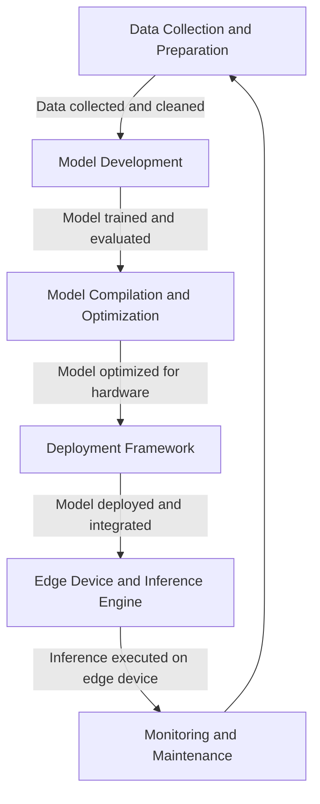

# End-to-End Edge AI MLOps Stack

## High-Level Overview

(Source: [Hymel et al. An MLOps Platform for Tiny Machine Learning, 2023](https://arxiv.org/abs/2212.03332)) 

## A Comprehensive Workflow

### Description

**1. Data Collection and Preparation:**
   * **Data Acquisition:** Gather relevant data from various sources (sensors, cameras, IoT devices).
   * **Data Cleaning:** Handle missing values, outliers, and inconsistencies.
   * **Data Labeling:** Annotate data with correct labels for training.
   * **Data Augmentation:** Generate additional training data to improve model robustness.

**2. Model Development:**
   * **Model Architecture Selection:** Choose a suitable architecture (CNN, RNN, Transformer, etc.) based on the problem.
   * **Model Training:** Train the model using a suitable optimization algorithm (e.g., SGD, Adam) and loss function.
   * **Model Evaluation:** Assess the model's performance on a validation dataset.
   * **Model Optimization:** Apply techniques like quantization, pruning, and knowledge distillation to reduce model size and improve efficiency.

**3. Model Compilation and Optimization:**
   * **Model Conversion:** Convert the trained model to a format supported by the target hardware (e.g., ONNX, TensorFlow Lite).
   * **Model Optimization:** Use a model compiler (e.g., TensorFlow Lite, TVM, XLA) to optimize the model for the target hardware.
   * **Hardware Acceleration:** Leverage specialized hardware accelerators (e.g., TPUs, GPUs, FPGAs) to accelerate inference.

**4. Deployment Framework:**
   * **Model Serving:** Use a deployment framework (e.g., TensorFlow Serving, TorchServe, MLflow) to deploy the optimized model.
   * **Model Management:** Track model versions, monitor performance, and roll back to previous versions if necessary.
   * **Model Integration:** Integrate the model with other systems (e.g., databases, cloud services) to enable real-time inference.

**5. Edge Device and Inference Engine:**
   * **Edge Device Selection:** Choose a suitable edge device based on power constraints, computational requirements, and connectivity options.
   * **Inference Engine:** Select an appropriate inference engine (e.g., TensorFlow Lite, ONNX Runtime) to execute the optimized model on the edge device.
   * **Hardware Acceleration:** Leverage hardware acceleration capabilities of the edge device to improve inference performance.

**6. Monitoring and Maintenance:**
   * **Model Performance Monitoring:** Track the model's performance over time and identify potential issues.
   * **Model Retraining:** Retrain the model periodically to adapt to changing data distributions or requirements.
   * **Security Considerations:** Implement security measures to protect the model and data privacy.

**Additional Considerations:**

* **Power Efficiency:** Optimize the model and hardware to minimize power consumption.
* **Latency:** Ensure low-latency inference to meet real-time requirements.
* **Connectivity:** Consider the connectivity options of the edge device and the network infrastructure.
* **Security:** Protect the model and data from unauthorized access and attacks.
* **Ethical Considerations:** Be mindful of the ethical implications of AI and ensure fairness and transparency.

By following these steps and considering the additional factors, you can successfully deploy edge AI solutions that deliver **real-time insights** and **improve decision-making** at the edge.

## Related Notes
- [End-to-End Edge-AI Deployment Stack](./end-to-end-edge-ai-deployment-stack.md)
