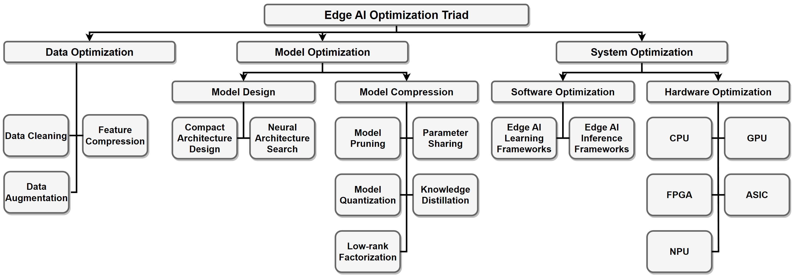
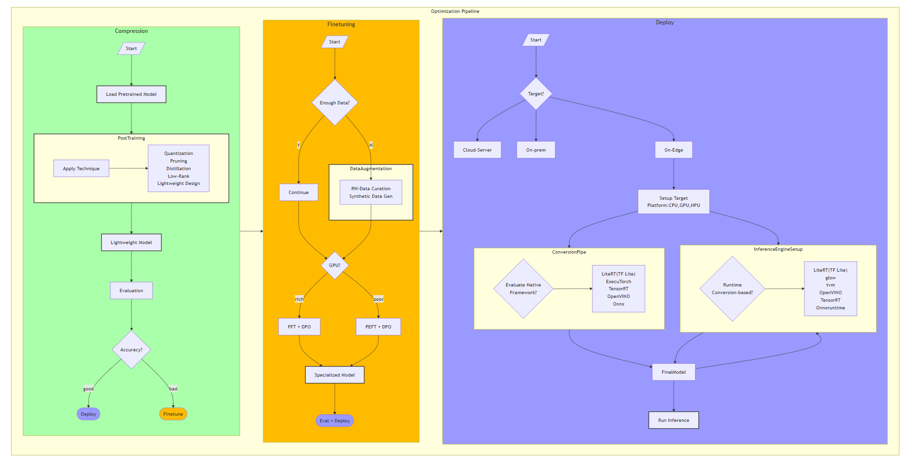

# Edge AI Optimization Stack

[Data](#data-optimization-still-to-come) | [Model](#model-optimization-a-full-process) | [System](#system-optimization-still-to-come)|

Wang et al. "Optimizing Edge AI: A Comprehensive Survey on Data, Model, and System Strategies", arXiv pp, [arXiv:2501.03265v1](https://arxiv.org/abs/2501.03265), 2025

After identifying performance bottlenecks, you can apply Edge AI SOTA optimization techniques across the data pipeline, model, and system architecture (as shown in diagram above) to meet your application goals.

For example, if you decide to use quantization, reducing the model precision from `FP32` to `INT8` can reduce the memory footprint and speed up computation, potentially resulting in the following table.

<table border="1">
  <thead>
    <tr>
      <th>Model</th>
      <th>Bit-Width (W/A) </th>
      <th>Size (MB)</th>
      <th>Params (MB)</th>
      <th>Top-1% Accuracy</th>
      <th>Storage (MB)</th>
      <th>Latency (ms) </th>
      <th>Throughput (inf/s) </th>
      <th>Energy (W)</th>
      <th colspan="3">Compute (OPS/GFlops)</th>
      <th><a href="#step-2-choose-your-target-edge-platform">Platform</a></th>
    </tr>
    <tr>
      <th></th>
      <th></th>
      <th></th>
      <th></th>
      <th></th>
      <th></th>
      <th></th>
      <th></th>
      <th></th>
      <th>CPU</th>
      <th>GPU</th>
      <th>NPU</th>
      <th>--</th>
    </tr>
  </thead>
  <tbody>
    <tr><td rowspan="3">ResNet-50</td></tr>
    <tr>
      <td>FP32 (Full Precision)</td>
      <td>-</td>
      <td>-</td>
      <td>-</td>
      <td>-</td>
      <td>-</td>
      <td>-</td>
      <td>-</td>
      <td>-</td>
      <td>-</td>
      <td>-</td>
      <td rowspan="3">MCU, Pi, Jetson Nano</td>
    </tr>
    <tr>
      <td>INT8 (Quantized)</td>
      <td>-</td>
      <td>-</td>
      <td>-</td>
      <td>-</td>
      <td>-</td>
      <td>-</td>
      <td>-</td>
      <td>-</td>
      <td>-</td>
      <td>-</td>
    </tr>
  </tbody>
</table>

## Data Optimization (Still to Come)

## Model Optimization: A Full Process

## System Optimization (Still to Come)
- HW
- SW
- Power

## Resources

- [Edge AI Engineering](https://github.com/afondiel/edge-ai-engineering) 
- [Edge AI Technical Guide](https://github.com/afondiel/computer-science-notebook/tree/master/core/systems/edge-computing/edge-ai/concepts)
- [Edge AI End-to-End Stack](https://www.qualcomm.com/developer/artificial-intelligence)
- [Edge AI Deployment Stack](https://github.com/afondiel/computer-science-notebook/tree/master/core/systems/edge-computing/edge-ai/concepts/deployment)
- [Edge AI Optimization Stack](https://github.com/afondiel/computer-science-notebook/tree/master/core/systems/edge-computing/edge-ai/concepts/optimization)
- [Edge AI Frameworks](https://github.com/afondiel/computer-science-notebook/tree/master/core/systems/edge-computing/edge-ai/frameworks)
- [Edge AI Model Zoos](https://github.com/afondiel/Edge-AI-Model-Zoo)
- [Edge AI Platforms](https://github.com/afondiel/Edge-AI-Platforms)
- [Edge AI Benchmarking](https://github.com/afondiel/Edge-AI-Benchmarking)
- [Edge AI Ecosystem](https://github.com/afondiel/computer-science-notebook/tree/master/core/systems/edge-computing/edge-ai/industry-applications)
- [Edge AI Books](https://github.com/afondiel/cs-books/blob/main/README.md#edge-computing)
- [Edge AI Blog](https://afondiel.github.io/posts/)
- [Edge AI Papers](https://github.com/afondiel/computer-science-notebook/tree/master/core/systems/edge-computing/edge-ai/resources/edge_ai_papers_news.md)