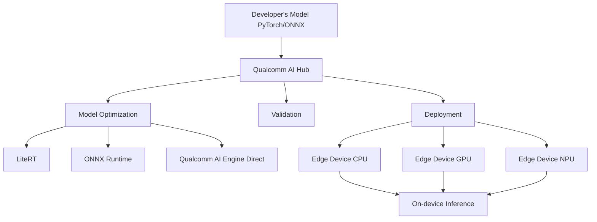

# Deploying Models On the Edge using Qualcomm AI Hub Technical Notes
<!-- [A rectangular image showing a smartphone running a real-time segmentation model, connected to the Qualcomm AI Hub cloud platform, with optimized model code and performance metrics displayed] -->

## Quick Reference
- Qualcomm AI Hub: Platform for optimizing and deploying AI models on edge devices
- Key use cases: Real-time object detection, image segmentation, and AI model deployment on Qualcomm-powered devices
- Prerequisites: Python programming, basic machine learning knowledge, familiarity with PyTorch or ONNX

## Table of Contents

# Table of Contents

1. [Introduction](#introduction)
2. [Quick Reference](#quick-reference)
3. [Core Concepts](#core-concepts)
4. [Visual Architecture](#visual-architecture)
5. [Implementation Details](#implementation-details)
6. [Real-World Applications](#real-world-applications)
7. [Tools & Resources](#tools-&-resources)
8. [References](#references)


## Introduction

Qualcomm AI Hub is a powerful platform designed to streamline the deployment of AI models, particularly for vision, audio, and speech applications, on edge devices. It enables developers to optimize, validate, and deploy AI models on Qualcomm platform devices efficiently, bridging the gap between cloud-based AI development and edge implementation[1].

## Core Concepts

### Fundamental Understanding

- **Model Optimization**: Qualcomm AI Hub automatically converts PyTorch or ONNX models for efficient on-device deployment using LiteRT, ONNX Runtime, or Qualcomm AI Engine Direct[1].
- **Edge Deployment**: The platform allows running AI models on real devices powered by Snapdragon and Qualcomm platforms, enabling performance profiling and on-device inference[1].
- **Pre-optimized Models**: Qualcomm AI Hub offers a library of over 100 pre-optimized models for various applications, including segmentation models[1].

### Visual Architecture



## Implementation Details

### Intermediate Patterns

1. **Device-Specific Targeting**:
   To target a specific edge device, use the `device` parameter when submitting a job:

```python
import qai_hub as qai

# List available devices
devices = qai.list_devices()

# Target a specific device (e.g., QCS 6490)
target_device = qai.Device("qcs6490")

# Load and optimize a model for the target device
model = qai.load_model("yolov7")
result = model.compile_profile(device=target_device)
```

2. **Performance Profiling**:
   Analyze model performance on the target device:

```python
# Profile the model
profile_result = model.profile(device=target_device)

# Print performance metrics
print(f"Inference time: {profile_result.inference_time} ms")
print(f"Memory usage: {profile_result.memory_usage} MB")
```

3. **Model Quantization**:
   Implement quantization for improved performance:

```python
import qai_hub as qai

# Load a model
model = qai.load_model("mobilenet_v2")

# Apply quantization
quantized_model = model.quantize(quantization_aware_training=True)

# Compile and profile the quantized model
result = quantized_model.compile_profile()
```

## Real-World Applications

### Industry Examples

- **Automotive**: Deploy real-time segmentation models for advanced driver-assistance systems (ADAS) on Qualcomm-powered in-vehicle infotainment systems.
- **Robotics**: Implement object detection and segmentation for autonomous navigation on the Qualcomm Robotics RB3 Gen 2 platform[2].

### Hands-On Project

Develop a real-time object detection application using YOLOv7 on a Qualcomm device:

1. Set up the Qualcomm AI Hub environment.
2. Load and optimize the YOLOv7 model for a specific Qualcomm device.
3. Implement a Python script to capture video input and perform real-time object detection.
4. Profile the model's performance and optimize for latency and power consumption.

## Tools & Resources

### Essential Tools
- Qualcomm AI Hub Python library
- Google Colab for development and testing
- PyTorch or ONNX for model development

### Learning Resources
- Qualcomm AI Hub documentation and API reference
- Qualcomm AI Hub YouTube channel for tutorial videos[2][3]
- Qualcomm AI Engine Direct SDK documentation[4]

By leveraging Qualcomm AI Hub, intermediate developers can efficiently deploy and optimize segmentation models on edge devices, enabling real-time AI applications across various industries.

## References

- [1] https://aihub.qualcomm.com/get-started
- [2] https://www.youtube.com/watch?v=G1OC8QQLMJ4
- [3] https://www.youtube.com/watch?v=D90EM-7Kl_M
- [4] https://docs.qualcomm.com/bundle/publicresource/topics/80-63442-50/setup.html?vproduct=1601111740013072&version=1.1&facet=Qualcomm+AI+Engine+Direct+SDK
- [5] https://academy.qualcomm.com/course-catalog/Introduction-to-Qualcomm-AI-Hub