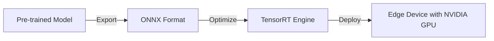

# Deploy at the Edge-AI with TensorRT  

## Quick Reference  
- **One-sentence definition**: TensorRT is NVIDIA's high-performance deep learning inference library, optimized for deploying AI models on GPUs in edge devices.  
- **Key use cases**: Real-time object detection, natural language processing, and computer vision tasks in constrained environments.  
- **Prerequisites**: Familiarity with Python, deep learning basics, and basic understanding of NVIDIA GPUs.  

## Table of Contents  
1. [Introduction](#introduction)
2. [Core Concepts](#core-concepts)
   - [What is TensorRT?](#what-is-tensorrt)
   - [How TensorRT Works](#how-tensorrt-works)
   - [Benefits for Edge AI Deployment](#benefits-for-edge-ai-deployment)
3. [Visual Architecture](#visual-architecture)
   - [Overview of TensorRT Workflow](#overview-of-tensorrt-workflow)
4. [Implementation Details](#implementation-details)
   - [Basic Deployment Example](#basic-deployment-example)
   - [Common Pitfalls and Solutions](#common-pitfalls-and-solutions)
5. [Tools & Resources](#tools--resources)
6. [References](#references)

## Introduction  
### What  
TensorRT is a deep learning inference library from NVIDIA that supports model optimization and acceleration for deployment on edge devices powered by NVIDIA GPUs.  

### Why  
Efficient inference is crucial for real-time AI applications on edge devices. TensorRT achieves this by reducing model size, optimizing runtime performance, and leveraging GPU capabilities.  

### Where  
Applications include:  
- **Healthcare**: Image segmentation on portable medical devices.  
- **Autonomous Systems**: Object detection in self-driving cars.  
- **Retail**: Real-time inventory tracking with edge cameras.  

## Core Concepts  
### What is TensorRT?  
TensorRT is a framework for optimizing, quantizing, and running deep learning models with high efficiency on NVIDIA hardware.

### How TensorRT Works  
1. **Model Parsing**: Load and parse models from frameworks like TensorFlow or PyTorch.  
2. **Optimization**: Apply techniques like layer fusion, precision calibration, and pruning.  
3. **Deployment**: Use the optimized model for low-latency, high-throughput inference.  

### Benefits for Edge AI Deployment  
- **High Performance**: Accelerated inference on GPUs.  
- **Model Optimization**: Reduces memory and compute requirements.  
- **Precision Support**: INT8, FP16, and FP32 modes for balancing performance and accuracy.  

## Visual Architecture  
### Overview of TensorRT Workflow



## Implementation Details  
### Basic Deployment Example  
#### Step 1: Convert Pre-trained Model to ONNX  
Export a PyTorch model to the ONNX format:  
```python
import torch
import onnx

# Load PyTorch model
model = torch.load("model.pth")
model.eval()

# Export to ONNX
dummy_input = torch.randn(1, 3, 224, 224)
onnx.export(model, dummy_input, "model.onnx")
```

#### Step 2: Optimize with TensorRT  
Convert the ONNX model into a TensorRT engine:  
```python
import tensorrt as trt

# TensorRT Logger
logger = trt.Logger(trt.Logger.WARNING)

# Load ONNX model
builder = trt.Builder(logger)
network = builder.create_network()
parser = trt.OnnxParser(network, logger)

with open("model.onnx", "rb") as f:
    parser.parse(f.read())

# Build optimized TensorRT engine
config = builder.create_builder_config()
config.max_workspace_size = 1 << 30  # 1GB
engine = builder.build_engine(network, config)

# Save engine
with open("model.trt", "wb") as f:
    f.write(engine.serialize())
```

#### Step 3: Deploy on Edge Device  
Run inference using the TensorRT engine:  
```python
import pycuda.driver as cuda
import pycuda.autoinit
import tensorrt as trt

# Load TensorRT engine
runtime = trt.Runtime(trt.Logger(trt.Logger.WARNING))
with open("model.trt", "rb") as f:
    engine = runtime.deserialize_cuda_engine(f.read())

# Allocate buffers and run inference
# (Buffer allocation and inference code here...)
```

### Common Pitfalls and Solutions  
1. **Model Conversion Issues**: Ensure model compatibility with ONNX.  
   - **Solution**: Use ONNX Model Checker for debugging.  
2. **Insufficient GPU Memory**: Optimize with reduced precision (e.g., INT8).  

## Tools & Resources  
### Essential Tools  
- **TensorRT**: Optimization library.  
- **ONNX**: Model interoperability format.  
- **PyCUDA**: Interface for running inference on GPUs.  

### Learning Resources  
- [TensorRT Documentation](https://docs.nvidia.com/deeplearning/tensorrt)  
- [ONNX Tutorials](https://onnx.ai)  
- [PyCUDA Guide](https://documen.tician.de/pycuda)  

## References  
- [NVIDIA TensorRT Official Guide](https://docs.nvidia.com/deeplearning/tensorrt)  
- [Optimizing AI Models for Edge Devices](https://arxiv.org/abs/edge-ai)  
