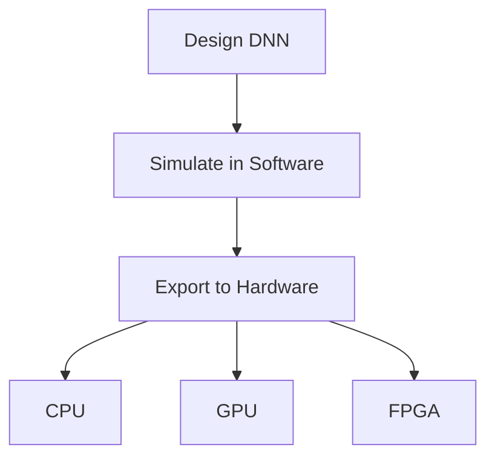

# Deploy with Aiedge

## Technical Resources
- [Aiedge Core Concepts](../../../concepts/frameworks/aidge)
- [Model Zoos](https://github.com/afondiel/Edge-AI-Model-Zoo)
- [Target (Hardware) Platforms](https://github.com/afondiel/Edge-AI-Platforms)
- [NEUROKIT2E Ecosystem](../../../industry-applications/neurokit2e-ecosystem)

## Quick Reference
- **One-sentence definition**: Deploying with Aidge involves using an open-source platform to design, simulate, and export deep neural networks (DNNs) to various hardware targets, tailored for embedded systems.
- **Key use cases**: Prototyping neural networks, deploying AI models to IoT devices, and testing DNNs for robotics.
- **Prerequisites**: Basic understanding of Python, familiarity with neural network concepts (e.g., layers, neurons), and a computer with Python 3.7+ installed.

## Table of Contents
- [Introduction](#introduction)
- [Core Concepts](#core-concepts)
    - [Fundamental Understanding](#fundamental-understanding)
    - [Visual Architecture](#visual-architecture)
- [Implementation Details](#implementation-details)
    - [Basic Implementation](#basic-implementation)
- [Real-World Applications](#real-world-applications)
    - [Industry Examples](#industry-examples)
    - [Hands-On Project](#hands-on-project)
- [Tools & Resources](#tools--resources)
    - [Essential Tools](#essential-tools)
    - [Learning Resources](#learning-resources)
- [References](#references)
- [Appendix](#appendix)
    - [Glossary](#glossary)

## Introduction
- **What**: Deploying with Aidge refers to the process of using the Aidge platform, hosted at [https://gitlab.eclipse.org/eclipse/aidge/aidge](https://gitlab.eclipse.org/eclipse/aidge/aidge), to design, simulate, and deploy deep neural networks onto hardware targets like CPUs, GPUs, and FPGAs, with a focus on embedded systems.
- **Why**: It solves the challenge of efficiently moving from neural network design to deployment on resource-constrained devices, offering beginners a streamlined, open-source toolset to learn and experiment with AI deployment without needing advanced hardware expertise.
- **Where**: Commonly applied in educational settings, hobbyist projects, and entry-level development for robotics, IoT, and edge computing devices.

## Core Concepts

### Fundamental Understanding
- **Basic Principles**: At its core, deployment with Aidge involves three stages: designing a neural network (defining its structure), simulating it (testing its behavior in software), and exporting it (converting it to run on hardware). For beginners, this means starting with simple models and learning how to adapt them for real devices.
- **Key Components**: 
  - **Network Design**: Creating the DNN structure using Python or importing models (e.g., ONNX format).
  - **Simulation**: Running the model in a software environment to check accuracy and performance.
  - **Hardware Export**: Translating the model into code compatible with specific hardware (e.g., C++ for CPUs).
- **Common Misconceptions**: Beginners might think deployment requires deep hardware knowledge—while Aidge simplifies this, understanding basic hardware constraints (e.g., memory limits) still helps.

### Visual Architecture

- **System Overview**: The diagram shows a linear flow from designing a DNN to deploying it on hardware, emphasizing Aidge’s role in bridging software and hardware.
- **Component Relationships**: Design feeds into simulation for validation, which then informs the export process tailored to the target device.

## Implementation Details

### Basic Implementation [Beginner]

[Python]
```python
# Example: Importing and deploying a simple ONNX model with Aidge
from aidge_core import Model  # Core module for model handling

# Step 1: Load a pre-trained ONNX model
model = Model.import_onnx("simple_model.onnx")  # Replace with your ONNX file

# Step 2: Simulate the model (inference)
input_data = [[1.0, 2.0, 3.0]]  # Dummy input for testing
output = model.run(input_data)  # Run inference
print("Simulation output:", output)

# Step 3: Export to C++ for CPU deployment
model.export("cpp", "output_model.cpp")  # Generates C++ code
print("Model exported to output_model.cpp")
```

- **Step-by-Step Setup**:
  1. Install Python 3.7+ and create a virtual environment: `python -m venv aidge_env`.
  2. Activate it: `source aidge_env/bin/activate` (Linux/Mac) or `aidge_env\Scripts\activate` (Windows).
  3. Install Aidge: `pip install aidge_core` (check [Aidge GitLab](https://gitlab.eclipse.org/eclipse/aidge/aidge) for latest modules).
  4. Download or create a simple ONNX model (e.g., from a tutorial).
  5. Run the script above to test and export.

- **Code Walkthrough**: 
  - `import_onnx` loads an external model file.
  - `run` simulates the model with input data.
  - `export` generates hardware-compatible code (here, C++).

- **Common Pitfalls**: Forgetting to activate the virtual environment, missing dependencies (e.g., ONNX runtime), or using an incompatible model format.

## Real-World Applications

### Industry Examples
- **Use Case**: Deploying a basic object detection model on a Raspberry Pi for a home security camera.
- **Implementation Pattern**: Design a small CNN, simulate it with sample images, and export to C++ for CPU execution.
- **Success Metrics**: Achieves >80% accuracy with <500ms latency on the Pi.

### Hands-On Project
- **Project Goals**: Deploy a digit recognition model to classify handwritten numbers (MNIST dataset) on a desktop CPU.
- **Implementation Steps**:
  1. Install Aidge and dependencies.
  2. Use a pre-trained MNIST ONNX model (available online or via tutorials).
  3. Simulate with sample digits and export to C++.
  4. Compile and run the C++ code locally.
- **Validation Methods**: Compare simulation output with expected labels; ensure exported model matches simulation accuracy.

## Tools & Resources

### Essential Tools
- **Development Environment**: Python 3.7+, any text editor (e.g., VS Code).
- **Key Frameworks**: Aidge_core (for model handling), ONNX (for model format).
- **Testing Tools**: Python’s `numpy` for input data prep, basic terminal for running scripts.

### Learning Resources
- **Documentation**: [Eclipse Aidge Docs](https://eclipse.dev/aidge/) for setup and API details.
- **Tutorials**: “Aidge Demonstration Tutorial” at [Tutorial Index](https://eclipse.dev/aidge/source/Tutorial/index.html).
- **Community Resources**: [Aidge GitLab Issues](https://gitlab.eclipse.org/groups/eclipse/aidge/-/issues) for support.

## References
- [Eclipse Aidge GitLab](https://gitlab.eclipse.org/eclipse/aidge/aidge)
- [Eclipse Aidge Documentation](https://eclipse.dev/aidge/)
- [ONNX Format Overview](https://onnx.ai/)
- [DeepGreen.ai](https://deepgreen.ai/)
- [NEUROKIT2E](https://www.neurokit2e.eu/)

## Appendix

### Glossary
- **DNN**: Deep Neural Network—a multi-layered AI model for complex tasks.
- **ONNX**: Open Neural Network Exchange—a standard format for sharing models.
- **Embedded System**: A small, resource-limited device (e.g., IoT sensor) running specific software.
