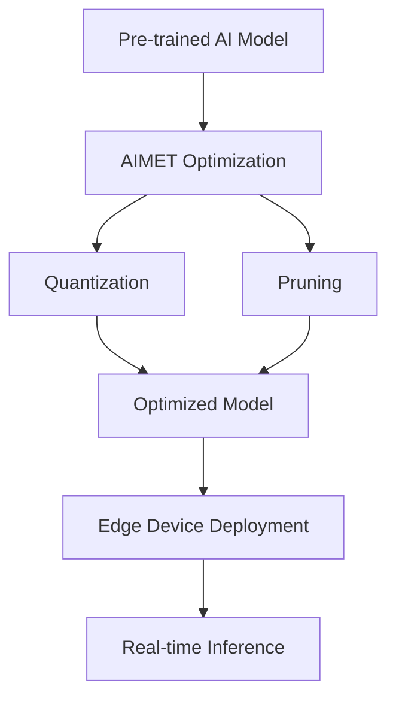

# Deploy with AIMET  

## Quick Reference  
- **One-sentence definition**: Deploying AI on edge devices with AIMET involves optimizing and compressing AI models to run efficiently on resource-constrained hardware using Qualcomm’s AI Model Efficiency Toolkit (AIMET).  
- **Key use cases**: Real-time IoT analytics, smart cameras, wearable health monitors.  
- **Prerequisites**: Basic understanding of AI models, Python programming, and edge hardware concepts (e.g., Raspberry Pi or similar).  

## Table of Contents  
- [Introduction](#introduction)  
- [Core Concepts](#core-concepts)  
  - [Fundamental Understanding](#fundamental-understanding)  
  - [Visual Architecture](#visual-architecture)  
- [Implementation Details](#implementation-details)  
  - [Basic Implementation](#basic-implementation)  
- [Real-World Applications](#real-world-applications)  
  - [Industry Examples](#industry-examples)  
  - [Hands-On Project](#hands-on-project)  
- [Tools & Resources](#tools--resources)  
  - [Essential Tools](#essential-tools)  
  - [Learning Resources](#learning-resources)  
- [References](#references)  
- [Appendix](#appendix)  

## Introduction  
- **What**: Deploying AI on edge devices with AIMET means adapting pre-trained AI models to run on low-power, resource-limited hardware using techniques like quantization and pruning provided by AIMET.  
- **Why**: It enables faster, offline AI processing, reduces latency, and saves bandwidth compared to cloud-based solutions.  
- **Where**: Used in IoT devices, autonomous drones, smart home systems, and other edge computing scenarios.  

## Core Concepts  
### Fundamental Understanding  
- **Basic principles**: Edge devices have limited memory and processing power, so AI models must be lightweight. AIMET optimizes models by reducing their size and complexity (e.g., converting 32-bit floats to 8-bit integers via quantization) while preserving accuracy.  
- **Key components**:  
  - Pre-trained AI model (e.g., TensorFlow or PyTorch).  
  - AIMET toolkit for optimization.  
  - Target edge hardware (e.g., Qualcomm Snapdragon, Raspberry Pi).  
- **Common misconceptions**:  
  - "Edge AI is less accurate" – With AIMET, accuracy loss is minimal.  
  - "You need advanced hardware" – Basic devices can work with proper optimization.  

### Visual Architecture  

- **System overview**: A model is trained, optimized with AIMET, and deployed to an edge device for inference.  
- **Component relationships**: AIMET bridges the gap between heavy models and edge constraints.  

## Implementation Details  
### Basic Implementation  
```python  
# Example: Quantizing a simple model with AIMET  
import tensorflow as tf  
from aimet_tensorflow import quantsim  

# Load a pre-trained model (e.g., MobileNet)  
model = tf.keras.applications.MobileNetV2(weights='imagenet')  

# Configure AIMET for quantization  
sim = quantsim.QuantizationSimModel(model, quant_scheme='tf')  

# Simulate quantization (fake quantization to test)  
sim.compute_encodings(forward_pass_callback=lambda m, _: m.predict(data),  
                      forward_pass_callback_args=None)  

# Export optimized model  
sim.export('/path/to/output', 'quantized_mobilenet')  
```  
- **Step-by-step setup**:  
  1. Install AIMET (`pip install aimet-tensorflow`).  
  2. Load a pre-trained model.  
  3. Apply quantization using AIMET.  
  4. Test and export the model.  
- **Code walkthrough**: The code loads MobileNetV2, simulates quantization, and saves an optimized version.  
- **Common pitfalls**: Forgetting to test on real data or skipping hardware compatibility checks.  

## Real-World Applications  
### Industry Examples  
- **Use case**: Smart security camera detecting motion offline.  
- **Implementation pattern**: Quantized model deployed on a low-power chip.  
- **Success metrics**: Reduced power usage, real-time detection within 50ms.  

### Hands-On Project  
- **Project goals**: Deploy a quantized image classifier on a Raspberry Pi.  
- **Implementation steps**:  
  1. Train a simple CNN on MNIST dataset.  
  2. Use AIMET to quantize it.  
  3. Deploy to Raspberry Pi and classify handwritten digits.  
- **Validation methods**: Measure accuracy and inference time (aim for <1s).  

## Tools & Resources  
### Essential Tools  
- **Development environment**: Python 3.8+, TensorFlow/PyTorch.  
- **Key frameworks**: AIMET (Qualcomm), TensorFlow Lite.  
- **Testing tools**: Raspberry Pi, sample datasets (e.g., MNIST).  

### Learning Resources  
- **Documentation**: AIMET User Guide (Qualcomm GitHub).  
- **Tutorials**: "Getting Started with AIMET" (Qualcomm Dev Network).  
- **Community resources**: Reddit r/MachineLearning, Stack Overflow.  

## References  
- Official AIMET documentation: [Qualcomm AIMET GitHub](https://github.com/quic/aimet).  
- TensorFlow Lite Edge Guide: [tensorflow.org/lite].  
- "Edge AI: A Vision for the Future" (IEEE Paper).  

## Appendix  
- **Glossary**:  
  - Quantization: Reducing numerical precision for efficiency.  
  - Pruning: Removing unnecessary model weights.  
- **Setup guides**: "Install AIMET on Ubuntu" (see AIMET docs).  
- **Code templates**: Basic quantization script (above).  

