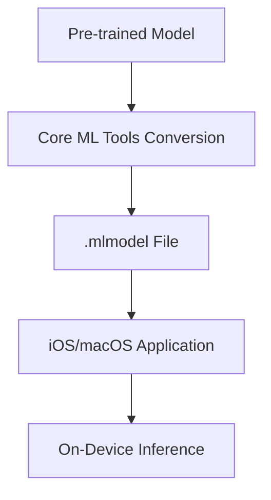

# Deploy with Core ML

## Technical Resources
- [Core Concepts](../../../concepts/frameworks/coreml)
- [Apple Ecosystem](../../../industry-applications/apple-ecosystem)

## Quick Reference
- **One-sentence definition**: Core ML is Apple's machine learning framework that allows developers to integrate optimized AI models into iOS, macOS, watchOS, and tvOS applications.  
- **Key use cases**: Image classification, object detection, natural language processing, and real-time audio analysis on Apple devices.  
- **Prerequisites**: Basic knowledge of Python and Swift, a pre-trained AI model, and an Apple development environment (Xcode and a macOS device).

## Table of Contents
1. [Introduction](#introduction)
2. [Core Concepts](#core-concepts)
    - [Fundamental Understanding](#fundamental-understanding)
    - [Visual Architecture](#visual-architecture)
3. [Implementation Details](#implementation-details)
    - [Basic Implementation](#basic-implementation)
4. [Tools & Resources](#tools--resources)
5. [References](#references)

## Introduction
### What
Core ML enables developers to deploy machine learning models directly on Apple devices, ensuring fast, on-device inference with minimal latency.

### Why
Edge AI with Core ML ensures data privacy by keeping inference on the device, eliminates dependency on internet connectivity, and provides high performance tailored to Apple’s hardware and software ecosystem.

### Where
- **Mobile Apps**: Integrate AI for photo categorization or AR applications.  
- **Wearables**: Use AI for health and fitness analytics on Apple Watch.  
- **Smart Home**: Enable natural language understanding in HomeKit-enabled devices.  

## Core Concepts
### Fundamental Understanding
- **Basic Principles**:  
    - Core ML converts pre-trained AI models into a `.mlmodel` format compatible with Apple platforms.  
    - It provides APIs to load and execute the models within apps written in Swift or Objective-C.  
- **Key Components**:  
    - **Model Conversion**: Tools like Core ML Tools convert models from popular frameworks (e.g., TensorFlow, PyTorch).  
    - **On-Device Inference**: Execute predictions directly on Apple devices using optimized hardware like the Apple Neural Engine (ANE).  
- **Common Misconceptions**:  
    - Core ML is not a training framework; it only supports model deployment.  
    - It is limited to Apple's ecosystem and cannot be used on non-Apple devices.

### Visual Architecture


## Implementation Details
### Basic Implementation
#### Step-by-Step Guide: Deploying an Image Classification Model
1. **Convert a Pre-Trained Model to Core ML Format**:
    - Install Core ML Tools:
      ```bash
      pip install coremltools
      ```
    - Use Core ML Tools to convert a TensorFlow/Keras model:
      ```python
      import coremltools as ct
      import tensorflow as tf

      # Load the pre-trained model
      model = tf.keras.applications.MobileNetV2(weights="imagenet")

      # Convert to Core ML format
      mlmodel = ct.convert(model, inputs=[ct.ImageType()])
      mlmodel.save("ImageClassifier.mlmodel")
      ```

2. **Integrate the Model into an Xcode Project**:
    - Open Xcode and create a new iOS app project.  
    - Drag the `.mlmodel` file into your project.  

3. **Use the Model in Swift Code**:
    - Write Swift code to load the model and perform inference:  
      ```swift
      import CoreML
      import Vision
      import UIKit

      func classifyImage(image: UIImage) {
          guard let model = try? VNCoreMLModel(for: ImageClassifier().model) else {
              print("Failed to load model")
              return
          }

          let request = VNCoreMLRequest(model: model) { request, error in
              guard let results = request.results as? [VNClassificationObservation] else {
                  print("Failed to process image")
                  return
              }
              if let firstResult = results.first {
                  print("Classification: \(firstResult.identifier) - Confidence: \(firstResult.confidence)")
              }
          }

          let handler = VNImageRequestHandler(cgImage: image.cgImage!)
          try? handler.perform([request])
      }
      ```

4. **Run the App on an Apple Device**:
    - Build and deploy the app on an iPhone or iPad using Xcode.  
    - Test with sample images.

#### Common Pitfalls
- **Model Compatibility**: Ensure the pre-trained model’s operations are supported by Core ML Tools.  
- **Hardware Limitations**: Models requiring extensive computation might not run efficiently on older Apple devices.  

## Tools & Resources
### Essential Tools
- **Development Environment**: Xcode and Swift.  
- **Conversion Tool**: Core ML Tools for Python.  
- **Testing Tools**: Apple Simulator for iOS and macOS testing.  

### Learning Resources
- [Core ML Documentation](https://developer.apple.com/documentation/coreml)  
- [Core ML Tools GitHub](https://github.com/apple/coremltools)  
- [Core ML Sample Projects](https://developer.apple.com/documentation/coreml/integrating_a_core_ml_model_into_your_app)  

## References
- [Core ML Official Documentation](https://developer.apple.com/documentation/coreml)  
- [TensorFlow to Core ML Conversion Guide](https://www.tensorflow.org/lite/convert/coreml)  
- [Apple Developer Videos on Core ML](https://developer.apple.com/videos/)  
