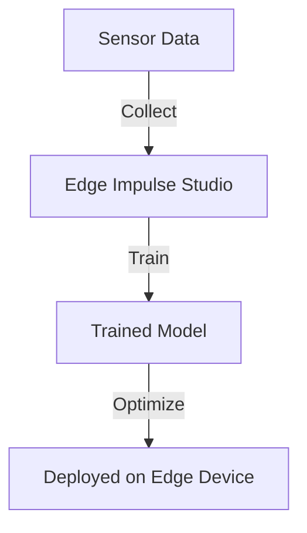

# Deploy with Edge Impulse  

## Technical Resources
- [Core Concepts](../../../concepts/frameworks/edge-impulse)
- [Edge Impulse Ecosystem](../../../industry-applications/edge-impulse-ecosystem)

## Quick Reference  
- **One-sentence definition**: Edge Impulse is a development platform for building, training, and deploying machine learning models directly onto edge devices.  
- **Key use cases**: Simplifies building edge AI applications for IoT devices, sensors, and low-power hardware.  
- **Prerequisites**: Basic understanding of machine learning, edge devices, and Python.  

## Table of Contents  
1. [Introduction](#introduction)
2. [Core Concepts](#core-concepts)
   - [What is Edge Impulse?](#what-is-edge-impulse)
   - [Why Use Edge Impulse for Edge AI?](#why-use-edge-impulse-for-edge-ai)
   - [Workflow Overview](#workflow-overview)
3. [Visual Architecture](#visual-architecture)
   - [Edge Impulse Deployment Pipeline](#edge-impulse-deployment-pipeline)
4. [Implementation Details](#implementation-details)
   - [Example: Building and Deploying a Motion Classifier](#example-building-and-deploying-a-motion-classifier)
   - [Running Inference on an Edge Device](#running-inference-on-an-edge-device)
5. [Tools & Resources](#tools--resources)
6. [References](#references)

## Introduction  
### What  
Edge Impulse is a platform that enables developers to create efficient machine learning models optimized for real-time performance on edge devices.  

### Why  
With Edge Impulse, developers can easily collect data, train models, and deploy them to constrained devices without deep expertise in ML.  

### Where  
Applications include:  
- **Wearables**: Activity recognition.  
- **IoT Sensors**: Environmental monitoring.  
- **Industrial Automation**: Fault detection.  

## Core Concepts  
### What is Edge Impulse?  
Edge Impulse simplifies the edge AI workflow by providing tools for data collection, model training, optimization, and deployment.  

### Why Use Edge Impulse for Edge AI?  
- **Ease of Use**: No-code/low-code interface for beginners.  
- **Optimization**: Automatically generates lightweight models for edge hardware.  
- **Cross-Platform**: Supports deployment on various edge devices like Arduino, STM32, and Raspberry Pi.  

### Workflow Overview  
1. **Data Collection**: Gather sensor or camera data.  
2. **Model Training**: Use Edge Impulse’s interface to train and validate the model.  
3. **Deployment**: Export optimized code for deployment.  

## Visual Architecture  
### Edge Impulse Deployment Pipeline  


## Implementation Details  
### Example: Building and Deploying a Motion Classifier  

#### Step 1: Collect Data  
- Use a supported device (e.g., Arduino Nano 33 BLE Sense) to collect accelerometer data using Edge Impulse Studio.  

#### Step 2: Train the Model  
- Upload the data to Edge Impulse Studio.  
- Select a motion classification model and train it.  

#### Step 3: Export the Model  
- Choose the desired deployment format (C++ library, WebAssembly, or TensorFlow Lite).  

#### Step 4: Deploy to Device  
```cpp
#include "model.h"  // Include Edge Impulse model header

void loop() {
    // Read sensor data
    float input_data[3] = {x, y, z};
    // Run inference
    EI_IMPULSE_RESULT result = run_classifier(input_data, sizeof(input_data));

    // Process the result
    Serial.print("Detected motion: ");
    Serial.println(result.classification[0].label);
}
```

## Tools & Resources  
### Tools  
- **Edge Impulse Studio**: Platform for building and training models.  
- **Edge Impulse CLI**: Command-line tools for deployment.  

### Learning Resources  
- [Edge Impulse Documentation](https://docs.edgeimpulse.com)  
- [Edge Impulse Tutorials](https://www.edgeimpulse.com/tutorials)  

## References  
- [Introduction to Edge Impulse](https://docs.edgeimpulse.com/docs/introduction)  
- [Getting Started with Edge Impulse](https://docs.edgeimpulse.com/docs/getting-started)  
