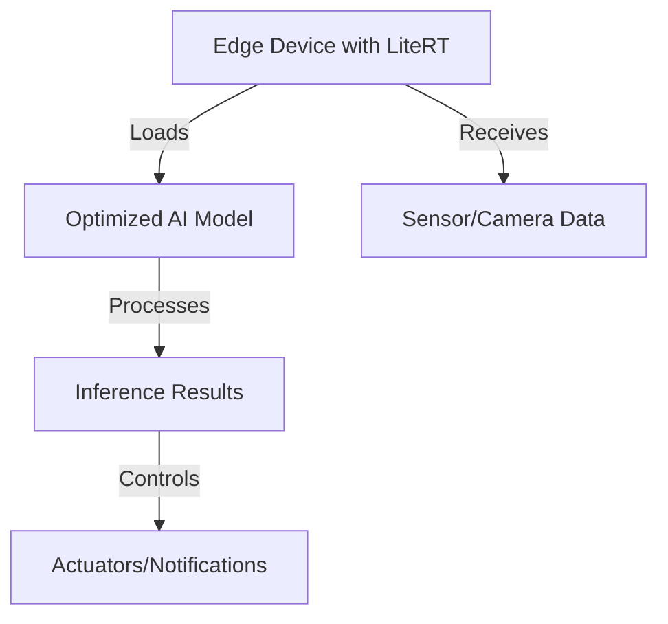

# Deploy with LiteRT (formerly TensorFlow Lite)

## Technical Resources
- [Core Concepts](../../../concepts/frameworks/LiteRT)
- [Google Ecosystem](../../../industry-applications/google-ecosystem)

## Quick Reference  
- **One-sentence definition**: LiteRT is a lightweight AI inference framework designed to deploy optimized machine learning models on edge devices with minimal latency and power consumption.  
- **Key use cases**: Smart cities, autonomous vehicles, real-time video analytics, predictive maintenance in manufacturing.  
- **Prerequisites**: Basic understanding of Python, machine learning, and edge computing concepts.

## Table of Contents  
1. [Introduction](#introduction)
2. [Industry Applications](#industry-applications)
   - [Application Overview](#application-overview)
   - [Use Case Examples](#use-case-examples)
   - [Value Proposition](#value-proposition)
3. [Visual Architecture](#visual-architecture)
   - [System Diagram](#system-diagram)
   - [Workflow for Deployment](#workflow-for-deployment)
4. [Implementation Details](#implementation-details)
   - [Hands-On Example: Real-Time Video Analytics](#hands-on-example-real-time-video-analytics)
   - [Common Pitfalls and Solutions](#common-pitfalls-and-solutions)
5. [Tools & Resources](#tools--resources)
6. [References](#references)

## Introduction  
### What  
LiteRT simplifies deploying machine learning models on resource-constrained edge devices by providing a lightweight runtime that supports optimized models.  

### Why  
Efficient deployment of AI at the edge minimizes data transfer to the cloud, reduces latency, and supports privacy compliance, enabling applications that require real-time decision-making.  

### Where  
LiteRT can be applied in:  
- **Smart Cities**: Traffic monitoring and crowd analysis.  
- **Autonomous Vehicles**: Object detection and lane tracking.  
- **Manufacturing**: Fault detection in production lines.  
- **Retail**: Customer behavior analysis using edge cameras.  

## Industry Applications  
### Application Overview  
LiteRT empowers edge devices to perform advanced AI tasks, reducing the dependency on cloud infrastructure and enabling real-time processing in environments with limited connectivity.  

### Use Case Examples  
1. **Traffic Monitoring (Smart Cities)**  
   - Deploy AI models for detecting traffic congestion and accidents.  
   - Real-time data processing at traffic cameras.  

2. **Defect Detection (Manufacturing)**  
   - Analyze images from conveyor belts to identify defects in products.  
   - Ensure quality control without halting production.  

3. **Customer Analytics (Retail)**  
   - Use edge cameras to analyze customer movements and preferences.  
   - Optimize store layouts and inventory.  

### Value Proposition  
Deploying AI with LiteRT on edge devices ensures:  
- **Low Latency**: Real-time decision-making.  
- **Energy Efficiency**: Suitable for battery-operated devices.  
- **Cost Savings**: Reduces dependency on high-bandwidth cloud services.  

## Visual Architecture  
### System Diagram  


### Workflow for Deployment  
1. Preprocess data locally.  
2. Load optimized AI model using LiteRT.  
3. Run inference on incoming data streams.  
4. Generate actionable insights and send results to actuators or dashboards.  

## Implementation Details  
### Hands-On Example: Real-Time Video Analytics  

#### Step 1: Optimize the Model  
Convert a pre-trained model (e.g., YOLOv5) into a LiteRT-compatible format using TensorFlow Lite:  
```python
import tensorflow as tf

model = tf.keras.models.load_model("yolov5_model.h5")
converter = tf.lite.TFLiteConverter.from_keras_model(model)
tflite_model = converter.convert()

with open("model.tflite", "wb") as f:
    f.write(tflite_model)
```

#### Step 2: Deploy and Process Video Streams  
Use LiteRT to load the model and analyze video frames:  
```python
import cv2
import litert

# Load LiteRT runtime
runtime = litert.Runtime()

# Load the optimized model
model = runtime.load_model("model.tflite")

# Initialize video stream
cap = cv2.VideoCapture(0)  # Use 0 for webcam or specify video file

while cap.isOpened():
    ret, frame = cap.read()
    if not ret:
        break

    # Preprocess frame (resize, normalize)
    input_data = preprocess_frame(frame)

    # Perform inference
    results = model.run(input_data)

    # Visualize results on frame
    annotated_frame = annotate_frame(frame, results)
    cv2.imshow("Real-Time Analytics", annotated_frame)

    if cv2.waitKey(1) & 0xFF == ord('q'):
        break

cap.release()
cv2.destroyAllWindows()
```

#### Step 3: Annotate and Display Results  
Add visualization for detected objects:  
```python
def preprocess_frame(frame):
    resized_frame = cv2.resize(frame, (224, 224))
    normalized_frame = resized_frame / 255.0
    return normalized_frame.reshape(1, 224, 224, 3)

def annotate_frame(frame, results):
    for obj in results["detections"]:
        x, y, w, h = obj["bbox"]
        label = obj["label"]
        confidence = obj["confidence"]
        cv2.rectangle(frame, (x, y), (x+w, y+h), (0, 255, 0), 2)
        cv2.putText(frame, f"{label} ({confidence:.2f})", (x, y-10),
                    cv2.FONT_HERSHEY_SIMPLEX, 0.5, (0, 255, 0), 2)
    return frame
```

### Common Pitfalls and Solutions  
1. **Poor Inference Accuracy**: Ensure the model is optimized and quantized for edge deployment.  
   - **Solution**: Use a well-trained model and validate on edge hardware.  
2. **High Latency**: Ensure data preprocessing is lightweight.  
   - **Solution**: Resize and normalize frames before passing to LiteRT.  

## Tools & Resources  
### Essential Tools  
- **LiteRT Framework**: Lightweight runtime for edge deployment.  
- **TensorFlow Lite**: Framework for model optimization.  
- **OpenCV**: Library for video processing.  

### Learning Resources  
- [LiteRT Documentation](https://litert.docs.example)  
- [TensorFlow Lite Optimization Guide](https://www.tensorflow.org/lite)  
- [OpenCV Tutorials](https://docs.opencv.org)  

## References  
- [LiteRT Official Guide](https://litert.docs.example)  
- [Efficient AI Deployment on Edge Devices](https://arxiv.org/abs/edge-ai-2024)  
- [OpenCV for Beginners](https://docs.opencv.org/4.x/d6/d00/tutorial_py_root.html)  
