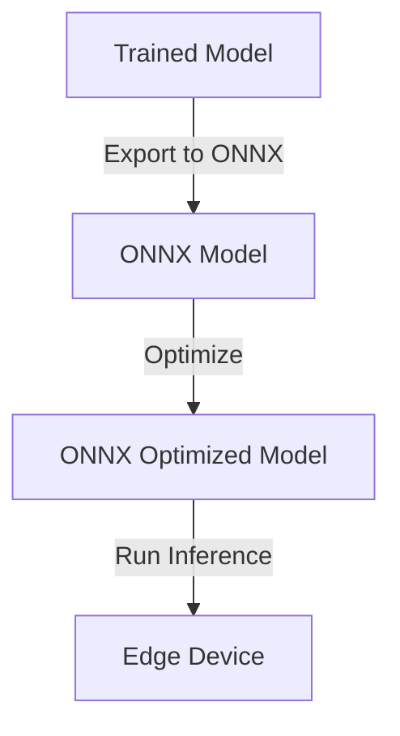

# Deploy with ONNX 

## Technical Resources
- [Core Concepts](../../../concepts/frameworks/onnx)
- [Model Zoos](https://github.com/afondiel/Edge-AI-Model-Zoo)
- [Target (Hardware) Platforms](https://github.com/afondiel/Edge-AI-Platforms)
- [Microsoft Ecosystem](../../../industry-applications/microsoft-ecosystem)

## Quick Reference  
- **One-sentence definition**: ONNX (Open Neural Network Exchange) provides an open-source framework for model interoperability, enabling seamless deployment of AI models across platforms and devices.  
- **Key use cases**: Simplifies moving AI models from training frameworks like PyTorch or TensorFlow to inference environments like TensorRT or OpenVINO.  
- **Prerequisites**: Understanding of Python, basic AI concepts, and familiarity with ONNX-compatible frameworks.  

## Table of Contents  
1. [Introduction](#introduction)
2. [Core Concepts](#core-concepts)
   - [What is ONNX?](#what-is-onnx)
   - [Why Use ONNX for Edge AI?](#why-use-onnx-for-edge-ai)
   - [ONNX Workflow Overview](#onnx-workflow-overview)
3. [Visual Architecture](#visual-architecture)
   - [ONNX Model Deployment Pipeline](#onnx-model-deployment-pipeline)
4. [Implementation Details](#implementation-details)
   - [Model Conversion Example](#model-conversion-example)
   - [Running Inference with ONNX Runtime](#running-inference-with-onnx-runtime)
5. [Tools & Resources](#tools--resources)
6. [References](#references)

## Introduction  
### What  
ONNX is an open standard that allows AI models to be portable between different frameworks and optimized inference runtimes.  

### Why  
With ONNX, developers can optimize and deploy models efficiently across diverse edge devices, enabling robust real-time AI applications.  

### Where  
- **Healthcare**: Image diagnostics on portable devices.  
- **Retail**: Customer behavior analysis via AI cameras.  
- **Smart Homes**: Voice recognition on low-power IoT devices.  

## Core Concepts  
### What is ONNX?  
ONNX is a unified format for AI models, supported by a growing ecosystem of tools and runtimes.  

### Why Use ONNX for Edge AI?  
- **Interoperability**: Models can be exported and run in diverse environments.  
- **Optimization**: Compatible with performance-focused runtimes like TensorRT or OpenVINO.  
- **Scalability**: Simplifies deployment across multiple devices.  

### ONNX Workflow Overview  
1. **Export**: Convert a trained model from frameworks like PyTorch or TensorFlow to ONNX.  
2. **Optimize**: Use ONNX tools to optimize the model.  
3. **Deploy**: Run the model on edge devices using ONNX Runtime.  

## Visual Architecture  
### ONNX Model Deployment Pipeline  


## Implementation Details  
### Model Conversion Example  
#### Step 1: Convert a PyTorch Model to ONNX  
```python
import torch
import onnx

# Load a pre-trained PyTorch model
model = torch.load("model.pth")
model.eval()

# Dummy input for ONNX export
dummy_input = torch.randn(1, 3, 224, 224)

# Export the model
onnx.export(model, dummy_input, "model.onnx", opset_version=11)
```

#### Step 2: Validate the ONNX Model  
```bash
onnxruntime_tools check model.onnx
```

### Running Inference with ONNX Runtime  
#### Step 1: Install ONNX Runtime  
```bash
pip install onnxruntime
```

#### Step 2: Run Inference  
```python
import onnxruntime as ort
import numpy as np

# Load ONNX model
session = ort.InferenceSession("model.onnx")

# Prepare input
input_name = session.get_inputs()[0].name
input_data = np.random.randn(1, 3, 224, 224).astype(np.float32)

# Run inference
outputs = session.run(None, {input_name: input_data})
print(outputs)
```

## Tools & Resources  
### Tools  
- **ONNX Runtime**: High-performance inference engine.  
- **Netron**: Visualize ONNX models.  

### Learning Resources  
- [ONNX Documentation](https://onnx.ai)  
- [ONNX Runtime Tutorials](https://onnxruntime.ai/tutorials)  

## References  
- [ONNX Format Overview](https://onnx.ai/about)  
- [ONNX Runtime Performance Tips](https://onnxruntime.ai/performance)  
