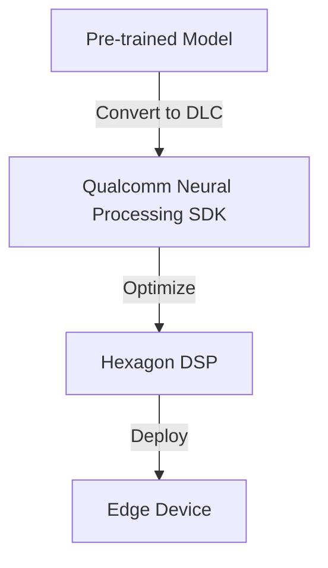

# Deploy with Qualcomm AI Hub 

## Technical Resources
- [Core Concepts](../../../concepts/frameworks/qualcomm_ai_hub)
- [Model Zoos](https://github.com/afondiel/Edge-AI-Model-Zoo)
- [Target (Hardware) Platforms](https://github.com/afondiel/Edge-AI-Platforms)
- [Qualcomm Ecosystem](../../../industry-applications/qualcomm-ecosystem)


## Quick Reference  
- **One-sentence definition**: Qualcomm’s AI platforms and tools like the Qualcomm Neural Processing SDK enable efficient deployment of AI models on Qualcomm-powered edge devices.  
- **Key use cases**: Real-time inference for IoT devices, smartphones, and AR/VR applications.  
- **Prerequisites**: Basic understanding of AI model development, Qualcomm Snapdragon devices, and Python programming.  

## Table of Contents  
1. [Introduction](#introduction)
2. [Core Concepts](#core-concepts)
   - [What is Qualcomm’s Edge AI Platform?](#what-is-qualcomm’s-edge-ai-platform)
   - [Why Use Qualcomm for Edge AI?](#why-use-qualcomm-for-edge-ai)
   - [Key Components](#key-components)
3. [Visual Architecture](#visual-architecture)
   - [Qualcomm AI Deployment Workflow](#qualcomm-ai-deployment-workflow)
4. [Implementation Details](#implementation-details)
   - [Example: Image Classification on Snapdragon Devices](#example-image-classification-on-snapdragon-devices)
   - [Key Concepts in Model Optimization](#key-concepts-in-model-optimization)
5. [Tools & Resources](#tools-and-resources)
6. [References](#references)

## Introduction  
### What  
[Qualcomm’s AI platform](https://aihub.qualcomm.com/) provides hardware-accelerated solutions for deploying machine learning models on Snapdragon devices, optimized for edge computing.  

### Why  
Qualcomm delivers high-performance, power-efficient solutions ideal for real-time edge AI applications.  

### Where  
Applications include:  
- **Smartphones**: Camera-based AI (e.g., scene recognition).  
- **IoT Devices**: Predictive maintenance.  
- **AR/VR**: Enhanced user experiences.  

## Core Concepts  
### What is Qualcomm’s Edge AI Platform?  
A suite of tools and SDKs to optimize and deploy machine learning models on devices powered by Qualcomm chipsets, leveraging AI accelerators like Hexagon DSP.  

### Why Use Qualcomm for Edge AI?  
- **Power Efficiency**: Optimized for low-power edge devices.  
- **Hardware Acceleration**: Supports heterogeneous computing (CPU, GPU, DSP).  
- **Cross-Compatibility**: Runs TensorFlow, PyTorch, and ONNX models.  

### Key Components  
- **Qualcomm Neural Processing SDK**: For model conversion and deployment.  
- **Hexagon DSP**: Dedicated AI accelerator for Snapdragon devices.  
- **AI Model Efficiency Toolkit (AIMET)**: Model compression and quantization.  

## Visual Architecture  
### Qualcomm AI Deployment Workflow  


## Implementation Details  
### Example: Image Classification on Snapdragon Devices  

#### Step 1: Prepare Your Model  
- Train an image classification model (e.g., MobileNet) using TensorFlow.  

#### Step 2: Convert the Model to DLC Format  
Use Qualcomm Neural Processing SDK to convert the model.  
```bash
snpe-tensorflow-to-dlc --input_network model.pb --output_network model.dlc
```

#### Step 3: Deploy the Model to the Device  
- Use the SDK to load the model on the device and run inference.  

#### Step 4: Run Inference  
```cpp
#include "snpe_api.h"

void classify_image() {
    // Load the DLC model
    auto model = snpe::loadModel("model.dlc");

    // Run inference
    auto results = model->execute(input_data);
    process_results(results);
}
```

## Tools & Resources  
### Tools  
- **Qualcomm Neural Processing SDK**: Model deployment.  
- **Hexagon DSP Debugger**: For performance profiling.  

### Learning Resources  
- [Qualcomm Developer Network](https://www.qualcomm.com/developer)  
- [AI Model Efficiency Toolkit](https://www.qualcomm.com/developer/software/ai-model-efficiency-toolkit)  

## References  
- [Qualcomm Neural Processing SDK Documentation](https://developer.qualcomm.com/software/qualcomm-neural-processing-sdk)  
- [Snapdragon AI Solutions](https://www.qualcomm.com/products/artificial-intelligence/edge-ai)  
