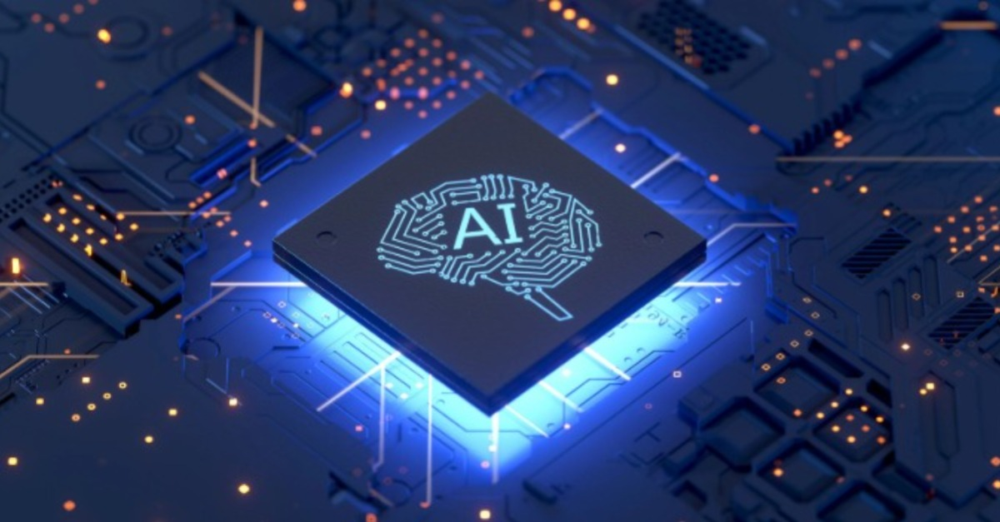

# Edge-AI Notes

## Overview

Edge-AI core concepts for real-world applications.



Src: [Qualcomm](https://academy.qualcomm.com/course-catalog/AI-Hub-Training)

## Learning Guideline 

```
│   edge-ai-guide.md
│
├───resources
│       2403.02619v3.pdf
│       Edge-AI-Frameworks.pdf
│       additional-materials.md
│       Deploying machine learning models on the edge Presentation.pdf
│
├───concepts
│       edge-ai-core-concepts-intermediate.md
│       edge-ai-core-concepts-advanced.md
│       edge-ai-core-concepts-basics.md
│
├───examples
│       implementation.md
│
└───industry-applications
        industry-links.md
```
## Related Notes
- [Embedded-AI - Notes](../../embedded-systems/embedded-ai-notes/)

## References

- [Microsoft AI@Edge Community](https://microsoft.github.io/ai-at-edge/)
- [Microsoft Open Source ](https://opensource.microsoft.com/)
- [What Is Edge AI and How Does It Work?](https://blogs.nvidia.com/blog/2022/02/17/what-is-edge-ai/)
- [On-Device Machine Learning - Google Developers](https://developers.google.com/learn/topics/on-device-ml)


