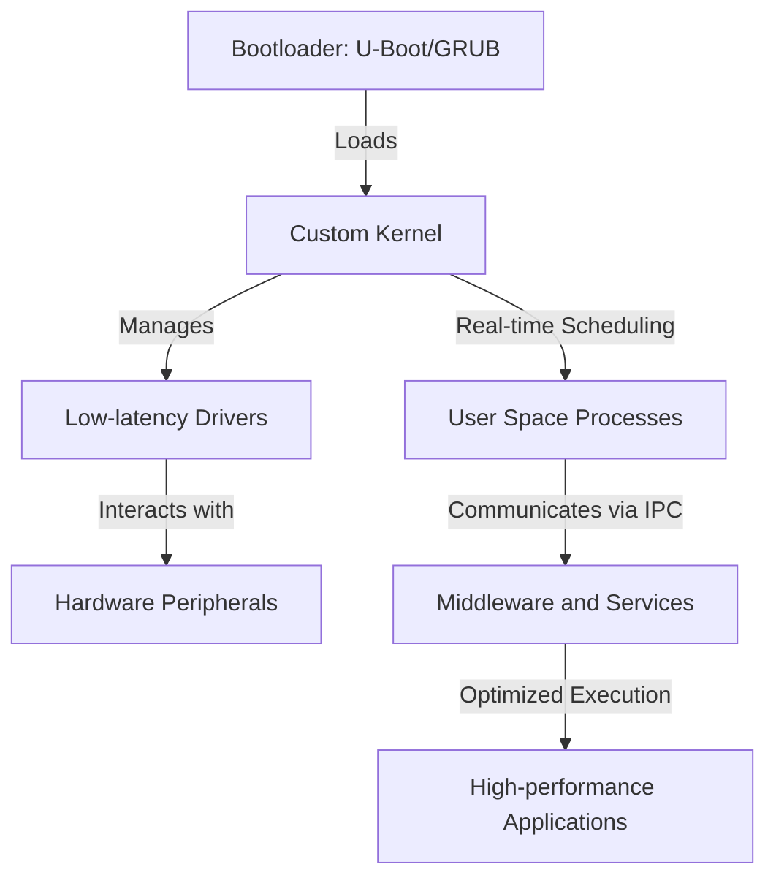

# Embedded Linux Technical Notes

<!-- [Long and descriptive prompt description of image in rectangular format] -->

## Quick Reference

- One-sentence definition: Embedded Linux is a customizable, scalable, and performance-optimized Linux distribution designed for constrained embedded environments, requiring advanced tuning and real-time considerations.
- Key use cases: Autonomous vehicles, aerospace systems, industrial automation, high-performance networking.
- Prerequisites: Deep understanding of Linux kernel internals, real-time systems, cross-compilation, and embedded hardware.

## Table of Contents

- [Introduction](#introduction)
    - [What](#what)
    - [Why](#why)
    - [Where](#where)
- [Core Concepts](#core-concepts)
    - [Fundamental Understanding](#fundamental-understanding)
    - [Visual Architecture](#visual-architecture)
- [Implementation Details](#implementation-details)
    - [Advanced Topics](#advanced-topics)
- [Real-World Applications](#real-world-applications)
    - [Industry Examples](#industry-examples)
    - [Hands-On Project](#hands-on-project)
- [Tools & Resources](#tools--resources)
    - [Essential Tools](#essential-tools)
    - [Learning Resources](#learning-resources)
- [References](#references)
- [Appendix](#appendix)

## Introduction

### What

Embedded Linux is an adaptation of the Linux operating system optimized for high-performance embedded applications, offering real-time capabilities, security, and extensive driver support.

### Why

It provides an open-source, flexible, and cost-effective alternative to proprietary RTOS solutions while enabling customization for mission-critical applications.

### Where

Used in avionics, autonomous robotics, industrial edge computing, medical imaging, and 5G networking infrastructure.

## Core Concepts

### Fundamental Understanding

- Kernel customization: Low-latency patches, real-time scheduling, kernel module tuning.
- System optimization: Minimizing memory footprint, reducing boot time below 1 second, power management techniques.
- Security considerations: Secure boot, trusted execution environments (TEE), kernel hardening.
- Common misconceptions: Preempt-RT alone does not make Linux fully deterministic; real-time behavior depends on hardware and software co-design.

### Visual Architecture



## Implementation Details

### Advanced Topics [Advanced]

```bash
# Example: Enabling full real-time capabilities with PREEMPT_RT
cd linux-src
git apply patches/rt.patch
make ARCH=arm64 CROSS_COMPILE=aarch64-linux-gnu- menuconfig
# Enable CONFIG_PREEMPT_RT, disable unneeded kernel features
make ARCH=arm64 CROSS_COMPILE=aarch64-linux-gnu- -j8
make modules_install INSTALL_MOD_PATH=<target_rootfs>

```

- System design: Deterministic scheduling strategies, kernel bypass techniques, FPGA offloading.
- Optimization techniques: Lock-free algorithms, NUMA awareness, IPC performance tuning.
- Production considerations: OTA updates, containerized embedded deployments, long-term support (LTS) kernel strategies.

## Real-World Applications

### Industry Examples

- Aerospace: Real-time Linux for avionics and satellite communication.
- Automotive: AUTOSAR-compliant Linux for ADAS and infotainment systems.
- Edge Computing: Industrial control systems with AI acceleration.

### Hands-On Project

- Project goals: Build an ultra-low-latency Embedded Linux system with real-time constraints.
- Implementation steps: Patch and optimize the kernel, configure a real-time scheduler, profile system performance.
- Validation methods: Benchmarking kernel latency, analyzing IPC overhead, stress-testing workloads.

## Tools & Resources

### Essential Tools

- Development environment: Yocto, Buildroot, OpenEmbedded, ELBE.
- Key frameworks: PREEMPT_RT, Xenomai, LTTng for tracing.
- Testing tools: Ftrace for debugging latency, cyclictest for RT performance validation.

### Learning Resources

- Documentation: Real-time Linux project, kernel.org, ELISA Project.
- Tutorials: Advanced kernel debugging techniques, Linux Foundation courses.
- Community resources: Linux kernel mailing lists, OpenEmbedded forums.

## References

- Official documentation: Kernel.org, Yocto Project.
- Technical papers: Research on hard real-time Linux performance.
- Industry standards: IEC 61508, DO-178C for safety-critical systems.

## Appendix

- Glossary: Definitions of advanced Linux kernel and real-time terms.
- Setup guides: Cross-compilation toolchain for real-time Linux.
- Code templates: Preempt-RT kernel configuration, secure boot setup.