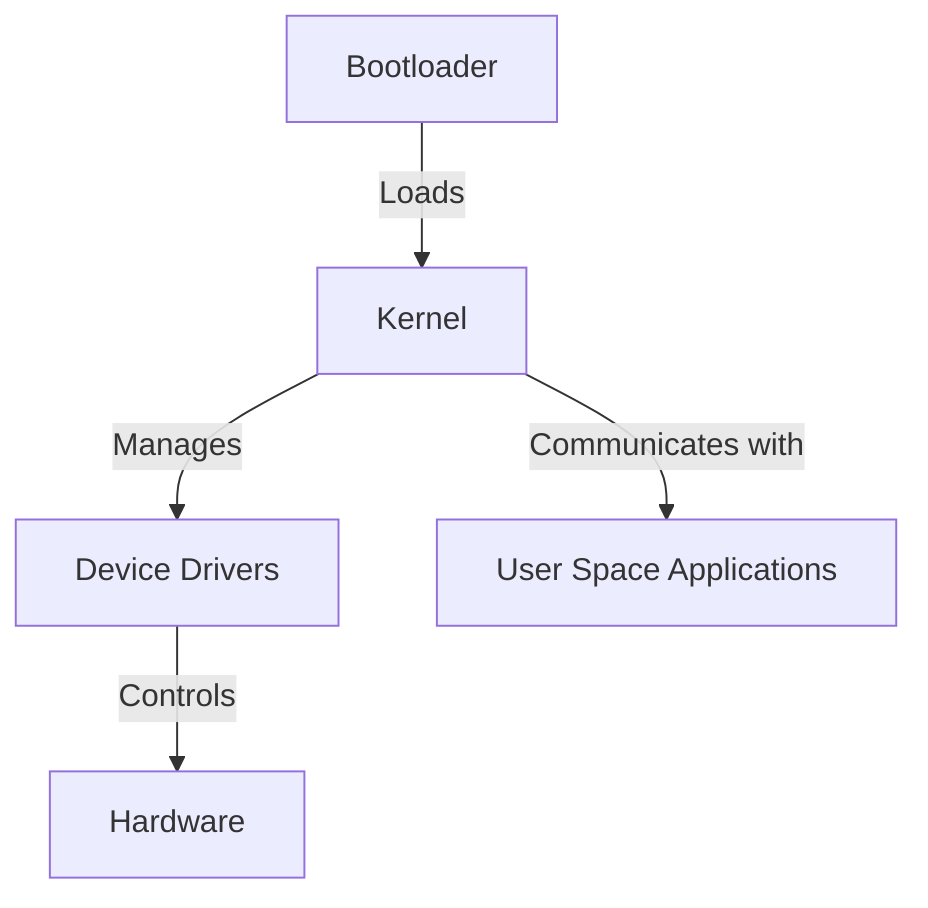

# Embedded Linux Technical Notes

<!-- [Long and descriptive prompt description of image in rectangular format] -->

## Quick Reference

- One-sentence definition: Embedded Linux is a specialized version of the Linux operating system designed for use in embedded systems, offering flexibility, scalability, and open-source support.
- Key use cases: IoT devices, industrial automation, consumer electronics, automotive systems.
- Prerequisites: Basic understanding of operating systems and Linux command-line interface.

## Table of Contents

- [Introduction](#introduction)
    - [What](#what)
    - [Why](#why)
    - [Where](#where)
- [Core Concepts](#core-concepts)
    - [Fundamental Understanding](#fundamental-understanding)
    - [Visual Architecture](#visual-architecture)
- [Implementation Details](#implementation-details)
    - [Basic Implementation](#basic-implementation)
- [Real-World Applications](#real-world-applications)
    - [Industry Examples](#industry-examples)
    - [Hands-On Project](#hands-on-project)
- [Tools & Resources](#tools--resources)
    - [Essential Tools](#essential-tools)
    - [Learning Resources](#learning-resources)
- [References](#references)
- [Appendix](#appendix)

## Introduction

### What

Embedded Linux is a streamlined version of Linux optimized for embedded systems, balancing resource efficiency with robust functionality.

### Why

It provides a cost-effective, open-source alternative to proprietary real-time operating systems, enabling customization and community support.

### Where

Used in automotive infotainment systems, medical devices, network routers, robotics, and more.

## Core Concepts

### Fundamental Understanding

- Basic principles: Linux kernel, bootloaders, device drivers, user-space applications.
- Key components: Kernel, root filesystem, bootloader (U-Boot), libraries.
- Common misconceptions: Embedded Linux is not the same as a real-time OS; requires careful optimization for constrained environments.

### Visual Architecture



## Implementation Details

### Basic Implementation [Beginner]

```bash
# Example: Cross-compiling a simple program for an embedded Linux target
gcc -o hello hello.c --sysroot=<target_sysroot>

```

- Step-by-step setup: Setting up a cross-compilation environment.
- Code walkthrough: Understanding basic compilation and execution on an embedded device.
- Common pitfalls: Library mismatches, incorrect toolchain configurations.

## Real-World Applications

### Industry Examples

- Consumer Electronics: Smart TVs, digital cameras.
- Industrial Automation: PLCs running Linux-based control software.
- Automotive: Infotainment systems, vehicle telemetry.

### Hands-On Project

- Project goals: Build a simple embedded Linux application.
- Implementation steps: Set up a cross-compiler, write and compile a program, deploy to a target.
- Validation methods: Running the application and verifying system behavior.

## Tools & Resources

### Essential Tools

- Development environment: GCC, Buildroot, Yocto.
- Key frameworks: BusyBox, systemd.
- Testing tools: GDB, strace.

### Learning Resources

- Documentation: Linux kernel docs, Yocto project guides.
- Tutorials: Online courses, embedded Linux books.
- Community resources: Linux mailing lists, open-source forums.

## References

- Official documentation: Kernel.org, Yocto Project docs.
- Technical papers: Research on embedded Linux performance.
- Industry standards: POSIX compliance, real-time extensions.

## Appendix

- Glossary: Definitions of key embedded Linux terms.
- Setup guides: How to install cross-compilation tools.
- Code templates: Sample embedded Linux applications.