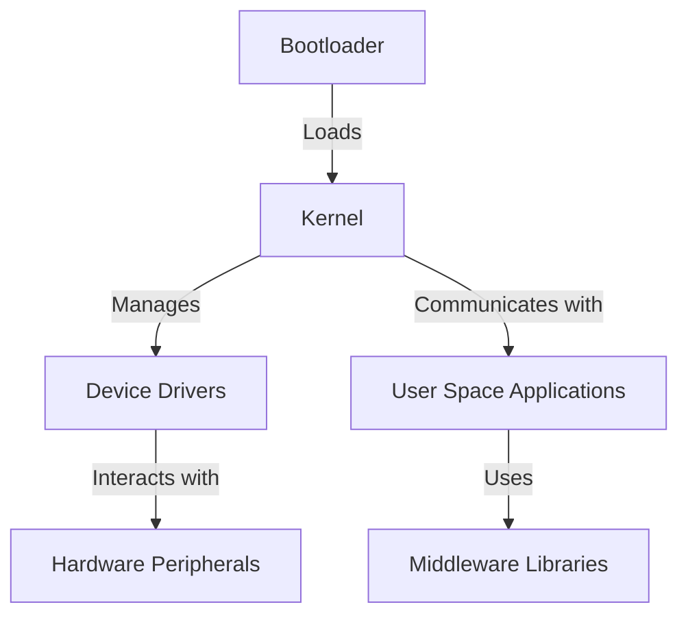

# Embedded Linux Technical Notes

<!-- [Long and descriptive prompt description of image in rectangular format] -->

## Quick Reference

- One-sentence definition: Embedded Linux is a lightweight and customizable Linux distribution optimized for embedded systems, balancing performance, flexibility, and real-time constraints.
- Key use cases: IoT devices, industrial automation, robotics, networking equipment, automotive systems.
- Prerequisites: Familiarity with Linux internals, shell scripting, and basic embedded system concepts.

## Table of Contents

- [Introduction](#introduction)
    - [What](#what)
    - [Why](#why)
    - [Where](#where)
- [Core Concepts](#core-concepts)
    - [Fundamental Understanding](#fundamental-understanding)
    - [Visual Architecture](#visual-architecture)
- [Implementation Details](#implementation-details)
    - [Intermediate Patterns](#intermediate-patterns)
- [Real-World Applications](#real-world-applications)
    - [Industry Examples](#industry-examples)
    - [Hands-On Project](#hands-on-project)
- [Tools & Resources](#tools--resources)
    - [Essential Tools](#essential-tools)
    - [Learning Resources](#learning-resources)
- [References](#references)
- [Appendix](#appendix)

## Introduction

### What

Embedded Linux is an adaptation of Linux for resource-constrained embedded devices, offering modularity, open-source community support, and extensive hardware compatibility.

### Why

It enables developers to build scalable and secure embedded solutions with lower development costs compared to proprietary real-time operating systems.

### Where

Used in industrial control systems, medical devices, networking infrastructure, and autonomous systems.

## Core Concepts

### Fundamental Understanding

- Key principles: Kernel customization, real-time patches, device tree configurations.
- Core components: Bootloaders (U-Boot), kernel modules, root filesystem (Buildroot/Yocto), middleware.
- Common misconceptions: Embedded Linux does not guarantee real-time behavior by default; requires additional tuning and configuration.

### Visual Architecture



## Implementation Details

### Intermediate Patterns [Intermediate]

```bash
# Example: Configuring and compiling a custom Linux kernel for an embedded board
make ARCH=arm CROSS_COMPILE=arm-linux-gnueabi- menuconfig
make ARCH=arm CROSS_COMPILE=arm-linux-gnueabi- -j4
make ARCH=arm CROSS_COMPILE=arm-linux-gnueabi- modules_install INSTALL_MOD_PATH=<target_rootfs>

```

- Design patterns: Modular kernel builds, minimalistic root filesystems, secure boot strategies.
- Best practices: Optimizing power consumption, reducing boot time, managing firmware updates.
- Performance considerations: Enabling kernel preemption, using real-time extensions (PREEMPT_RT), minimizing memory footprint.

## Real-World Applications

### Industry Examples

- Automotive: ECU firmware, ADAS software stacks.
- Industrial: PLCs, SCADA systems running Linux-based control loops.
- Networking: Embedded Linux in routers, firewalls, and VPN appliances.

### Hands-On Project

- Project goals: Build and optimize a minimal Embedded Linux distribution.
- Implementation steps: Configure Buildroot/Yocto, cross-compile a lightweight application, deploy on hardware.
- Validation methods: Benchmarking system boot time, analyzing memory usage.

## Tools & Resources

### Essential Tools

- Development environment: Yocto, Buildroot, OpenEmbedded.
- Key frameworks: Systemd, BusyBox, U-Boot.
- Testing tools: QEMU for virtualization, Perf for profiling, GDB for debugging.

### Learning Resources

- Documentation: Yocto Project docs, kernel.org resources.
- Tutorials: Online embedded Linux workshops, training courses.
- Community resources: OpenEmbedded forums, kernel mailing lists.

## References

- Official documentation: Kernel.org, Yocto Project.
- Technical papers: Research on real-time Linux performance.
- Industry standards: POSIX compliance, safety-critical Linux extensions.

## Appendix

- Glossary: Definitions of key embedded Linux terms.
- Setup guides: How to install and configure Yocto/Buildroot.
- Code templates: Sample Linux kernel configuration and bootloader setup.