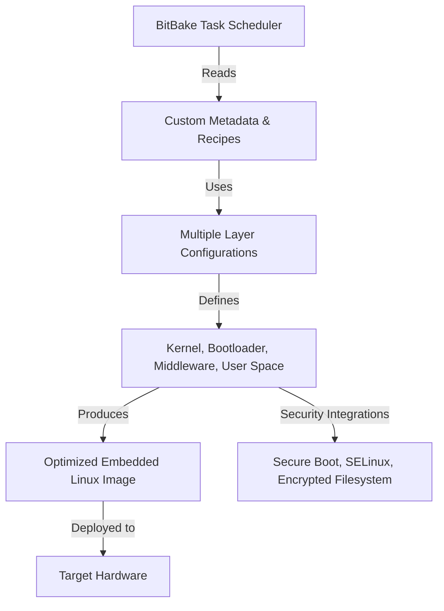

# Yocto Technical Notes
[Long and descriptive prompt description of image in rectangular format]

## Quick Reference
- One-sentence definition: Yocto is a flexible, open-source build system used to create highly customizable, optimized Linux distributions for embedded systems.
- Key use cases: Advanced embedded Linux development, BSP (Board Support Package) customization, real-time Linux implementations, large-scale deployment optimization.
- Prerequisites: Strong understanding of Linux internals, kernel customization, cross-compilation, build system architecture, and experience with Yocto fundamentals.

## Table of Contents
- [Introduction](#introduction)
    - [What](#what)
    - [Why](#why)
    - [Where](#where)
- [Core Concepts](#core-concepts)
    - [Fundamental Understanding](#fundamental-understanding)
    - [Visual Architecture](#visual-architecture)
- [Implementation Details](#implementation-details)
    - [Advanced Topics](#advanced-topics)
- [Real-World Applications](#real-world-applications)
    - [Industry Examples](#industry-examples)
    - [Hands-On Project](#hands-on-project)
- [Tools & Resources](#tools--resources)
- [References](#references)
- [Appendix](#appendix)

## Introduction
### What
Yocto provides a highly modular and scalable framework to build customized Linux distributions for embedded systems, supporting BSP development, security hardening, and real-time applications.

### Why
- Enables fine-grained control over system components.
- Optimizes resource usage for embedded devices.
- Supports production-grade reliability, security, and compliance.
- Enhances scalability and maintainability for large-scale deployments.

### Where
Widely used in aerospace, industrial automation, autonomous systems, telecommunications, and automotive industries.

## Core Concepts
### Fundamental Understanding
- **BitBake Advanced Usage**: Customizing task execution, creating multi-stage builds, and optimizing dependencies.
- **Custom Metadata & Layers**: Developing advanced Yocto layers for BSPs, security, and device drivers.
- **Kernel and Device Tree Customization**: Integrating custom patches and real-time capabilities.
- **Security Enhancements**: Implementing secure boot, SELinux, and verified boot mechanisms.
- **Common Misconceptions**: Yocto is not just a Linux distribution but a framework for building tailored distributions.

### Visual Architecture


## Implementation Details
### Advanced Topics [Advanced]
```bash
# Customizing BitBake Execution Order
bitbake -g core-image-full-cmdline && cat task-depends.dot | dot -Tpng -o task-dependencies.png

# Building an Optimized Kernel with Custom Patches
git clone git://git.yoctoproject.org/linux-yocto.git
cd linux-yocto
git checkout custom-branch
bitbake -c menuconfig virtual/kernel
bitbake -c compile virtual/kernel

# Enabling Secure Boot
bitbake -c menuconfig u-boot
bitbake -c compile u-boot
```
- **System design**: Creating multi-layer architecture for modularity and maintainability.
- **Optimization techniques**: Reducing build time, leveraging distributed compilation, and minimizing dependencies.
- **Production considerations**: Automating updates, integrating OTA mechanisms, and securing the boot process.

## Real-World Applications
### Industry Examples
- **Aerospace**: Real-time Linux for avionics and autonomous flight systems.
- **Automotive**: Optimized IVI (In-Vehicle Infotainment) stacks, ADAS (Advanced Driver Assistance Systems).
- **Industrial Automation**: Real-time kernel integration for precision control systems.

### Hands-On Project
- **Project goals**: Build a secure, real-time Yocto-based image with OTA updates.
- **Implementation steps**: Kernel patching, secure boot integration, and real-time scheduling.
- **Validation methods**: Performance profiling, security audits, and stress testing.

## Tools & Resources
### Essential Tools
- **Development environment**: Poky, OpenEmbedded, BitBake advanced debugging.
- **Key frameworks**: meta-security, meta-virtualization, meta-rt.
- **Testing tools**: LTTng, Ftrace, Perf for profiling and debugging.

### Learning Resources
- **Documentation**: Yocto Project Mega Manual, OpenEmbedded best practices.
- **Tutorials**: Advanced BitBake scripting, kernel customization.
- **Community resources**: Yocto mailing lists, embedded Linux conferences.

## References
- **Official documentation**: Yocto Project, OpenEmbedded.
- **Technical papers**: Research on build system optimization.
- **Industry standards**: Linux Foundation, Automotive Grade Linux compliance.

## Appendix
- **Glossary**: Definitions of advanced Yocto concepts.
- **Setup guides**: Steps for distributed builds and CI/CD integration.
- **Code templates**: Example advanced BitBake recipes, secure boot setup.

