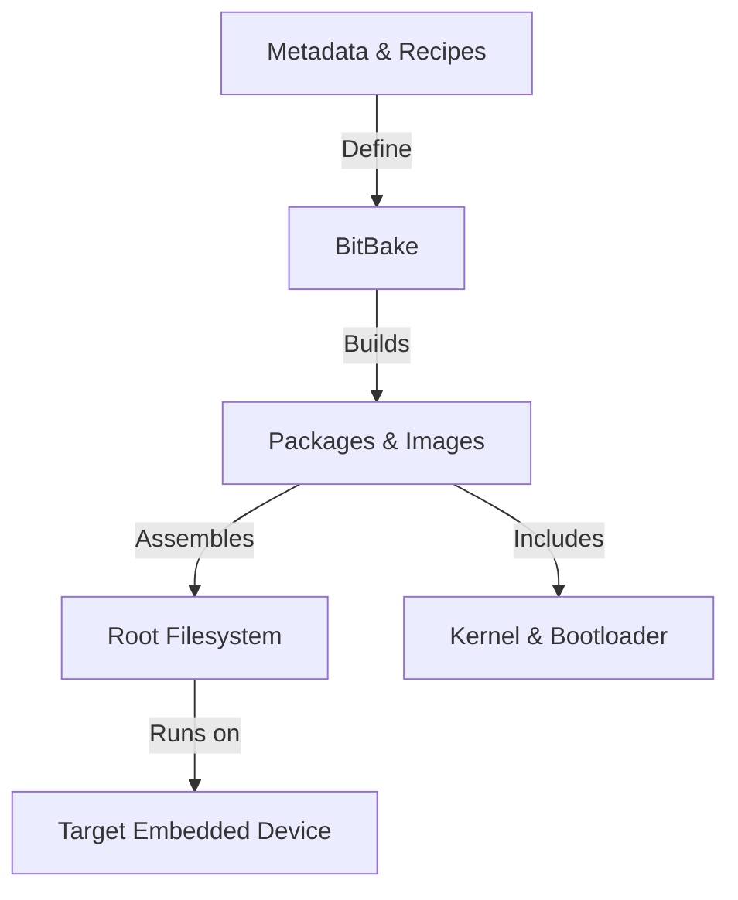

# Yocto Technical Notes
[Long and descriptive prompt description of image in rectangular format]

## Quick Reference
- One-sentence definition: Yocto is an open-source project that provides tools and templates to create custom Linux distributions for embedded systems.
- Key use cases: Embedded Linux development, custom OS builds, BSP (Board Support Package) creation.
- Prerequisites: Basic understanding of Linux, command-line tools, and cross-compilation.

## Table of Contents
- [Introduction](#introduction)
- [Core Concepts](#core-concepts)
    - [Fundamental Understanding](#fundamental-understanding)
    - [Visual Architecture](#visual-architecture)
- [Implementation Details](#implementation-details)
    - [Basic Implementation](#basic-implementation)
- [Real-World Applications](#real-world-applications)
    - [Industry Examples](#industry-examples)
    - [Hands-On Project](#hands-on-project)
- [Tools & Resources](#tools--resources)
- [References](#references)
- [Appendix](#appendix)

## Introduction
### What
Yocto is a build system that helps developers create tailored Linux distributions for embedded devices using metadata, recipes, and layers.

### Why
It simplifies embedded Linux development by providing a modular, reproducible, and scalable approach to building custom OS images.

### Where
Used in IoT devices, automotive infotainment systems, industrial automation, and networking appliances.

## Core Concepts
### Fundamental Understanding
- **BitBake**: Task execution engine for building software packages.
- **Metadata and Recipes**: Defines how software components are built and configured.
- **Layers**: Modular approach for organizing build components and board support.
- **Common misconceptions**: Yocto is not a Linux distribution; it is a framework for creating one.

### Visual Architecture


## Implementation Details
### Basic Implementation [Beginner]
```bash
# Setting up Yocto build environment
mkdir yocto-project && cd yocto-project
git clone git://git.yoctoproject.org/poky.git
git checkout kirkstone # Example: Select a release version
cd poky
source oe-init-build-env
bitbake core-image-minimal
```
- **Step-by-step setup**: Install dependencies, configure build environment.
- **Code walkthrough**: Understanding BitBake execution flow.
- **Common pitfalls**: Long build times, missing dependencies, layer compatibility issues.

## Real-World Applications
### Industry Examples
- Automotive: Custom Linux for infotainment systems.
- IoT: Optimized firmware for edge devices.
- Industrial: Secure, minimal Linux images for factory automation.

### Hands-On Project
- **Project goals**: Build a minimal Yocto-based Linux image for a Raspberry Pi.
- **Implementation steps**: Configure BSP layers, build a bootable SD card image.
- **Validation methods**: Boot testing, package verification.

## Tools & Resources
### Essential Tools
- **Development environment**: Yocto Project, Poky, BitBake.
- **Key frameworks**: OpenEmbedded, meta layers.
- **Testing tools**: QEMU for simulation, devshell debugging.

### Learning Resources
- **Documentation**: Yocto Project Reference Manual, OpenEmbedded Wiki.
- **Tutorials**: Beginner-friendly guides on custom image creation.
- **Community resources**: Yocto mailing lists, forums, and Discord channels.

## References
- **Official documentation**: Yocto Project website.
- **Technical papers**: Research on embedded Linux build automation.
- **Industry standards**: Yocto compliance with OpenEmbedded and Linux Foundation guidelines.

## Appendix
- **Glossary**: Definitions of key Yocto terms.
- **Setup guides**: Steps for host machine setup.
- **Code templates**: Example BitBake recipes and layer configurations.

