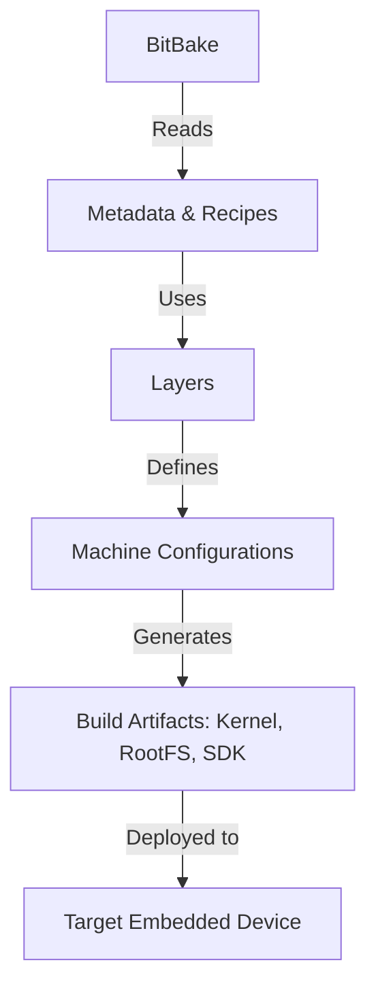

# Yocto Technical Notes
[Long and descriptive prompt description of image in rectangular format]

## Quick Reference
- One-sentence definition: Yocto is an open-source build system used to create custom Linux distributions for embedded systems, leveraging a layer-based approach.
- Key use cases: Embedded Linux development, custom OS builds, BSP (Board Support Package) creation, cross-compilation.
- Prerequisites: Understanding of Linux systems, command-line tools, cross-compilation, basic Yocto knowledge.

## Table of Contents
- [Introduction](#introduction)
    - [What](#what)
    - [Why](#why)
    - [Where](#where)
- [Core Concepts](#core-concepts)
    - [Fundamental Understanding](#fundamental-understanding)
    - [Visual Architecture](#visual-architecture)
- [Implementation Details](#implementation-details)
    - [Intermediate Patterns](#intermediate-patterns)
- [Real-World Applications](#real-world-applications)
    - [Industry Examples](#industry-examples)
    - [Hands-On Project](#hands-on-project)
- [Tools & Resources](#tools--resources)
- [References](#references)
- [Appendix](#appendix)

## Introduction
### What
Yocto is a build system designed for developers who need to create customized Linux distributions optimized for embedded devices. It uses metadata, recipes, and layers to provide a flexible and reproducible build process.

### Why
- Facilitates reproducible builds for embedded systems.
- Modular approach enables customization and scalability.
- Standardized workflow simplifies collaboration across teams.

### Where
Used in industrial automation, networking, automotive, medical devices, and IoT solutions where a tailored Linux environment is required.

## Core Concepts
### Fundamental Understanding
- **BitBake**: Task scheduler for building packages and images.
- **Metadata & Recipes**: Define package sources, dependencies, and build instructions.
- **Layers**: Provide modularity, allowing custom board support and configurations.
- **Machine Configuration**: Defines hardware-specific settings.
- **Package Groups**: Used to bundle related software packages together.
- **Common misconceptions**: Yocto is not a Linux distribution but a framework to create one.

### Visual Architecture


## Implementation Details
### Intermediate Patterns [Intermediate]
```bash
# Setting up Yocto build environment
git clone git://git.yoctoproject.org/poky.git
git checkout kirkstone
cd poky
source oe-init-build-env

# Adding a custom layer
git clone https://github.com/meta-custom-layer.git ../meta-custom
bitbake-layers add-layer ../meta-custom

# Building an image with custom layer
bitbake core-image-full-cmdline
```
- **Design patterns**: Best practices for managing layers, recipes, and machine configurations.
- **Best practices**: Using local.conf, customizing image.bb, and handling dependencies efficiently.
- **Performance considerations**: Optimizing build cache, leveraging shared state (sstate), and incremental builds.

## Real-World Applications
### Industry Examples
- **Automotive**: Custom Linux builds for infotainment and ADAS.
- **IoT & Edge Computing**: Lightweight, optimized firmware for resource-constrained devices.
- **Networking**: Router and switch firmware with specific kernel modifications.

### Hands-On Project
- **Project goals**: Create a custom Yocto-based image with additional software packages.
- **Implementation steps**: Define new layers, create recipes, modify local.conf.
- **Validation methods**: Boot testing, debugging with devshell, package verification.

## Tools & Resources
### Essential Tools
- **Development environment**: Poky, BitBake, OpenEmbedded.
- **Key frameworks**: meta-openembedded, meta-yocto-bsp.
- **Testing tools**: QEMU for simulation, devshell for debugging.

### Learning Resources
- **Documentation**: Yocto Project Reference Manual, OpenEmbedded Wiki.
- **Tutorials**: Guides on advanced BitBake and layer management.
- **Community resources**: Yocto mailing lists, Discord, and meta layers repositories.

## References
- **Official documentation**: Yocto Project and OpenEmbedded.
- **Technical papers**: Research on Linux build automation.
- **Industry standards**: Linux Foundation and OpenEmbedded compliance.

## Appendix
- **Glossary**: Definitions of key Yocto terms.
- **Setup guides**: Steps for host machine configuration.
- **Code templates**: Example BitBake recipes, layer structures.

