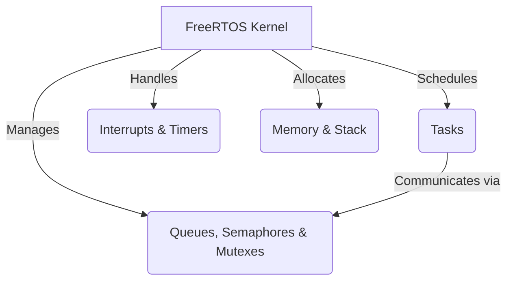

# FreeRTOS Technical Notes
<!-- [A detailed block diagram showing FreeRTOS real-time scheduling, memory management strategies, inter-task communication, and hardware abstraction layers.] -->

## Quick Reference
- **One-sentence definition**: FreeRTOS is an open-source real-time operating system (RTOS) that provides **deterministic scheduling, inter-task communication, and resource management** for embedded systems.
- **Key use cases**: Industrial automation, automotive ECUs, real-time sensor fusion, robotics, and mission-critical IoT applications.
- **Prerequisites**: Strong understanding of embedded systems, real-time constraints, C programming, RTOS fundamentals, and low-level hardware interaction.

## Table of Contents
1. [Introduction](#introduction)
2. [Core Concepts](#core-concepts)
    - [Advanced FreeRTOS Architecture](#advanced-freertos-architecture)
    - [Advanced Task Scheduling](#advanced-task-scheduling)
    - [Memory Management & Optimization](#memory-management--optimization)
    - [Inter-Task Communication Mechanisms](#inter-task-communication-mechanisms)
3. [Visual Architecture](#visual-architecture)
4. [Implementation Details](#implementation-details)
    - [High-Performance Task Synchronization](#high-performance-task-synchronization)
    - [Real-Time Constraints & Deterministic Execution](#real-time-constraints--deterministic-execution)
    - [Advanced Power Management Techniques](#advanced-power-management-techniques)
5. [Real-World Applications](#real-world-applications)
    - [Industry Examples](#industry-examples)
    - [Hands-On Project](#hands-on-project)
6. [Tools & Resources](#tools--resources)
7. [References](#references)
8. [Appendix](#appendix)

## Introduction
- **What**: FreeRTOS is a modular and configurable **RTOS kernel** optimized for **low-latency and high-reliability** embedded applications.
- **Why**: It provides **real-time deterministic execution**, efficient **task scheduling**, and robust **inter-task communication** mechanisms essential for **time-sensitive and mission-critical** applications.
- **Where**: Used in **automotive ECUs, industrial automation, robotics, aerospace, and medical systems**.

## Core Concepts
### Advanced FreeRTOS Architecture
- **Real-time kernel components**: Preemptive scheduler, task prioritization, IPC mechanisms, and system tick management.
- **Interrupt latency and real-time performance tuning**.
- **Tickless idle mode for ultra-low power applications**.
- **Multi-core FreeRTOS execution and asymmetric multiprocessing (AMP/SMP) considerations**.

### Advanced Task Scheduling
- **Fixed-priority preemptive scheduling with priority inheritance**.
- **Rate-monotonic vs. earliest-deadline-first (EDF) scheduling**.
- **Real-time task profiling and optimization**.
- **Interrupt-safe task management**.

### Memory Management & Optimization
- **Dynamic vs. static memory allocation trade-offs**.
- **Custom heap memory management (heap_4 and heap_5)**.
- **Memory fragmentation mitigation strategies**.
- **Stack depth analysis and overflow detection mechanisms**.

### Inter-Task Communication Mechanisms
- **Priority inversion prevention using mutexes and priority inheritance**.
- **Zero-copy message queues for high-performance IPC**.
- **Direct task notifications vs. event groups for synchronization**.
- **Shared memory management and cache coherence strategies**.

## Visual Architecture


## Implementation Details
### High-Performance Task Synchronization
```c
#include "FreeRTOS.h"
#include "task.h"
#include "semphr.h"

SemaphoreHandle_t xMutex;

void CriticalTask(void *pvParameters) {
    while (1) {
        if (xSemaphoreTake(xMutex, pdMS_TO_TICKS(100))) {
            printf("Executing high-priority critical section\n");
            xSemaphoreGive(xMutex);
        }
        vTaskDelay(pdMS_TO_TICKS(10));
    }
}

void BackgroundTask(void *pvParameters) {
    while (1) {
        printf("Low-priority task executing\n");
        vTaskDelay(pdMS_TO_TICKS(50));
    }
}

int main() {
    xMutex = xSemaphoreCreateMutex();
    xTaskCreate(CriticalTask, "CriticalTask", configMINIMAL_STACK_SIZE, NULL, 3, NULL);
    xTaskCreate(BackgroundTask, "BackgroundTask", configMINIMAL_STACK_SIZE, NULL, 1, NULL);
    vTaskStartScheduler();
    while (1);
}
```
- **Task priority tuning for latency-sensitive tasks**.
- **Ensuring atomic access to shared resources using mutexes**.
- **Analyzing performance using FreeRTOS trace tools**.

### Real-Time Constraints & Deterministic Execution
- **Worst-case execution time (WCET) estimation**.
- **Latency measurement using FreeRTOS+Trace and SystemView**.
- **Optimizing interrupt latency and response time**.
- **Avoiding deadlocks and priority inversions in real-time systems**.

### Advanced Power Management Techniques
- **Tickless idle mode implementation**.
- **Dynamic power scaling based on task load**.
- **Optimizing CPU sleep modes while maintaining task responsiveness**.
- **Balancing real-time performance with low-power operation**.

## Real-World Applications
### Industry Examples
- **Automotive ECUs**: Real-time control of vehicle subsystems (e.g., engine management, ADAS).
- **Aerospace**: Reliable avionics software with deterministic execution.
- **Robotics**: Multi-threaded sensor fusion and motion control.
- **Industrial Automation**: PLCs running real-time process control loops.

### Hands-On Project
**High-Performance Sensor Fusion System**
- **Project goals**: Develop a real-time sensor fusion system using FreeRTOS.
- **Implementation steps**:
  1. Create multiple tasks for **sensor acquisition, filtering, and data fusion**.
  2. Implement **priority-based scheduling and preemptive execution**.
  3. Use **zero-copy message queues** for high-speed data transfer.
- **Validation methods**: Measure latency, execution time, and power consumption.

## Tools & Resources
### Essential Tools
- **Development environment**: ARM Keil, IAR Embedded Workbench, GCC.
- **Key frameworks**: FreeRTOS+POSIX, FreeRTOS+TCP, FreeRTOS-SMP.
- **Debugging tools**: FreeRTOS+Trace, Segger SystemView, Percepio Tracealyzer.

### Learning Resources
- [FreeRTOS Official Documentation](https://www.freertos.org/)
- [FreeRTOS Kernel API Reference](https://www.freertos.org/a00106.html)
- [Real-Time Embedded Systems Books]

## References
- [FreeRTOS Advanced Topics](https://www.freertos.org/)
- [FreeRTOS SMP Support](https://www.freertos.org/smp-symmetrical-multiprocessing.html)
- [Technical Papers on RTOS Scheduling]

## Appendix
- **Glossary**: Definitions of key FreeRTOS terms.
- **Advanced debugging guides**.
- **Code templates** for real-time task scheduling and optimization.

