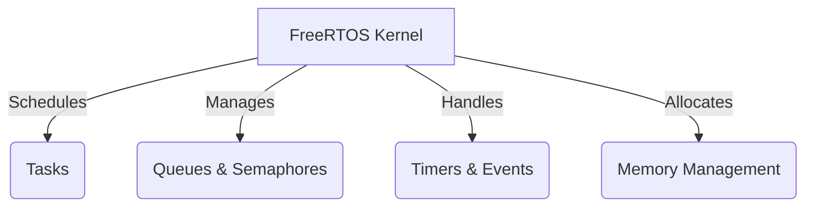

# FreeRTOS Technical Notes
<!-- [A simple block diagram showing FreeRTOS task scheduling, inter-task communication, and basic memory management.] -->

## Quick Reference
- **One-sentence definition**: FreeRTOS is a **lightweight real-time operating system** designed for embedded systems, offering task scheduling, inter-task communication, and memory management.
- **Key use cases**: IoT devices, industrial automation, automotive systems, robotics, and medical devices.
- **Prerequisites**: Basic understanding of embedded systems and C programming.

## Table of Contents
1. [Introduction](#introduction)
2. [Core Concepts](#core-concepts)
    - [FreeRTOS Architecture](#freertos-architecture)
    - [Task Management](#task-management)
    - [Scheduling Policies](#scheduling-policies)
    - [Inter-Task Communication](#inter-task-communication)
    - [Memory Management](#memory-management)
3. [Visual Architecture](#visual-architecture)
4. [Implementation Details](#implementation-details)
    - [Basic Task Creation](#basic-task-creation)
    - [Synchronization Techniques](#synchronization-techniques)
5. [Real-World Applications](#real-world-applications)
    - [Industry Examples](#industry-examples)
    - [Hands-On Project](#hands-on-project)
6. [Tools & Resources](#tools--resources)
7. [References](#references)
8. [Appendix](#appendix)

## Introduction
- **What**: FreeRTOS is an **open-source real-time operating system** that provides lightweight multitasking for embedded applications.
- **Why**: It enables **efficient task scheduling, real-time responsiveness, and resource optimization** in constrained environments.
- **Where**: Used in **IoT, robotics, automotive control units, and industrial automation**.

## Core Concepts
### FreeRTOS Architecture
- **Kernel components**: Scheduler, tasks, queues, semaphores, and timers.
- **Preemptive vs. cooperative scheduling**.
- **Tick interrupts and context switching**.

### Task Management
- **Creating and deleting tasks**.
- **Task priorities and state transitions**.
- **Idle task and watchdog timer**.

### Scheduling Policies
- **Preemptive scheduling**: Tasks run based on priority.
- **Time slicing**: Fair CPU sharing among equal-priority tasks.
- **Round-robin scheduling**.

### Inter-Task Communication
- **Message queues**: Data transfer between tasks.
- **Semaphores**: Synchronization and resource sharing.
- **Mutexes**: Preventing race conditions.

### Memory Management
- **Heap management strategies**.
- **Stack overflow detection**.
- **Dynamic vs. static memory allocation**.

## Visual Architecture


## Implementation Details
### Basic Task Creation [Beginner]
```c
#include "FreeRTOS.h"
#include "task.h"
#include <stdio.h>

void TaskFunction(void *pvParameters) {
    while (1) {
        printf("Task running...\n");
        vTaskDelay(pdMS_TO_TICKS(1000)); // Delay for 1 second
    }
}

int main() {
    xTaskCreate(TaskFunction, "SimpleTask", configMINIMAL_STACK_SIZE, NULL, 1, NULL);
    vTaskStartScheduler();
    while (1);
}
```
- **Step-by-step setup**
- **Code walkthrough**
- **Common pitfalls (e.g., insufficient stack size, priority inversion)**

### Synchronization Techniques
- **Using semaphores for task synchronization**.
- **Mutexes for shared resource protection**.
- **Event groups for signaling between tasks**.

## Real-World Applications
### Industry Examples
- **IoT**: Sensor data acquisition and transmission.
- **Automotive**: Real-time control systems in ECUs.
- **Robotics**: Coordinated multi-task execution.

### Hands-On Project
**Basic IoT Sensor Data Logger**
- **Project goals**: Collect and log sensor data using FreeRTOS.
- **Implementation steps**:
  1. Create tasks for **sensor reading, data logging, and communication**.
  2. Use **queues for data transfer** between tasks.
  3. Implement **power-saving techniques**.
- **Validation methods**: Check real-time responsiveness and task execution order.

## Tools & Resources
### Essential Tools
- **Development environment**: GCC, Keil, IAR.
- **Key frameworks**: FreeRTOS Kernel, FreeRTOS+TCP.
- **Testing tools**: FreeRTOS Tracealyzer, Segger SystemView.

### Learning Resources
- [FreeRTOS Official Documentation](https://www.freertos.org/)
- [FreeRTOS Tutorials](https://www.freertos.org/RTOS.html)
- [Embedded Systems Books]

## References
- [FreeRTOS Kernel API](https://www.freertos.org/a00106.html)
- [FreeRTOS Best Practices](https://www.freertos.org/FAQHowTo.html)

## Appendix
- **Glossary**: Definitions of key FreeRTOS terms.
- **Setup guides**: How to configure FreeRTOS on different platforms.
- **Code templates**: Task creation and inter-task communication examples.

