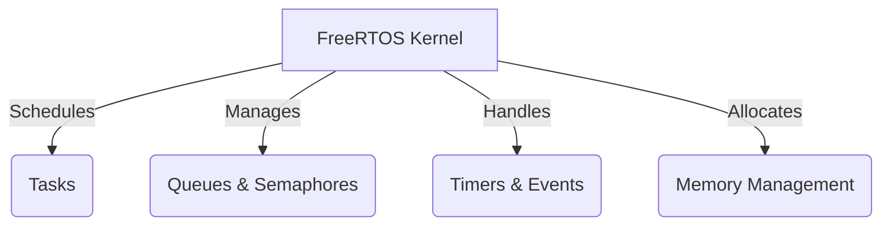

# FreeRTOS Technical Notes
<!-- [A block diagram showing FreeRTOS task scheduling, inter-task communication mechanisms, and memory management strategies.] -->

## Quick Reference
- **One-sentence definition**: FreeRTOS is an open-source real-time operating system designed for embedded systems, offering **preemptive multitasking, inter-task communication, and memory management**.
- **Key use cases**: IoT, industrial automation, automotive ECUs, robotics, and medical devices.
- **Prerequisites**: Understanding of embedded systems, C programming, and basic RTOS concepts.

## Table of Contents
1. [Introduction](#introduction)
2. [Core Concepts](#core-concepts)
    - [FreeRTOS Architecture](#freertos-architecture)
    - [Task Management & Scheduling](#task-management--scheduling)
    - [Inter-Task Communication](#inter-task-communication)
    - [Memory Management](#memory-management)
3. [Visual Architecture](#visual-architecture)
4. [Implementation Details](#implementation-details)
    - [Task Synchronization Techniques](#task-synchronization-techniques)
    - [Real-Time Constraints](#real-time-constraints)
    - [Power Management Techniques](#power-management-techniques)
5. [Real-World Applications](#real-world-applications)
    - [Industry Examples](#industry-examples)
    - [Hands-On Project](#hands-on-project)
6. [Tools & Resources](#tools--resources)
7. [References](#references)
8. [Appendix](#appendix)

## Introduction
- **What**: FreeRTOS is a lightweight **real-time operating system (RTOS)** for embedded applications, enabling **efficient task execution and resource management**.
- **Why**: It provides **deterministic task scheduling, low-latency communication, and modular design** for time-sensitive systems.
- **Where**: Used in **IoT devices, robotics, automotive control units, industrial automation, and medical systems**.

## Core Concepts
### FreeRTOS Architecture
- **Kernel components**: Scheduler, task management, queues, semaphores, and timers.
- **Preemptive vs. cooperative scheduling**.
- **Tick interrupts and context switching**.
- **Task states (Ready, Running, Blocked, Suspended, Deleted)**.

### Task Management & Scheduling
- **Creating and deleting tasks**.
- **Task priorities and preemption**.
- **Round-robin and priority-based scheduling**.
- **Idle task and watchdog integration**.
- **Task starvation and priority inversion handling**.

### Inter-Task Communication
- **Message queues**: Buffering and message passing.
- **Binary and counting semaphores**: Synchronization and event signaling.
- **Mutexes**: Avoiding resource conflicts and priority inversion.
- **Event groups**: Efficient task signaling.

### Memory Management
- **Heap management strategies** (heap_1 to heap_5).
- **Static vs. dynamic memory allocation**.
- **Stack overflow detection and handling**.
- **Optimizing memory usage for low-resource devices**.

## Visual Architecture


## Implementation Details
### Task Synchronization Techniques
```c
#include "FreeRTOS.h"
#include "task.h"
#include "semphr.h"

SemaphoreHandle_t xSemaphore;

void Task1(void *pvParameters) {
    while (1) {
        if (xSemaphoreTake(xSemaphore, portMAX_DELAY)) {
            printf("Task1 executing critical section\n");
            vTaskDelay(pdMS_TO_TICKS(500));
            xSemaphoreGive(xSemaphore);
        }
    }
}

void Task2(void *pvParameters) {
    while (1) {
        if (xSemaphoreTake(xSemaphore, portMAX_DELAY)) {
            printf("Task2 executing critical section\n");
            vTaskDelay(pdMS_TO_TICKS(500));
            xSemaphoreGive(xSemaphore);
        }
    }
}

int main() {
    xSemaphore = xSemaphoreCreateMutex();
    xTaskCreate(Task1, "Task1", configMINIMAL_STACK_SIZE, NULL, 2, NULL);
    xTaskCreate(Task2, "Task2", configMINIMAL_STACK_SIZE, NULL, 2, NULL);
    vTaskStartScheduler();
    while (1);
}
```
- **Synchronization techniques**: Using semaphores and mutexes.
- **Task execution order and debugging deadlocks**.

### Real-Time Constraints
- **Understanding worst-case execution time (WCET)**.
- **Configuring tick rate and priority tuning**.
- **Avoiding priority inversion using priority inheritance**.

### Power Management Techniques
- **Idle task and low-power modes**.
- **Reducing task execution overhead**.
- **Using tickless idle mode for power efficiency**.

## Real-World Applications
### Industry Examples
- **IoT**: Sensor data acquisition with low-power operation.
- **Automotive**: Managing multiple ECUs in real time.
- **Industrial Automation**: PLC control loops with precise timing.
- **Robotics**: Multi-tasking for motion control and vision processing.

### Hands-On Project
**Multi-Sensor Data Acquisition System**
- **Project goals**: Implement an RTOS-based system for sensor data acquisition and processing.
- **Implementation steps**:
  1. Create multiple tasks for **sensor reading, data logging, and communication**.
  2. Use **queues for data transfer** between tasks.
  3. Implement **priority-based scheduling**.
- **Validation methods**: Verify real-time response and event-driven behavior.

## Tools & Resources
### Essential Tools
- **Development environment**: GCC, Keil, IAR.
- **Key frameworks**: FreeRTOS+TCP, FreeRTOS+POSIX.
- **Testing tools**: FreeRTOS Tracealyzer, Segger SystemView.

### Learning Resources
- [FreeRTOS Official Documentation](https://www.freertos.org/)
- [FreeRTOS Tutorials](https://www.freertos.org/RTOS.html)
- [Real-Time Embedded Systems Books]

## References
- [FreeRTOS Kernel API](https://www.freertos.org/a00106.html)
- [FreeRTOS Best Practices](https://www.freertos.org/FAQHowTo.html)
- [Technical Papers on RTOS Scheduling]

## Appendix
- **Glossary**: Definitions of key FreeRTOS terms.
- **Setup guides**: How to configure FreeRTOS on different platforms.
- **Code templates**: Task creation, synchronization, and event handling examples.

