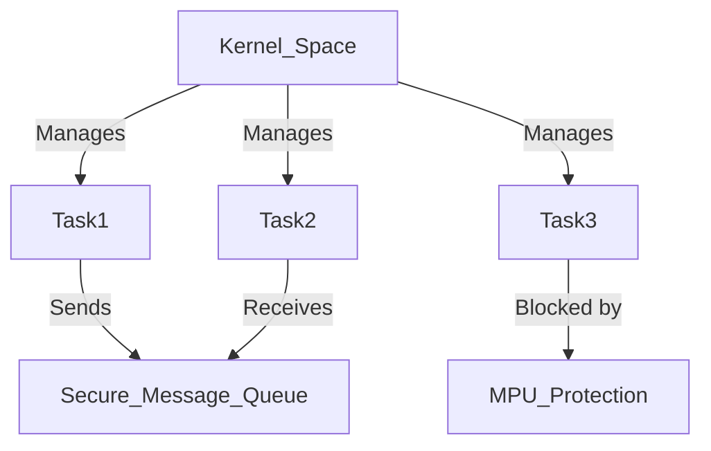
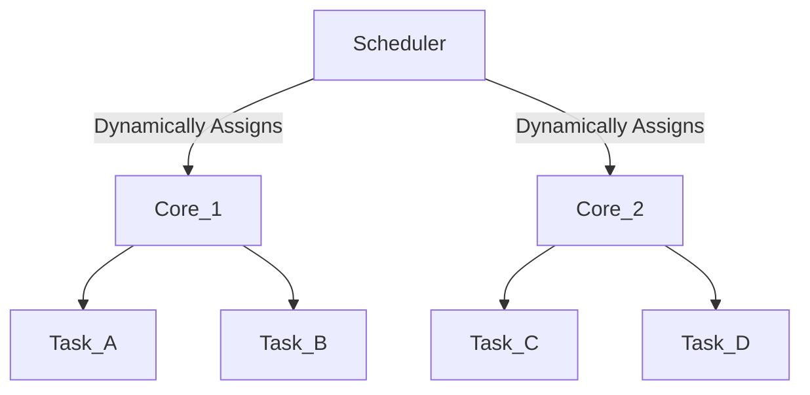

# PXROS Technical Notes (Advanced)  

## Quick Reference  
- **Definition**: PXROS (Protected eXecutive Real-Time Operating System) is a **highly modular microkernel RTOS** designed for **safety-critical and real-time applications**. It supports **task isolation, deterministic scheduling, and inter-process communication (IPC) with message-based mechanisms**.  
- **Key Use Cases**: Automotive ECUs, avionics, industrial robotics, medical devices, and defense systems.  
- **Prerequisites**:  
  - Deep understanding of **real-time scheduling, multi-core processing, and embedded RTOS architectures**.  
  - Experience with **low-level memory management and synchronization techniques**.  
  - Familiarity with **PXROS internals, IPC mechanisms, and debugging complex RTOS systems**.  

---

## Table of Contents  
1. **Introduction**  
2. **Core Concepts**  
   - Deterministic Scheduling & Task Management  
   - Isolation & Fault Containment  
   - Advanced IPC Mechanisms  
3. **System Architecture**  
   - Microkernel Isolation Model  
   - Multi-Core Processing & Load Balancing  
   - Timing & Synchronization  
4. **Implementation Details**  
   - Advanced Task Prioritization  
   - Memory Management & MPU Configurations  
   - Debugging & Profiling  
5. **Real-World Applications**  
   - **Safety-Critical Industry Use Cases**  
   - **High-Performance Real-Time Systems**  
   - **Hands-on PXROS Project**  
6. **Tools & Resources**  

---

## Introduction  

### **What is PXROS?**  
PXROS is a **real-time, microkernel-based RTOS** that provides:  
- **Hard real-time guarantees** with deterministic execution.  
- **Task isolation** to prevent system-wide failures.  
- **Efficient IPC** via message queues, reducing synchronization overhead.  

### **Why PXROS?**  
- **Safety-Critical Applications**: Ensures system **stability and fault tolerance**.  
- **Scalability**: Designed for **multi-core architectures and distributed processing**.  
- **Low-Latency Execution**: Optimized for **predictable task execution** in high-performance embedded systems.  

### **Where is it used?**  
- **Automotive**: Powertrain control, ADAS, real-time sensor fusion.  
- **Aerospace & Defense**: Mission-critical avionics, radar processing.  
- **Industrial Automation**: Multi-axis robotics, real-time process control.  

---

## Core Concepts  

### **Deterministic Scheduling & Task Management**  
PXROS uses a **time-partitioned scheduling model** that ensures:  
- **Fixed execution slots** for high-priority tasks.  
- **Preemptive priority scheduling** with strict real-time constraints.  
- **Interrupt latency minimization** using optimized context switching.  

**Key Mechanisms:**  
- **Fixed-priority scheduling** for high-determinism.  
- **Dynamic task creation** with low-overhead execution.  
- **Priority inheritance mechanisms** to handle priority inversion.  

---

### **Isolation & Fault Containment**  
PXROS implements **strong task isolation** via:  
- **Memory Protection Units (MPU)** to prevent illegal memory access.  
- **Kernel-space/user-space separation** for reliability.  
- **Fault-tolerant messaging mechanisms** to avoid deadlocks.  

**Example: PXROS Task Isolation Model**  


**Benefits:**  
✔ Prevents **task interference** and memory corruption.  
✔ Reduces the impact of **faulty drivers or rogue processes**.  
✔ Enhances **safety certification compliance (ISO 26262, DO-178C)**.  

---

### **Advanced IPC Mechanisms**  
- **Message-Passing IPC**: Enables **zero-copy data exchange**.  
- **Synchronous & Asynchronous Messaging**: Allows **event-driven execution**.  
- **Shared Memory Regions**: Optimized for **low-latency data transfer**.  

**Example: Zero-Copy Message Queue in PXROS**  
```c
PXROS_Queue queue;

void ProducerTask(void) {
    PXROS_SendMessage(&queue, "Sensor Data", sizeof("Sensor Data"));
}

void ConsumerTask(void) {
    char buffer[32];
    PXROS_ReceiveMessage(&queue, buffer, sizeof(buffer));
}
```
✔ **Reduces CPU load** compared to traditional queue-based IPC.  
✔ **Optimized for multi-core processing** using shared memory regions.  

---

## System Architecture  

### **Microkernel Isolation Model**  
- PXROS **only runs core services** (task scheduling, IPC, memory management) in the kernel.  
- **Drivers and applications run in user space**, reducing kernel failure risks.  

### **Multi-Core Processing & Load Balancing**  
- **Task migration support** across cores.  
- **Per-core scheduling policies** for better real-time guarantees.  
- **Efficient inter-core synchronization** to prevent bottlenecks.  

**Example: Multi-Core Load Balancing**  


### **Timing & Synchronization**  
- **High-precision timers** for real-time scheduling.  
- **Lock-free synchronization** to minimize contention.  

---

## Implementation Details  

### **Advanced Task Prioritization**  
- **Fixed vs. Dynamic Priorities**: Ensuring **low-latency scheduling**.  
- **Real-Time Thread Pools**: Efficient **multi-threaded execution**.  

**Priority-based Task Execution in PXROS**  
```c
PXROS_TaskCreate("HighPriorityTask", HIGH_PRIORITY, StackSize, TaskFunction);
PXROS_TaskCreate("LowPriorityTask", LOW_PRIORITY, StackSize, TaskFunction);
```
✔ Ensures **real-time constraints are met**.  

---

### **Memory Management & MPU Configurations**  
- **Dynamic memory allocation** optimized for real-time constraints.  
- **Per-task memory partitions** for **fault isolation**.  

**Example: MPU Protection in PXROS**  
```c
PXROS_SetMemoryProtection(Task1, READ_ONLY);
PXROS_SetMemoryProtection(Task2, READ_WRITE);
```
✔ Prevents **buffer overflows and unauthorized access**.  

---

### **Debugging & Profiling**  
- **JTAG & Trace32 Support** for deep system analysis.  
- **Real-time profiling tools** for performance monitoring.  
- **Kernel-level logging** for fault detection.  

**Example: Profiling Task Execution Time**  
```c
PXROS_StartProfiling();
PXROS_RunTask(TaskX);
PXROS_StopProfiling();
PXROS_GetProfilingResults();
```
✔ Identifies **performance bottlenecks** in real-time execution.  

---

## Real-World Applications  

### **Safety-Critical Industry Use Cases**  
- **Automotive**: **ECU real-time scheduling, ADAS perception stack**.  
- **Aerospace**: **Autonomous flight control, radar tracking**.  
- **Industrial**: **High-speed motion control for robotics**.  

---

### **Hands-on PXROS Project: Real-Time Sensor Fusion**  
✔ **Goal**: Implement a **multi-threaded sensor fusion system** using PXROS.  
✔ **Implementation Steps**:  
1. **Create parallel tasks** for IMU, GPS, and LiDAR processing.  
2. **Use message queues** for inter-task communication.  
3. **Synchronize sensor data** and apply **Kalman filtering**.  
4. **Optimize task scheduling** for real-time performance.  

---

## Tools & Resources  

### **Essential Tools**  
- **PXROS SDK & Debugging Suite**  
- **JTAG Debuggers (Lauterbach, Trace32)**  
- **PXROS Simulator for Multi-Core Testing**  

### **Learning Resources**  
- **PXROS Internal Architecture Docs**  
- **RTOS Performance Optimization Books**  
- **Advanced Embedded Systems Courses**  

---

## References  
- PXROS Official Documentation  
- Technical Papers on Microkernel RTOS Architectures  
- Industry Whitepapers on PXROS Deployments  
