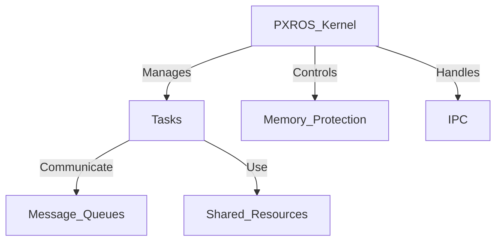

Here’s a **beginner-friendly** technical guide on **PXROS (Protected eXecutive Real-Time Operating System)**, covering its **core concepts, architecture, and basic implementation**. Let me know if you need refinements! 🚀  

---

# PXROS Technical Notes  

## Quick Reference  
- **Definition**: PXROS is a real-time operating system (RTOS) designed for embedded systems, providing **memory protection, task scheduling, and inter-process communication (IPC)**.  
- **Key Use Cases**: Automotive ECUs, industrial automation, avionics, safety-critical systems.  
- **Prerequisites**: Basic knowledge of embedded systems, C programming, and real-time operating principles.  

## Table of Contents  
1. **Introduction**  
2. **Core Concepts**  
   - Microkernel Architecture  
   - Task Scheduling & IPC  
   - Memory Protection  
3. **System Architecture**  
   - PXROS Kernel Components  
   - Message-based Communication  
4. **Implementation Details**  
   - **Basic PXROS Application**  
   - **Task Creation and Synchronization**  
   - **Common Pitfalls**  
5. **Real-World Applications**  
   - **Industry Use Cases**  
   - **Hands-on Project**  
6. **Tools & Resources**  

## Introduction  
- **What**: PXROS is a **real-time microkernel RTOS** that focuses on task isolation and message-based communication for **safety-critical applications**.  
- **Why**: Provides **deterministic task scheduling**, **fault tolerance**, and **low resource consumption**.  
- **Where**: Used in **automotive control units (ECUs), avionics, industrial robotics, and medical devices**.  

## Core Concepts  

### **Microkernel Architecture**  
- PXROS follows a **microkernel design**, ensuring that each process is **isolated** for **fault tolerance**.  
- Only **essential RTOS services** (task scheduling, IPC, and memory protection) run in the kernel.  

### **Task Scheduling & IPC**  
- **Preemptive scheduling** ensures real-time responsiveness.  
- **Message-based IPC** allows **safe inter-task communication**.  

### **Memory Protection**  
- Uses **memory compartments** to **isolate tasks** and prevent system-wide failures.  

## System Architecture  
Mermaid diagram representation:  



## Implementation Details  

### **Basic PXROS Application**  
#### **1. Task Creation**
```c
#include <pxros.h>

void TaskFunction(void)
{
    while (1) {
        // Task execution code
    }
}

int main(void)
{
    PXROS_Init();
    PXROS_CreateTask(TaskFunction, "Task1", PRIORITY_NORMAL);
    PXROS_Start();
    return 0;
}
```
- **PXROS_Init()** → Initializes the system.  
- **PXROS_CreateTask()** → Defines a real-time task.  
- **PXROS_Start()** → Starts the RTOS scheduler.  

### **2. Message-based IPC**
```c
PXROS_MSG_ID msg;
PXROS_Queue_ID queue;

void ProducerTask(void) {
    msg = PXROS_CreateMessage("Hello");
    PXROS_SendMessage(queue, msg);
}

void ConsumerTask(void) {
    PXROS_ReceiveMessage(queue, &msg);
    // Process the received message
}
```
- **PXROS_SendMessage()** → Sends a message between tasks.  
- **PXROS_ReceiveMessage()** → Receives messages asynchronously.  

### **Common Pitfalls**  
- **Task starvation**: Avoid by balancing task priorities.  
- **Deadlocks**: Prevent by using **timeouts in IPC calls**.  

## Real-World Applications  

### **Industry Use Cases**  
- **Automotive**: Used in **real-time ECU control for engine and transmission systems**.  
- **Avionics**: Ensures **reliable flight control systems**.  
- **Industrial Automation**: Manages **robotic actuators and PLCs**.  

### **Hands-on Project: Real-Time Sensor Data Processing**  
- **Goal**: Read sensor data and send it to a logging task.  
- **Implementation**:  
  1. Create a **sensor reading task**.  
  2. Use **message queues** for IPC.  
  3. Log data in **real-time**.  

## Tools & Resources  

### **Essential Tools**  
- PXROS SDK  
- PXROS Simulator  
- Embedded Debugging Tools (JTAG, GDB)  

### **Learning Resources**  
- PXROS User Manual  
- Official PXROS Documentation  
- RTOS Theory and Design Books  

## References  
- Official PXROS documentation  
- Technical papers on real-time microkernels  
- Industry case studies  
                                                                                                                                                                                                                                                                                                                                                                                                                                                                