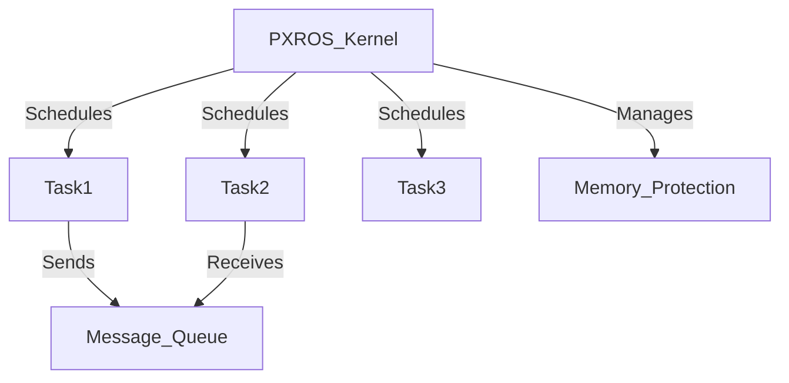

# PXROS Technical Notes (Intermediate)  

## Quick Reference  
- **Definition**: PXROS (Protected eXecutive Real-Time Operating System) is a microkernel-based RTOS optimized for **real-time, safety-critical applications**, offering **preemptive scheduling, task isolation, and message-based IPC**.  
- **Key Use Cases**: Automotive ECUs, avionics, industrial control, medical devices.  
- **Prerequisites**: Understanding of **real-time scheduling, embedded C programming, and RTOS fundamentals**.  

## Table of Contents  
1. **Introduction**  
2. **Core Concepts**  
   - Advanced Task Management  
   - Priority Inversion & Handling  
   - Inter-Process Communication (IPC)  
3. **System Architecture**  
   - Microkernel Design & Memory Protection  
   - IPC & Message Passing  
4. **Implementation Details**  
   - **Task Synchronization Techniques**  
   - **Memory Management in PXROS**  
   - **Common Performance Bottlenecks**  
5. **Real-World Applications**  
   - **Industry Use Cases**  
   - **Hands-on Project**  
6. **Tools & Resources**  

## Introduction  
- **What**: PXROS is a **real-time microkernel RTOS** providing **deterministic task execution, fault isolation, and IPC** for critical applications.  
- **Why**: It ensures **fault containment, robust task scheduling, and high system reliability**.  
- **Where**: Used in **automotive powertrains, flight control, industrial robotics, and medical monitoring systems**.  

## Core Concepts  

### **Advanced Task Management**  
- PXROS supports **time-partitioned scheduling**, ensuring tasks run **deterministically**.  
- **Task Priorities**: PXROS enables **priority-based task scheduling** with preemptive execution.  

### **Priority Inversion & Handling**  
- **Problem**: Lower-priority tasks blocking high-priority ones due to resource contention.  
- **Solution**: PXROS implements **priority inheritance** and **time-sliced execution**.  

### **Inter-Process Communication (IPC)**  
- **Message-based IPC** for **safe, asynchronous communication** between tasks.  
- **Zero-copy mechanisms** improve performance by reducing data copying overhead.  

## System Architecture  

### **Microkernel Design & Memory Protection**  
- **Kernel-only critical functions**: Task management, memory protection, IPC.  
- **User-space execution**: Reduces the risk of system-wide crashes.  



### **IPC & Message Passing**  
- **Synchronous & asynchronous messaging** ensures flexible communication.  
- **Event-driven execution** minimizes CPU usage in low-power systems.  

## Implementation Details  

### **Task Synchronization Techniques**  
#### **1. Mutex for Shared Resource Access**
```c
PXROS_Mutex mutex;

void Task1(void) {
    PXROS_LockMutex(&mutex);
    // Critical section
    PXROS_UnlockMutex(&mutex);
}
```
- Prevents **race conditions** in multi-threaded environments.  

#### **2. Semaphore for Task Coordination**
```c
PXROS_Semaphore sem;

void ProducerTask(void) {
    PXROS_SignalSemaphore(&sem);
}

void ConsumerTask(void) {
    PXROS_WaitSemaphore(&sem);
    // Process data
}
```
- **Binary semaphores** handle mutual exclusion.  
- **Counting semaphores** manage **resource availability**.  

### **Memory Management in PXROS**  
- **Memory protection units (MPUs)** isolate tasks from kernel space.  
- **Dynamic memory allocation** supports efficient **real-time memory handling**.  

### **Common Performance Bottlenecks**  
- **High-priority task starvation** → Solution: **Priority inheritance**.  
- **Memory fragmentation** → Solution: **Use fixed-size memory pools**.  
- **Message queue latency** → Solution: **Optimize queue sizes and polling rates**.  

## Real-World Applications  

### **Industry Use Cases**  
- **Automotive**: Used in **real-time powertrain control and ADAS**.  
- **Avionics**: Ensures **deterministic execution of flight-critical tasks**.  
- **Industrial Robotics**: Manages **multi-axis control in factory automation**.  

### **Hands-on Project: Real-Time Sensor Fusion**  
- **Goal**: Implement real-time **sensor fusion using PXROS IPC mechanisms**.  
- **Implementation Steps**:  
  1. Create **multiple sensor tasks** (e.g., IMU, GPS).  
  2. Use **message queues for inter-task communication**.  
  3. Process and **synchronize sensor data in real time**.  

## Tools & Resources  

### **Essential Tools**  
- **PXROS SDK**  
- **PXROS Debugging Tools (JTAG, GDB, Trace32)**  
- **PXROS Simulator for Real-Time Testing**  

### **Learning Resources**  
- **PXROS User Guide**  
- **Advanced RTOS Books & Whitepapers**  
- **Embedded Systems Technical Blogs**  

## References  
- PXROS Official Documentation  
- Technical Papers on Microkernel RTOS  
- Industry Case Studies on PXROS Deployments  
