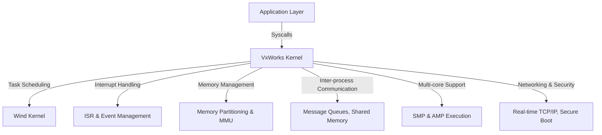

# VxWorks Technical Notes

## Quick Reference
- **One-sentence definition**: VxWorks is a real-time operating system (RTOS) designed for mission-critical embedded systems, offering deterministic scheduling, low-latency execution, and high reliability.
- **Key use cases**: Aerospace, automotive, industrial automation, telecommunications, medical devices.
- **Prerequisites**: Strong understanding of RTOS principles, embedded systems architecture, memory management, and real-time scheduling.

## Table of Contents
1. [Introduction](#introduction)
2. [Core Concepts](#core-concepts)
  - [Advanced Understanding](#advanced-understanding)
  - [Key Components](#key-components)
  - [Common Misconceptions](#common-misconceptions)
3. [Visual Architecture](#visual-architecture)
4. [Implementation Details](#implementation-details)
  - [Advanced Topics](#advanced-topics)
5. [Real-World Applications](#real-world-applications)
  - [Industry Examples](#industry-examples)
  - [Hands-On Project](#hands-on-project)
6. [Tools & Resources](#tools--resources)
  - [Essential Tools](#essential-tools)
  - [Learning Resources](#learning-resources)
7. [References](#references)
8. [Appendix](#appendix)

## Introduction
### What
VxWorks is a high-performance, real-time operating system (RTOS) used for mission-critical embedded applications that require deterministic execution and minimal latency.

### Why
It provides highly configurable real-time scheduling, optimized resource management, and robust security features for embedded systems.

### Where
VxWorks is deployed in safety-critical environments, including aerospace avionics, autonomous vehicles, industrial robotics, and high-performance networking.

## Core Concepts
### Advanced Understanding
- **Deterministic real-time scheduling**: Hard real-time constraints with interrupt-driven execution.
- **Multi-core processing**: Symmetric (SMP) and asymmetric multiprocessing (AMP) for parallel execution.
- **Advanced memory management**: Memory partitioning, MMU support, and zero-copy communication.
- **Safety and security**: Memory protection, secure boot, and DO-178C compliance for avionics.
- **Real-time networking**: Low-latency TCP/IP stack and deterministic data transmission.

### Key Components
- **Wind Kernel**: The core scheduler and execution engine providing preemptive multitasking.
- **Task Management**: Dynamic priority-based scheduling with real-time constraints.
- **Inter-task Communication (IPC)**: Fast message queues, semaphores, and shared memory.
- **Interrupt Handling**: Low-latency ISR (Interrupt Service Routine) processing.
- **Filesystem and I/O**: Flash-friendly file system (FFS), network file system (NFS), and device management.

### Common Misconceptions
- **VxWorks cannot handle modern multi-core architectures**: Supports SMP, AMP, and mixed-mode execution.
- **RTOS guarantees infinite CPU time for high-priority tasks**: Requires careful load balancing and watchdog monitoring.
- **Memory protection is unnecessary for real-time applications**: MMU-based protection is crucial for reliability and security.

## Visual Architecture


## Implementation Details
### Advanced Topics
```c
#include <vxWorks.h>
#include <taskLib.h>
#include <semLib.h>
#include <memLib.h>
#include <cacheLib.h>

SEM_ID sem;
void highPriorityTask() {
    while (1) {
        semTake(sem, WAIT_FOREVER);
        printf("Executing high-priority task\n");
        semGive(sem);
        taskDelay(10);
    }
}
void lowPriorityTask() {
    while (1) {
        semTake(sem, WAIT_FOREVER);
        printf("Executing low-priority task\n");
        semGive(sem);
        taskDelay(50);
    }
}
void start() {
    sem = semMCreate(SEM_Q_PRIORITY | SEM_INVERSION_SAFE);
    taskSpawn("highTask", 50, 0, 4000, (FUNCPTR)highPriorityTask, 0, 0, 0, 0, 0, 0, 0, 0, 0, 0);
    taskSpawn("lowTask", 100, 0, 4000, (FUNCPTR)lowPriorityTask, 0, 0, 0, 0, 0, 0, 0, 0, 0, 0);
}
```
- **System Design Considerations**:
  - Use **priority inheritance** to prevent priority inversion in real-time tasks.
  - Implement **cache coherency** mechanisms in multi-core systems.
  - Optimize **interrupt latency** with efficient ISR design.

- **Optimization Techniques**:
  - Use **zero-copy IPC** for high-speed data transfer.
  - Implement **spinlocks and mutexes** for safe concurrent execution.
  - Profile task execution with **Wind River System Viewer**.

- **Production Considerations**:
  - Ensure **deterministic execution** under heavy loads.
  - Implement **graceful failover mechanisms** for fault-tolerant systems.
  - Conduct **real-time performance analysis** to measure jitter and latency.

## Real-World Applications
### Industry Examples
- **Aerospace**: Flight control systems, avionics mission computers.
- **Automotive**: ADAS, real-time ECU control, vehicle-to-everything (V2X) communication.
- **Industrial Automation**: High-speed robotic control, motion planning.

### Hands-On Project
- **Project goal**: Develop a real-time multi-core communication framework.
- **Implementation steps**:
  1. Configure an AMP-based execution model with VxWorks.
  2. Implement a shared memory-based IPC for data transfer.
  3. Optimize for minimal latency using priority tuning.
- **Validation methods**:
  - Measure context switch overhead using VxWorks profiling tools.
  - Test real-time network response time using TCP/IP stack benchmarks.

## Tools & Resources
### Essential Tools
- **Development environment**: Wind River Workbench, Simics simulator.
- **Key frameworks**: VxWorks kernel API, real-time networking stack.
- **Testing tools**: Wind River Trace, performance profiling tools.

### Learning Resources
- **Documentation**: VxWorks API reference, Wind River advanced guides.
- **Tutorials**: Multi-core optimization and real-time debugging techniques.
- **Community resources**: Wind River forums, industry whitepapers.

## References
- VxWorks official documentation and advanced user guides.
- Research papers on real-time multi-core scheduling.
- Industry safety standards (DO-178C, ISO 26262).

## Appendix
- Glossary of RTOS terms.
- Multi-core configuration guides.
- Real-time debugging techniques.

