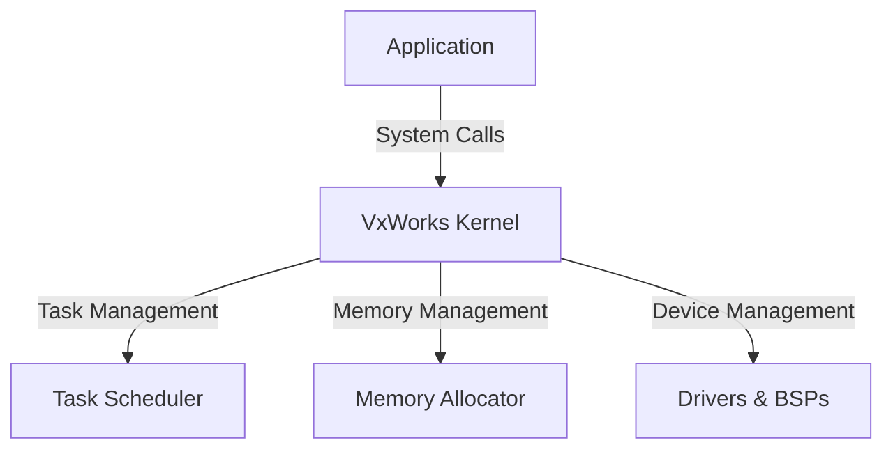

# VxWorks Technical Notes

## Quick Reference
- **One-sentence definition**: VxWorks is a real-time operating system (RTOS) designed for embedded systems, offering high performance, reliability, and scalability.
- **Key use cases**: Aerospace, automotive, industrial automation, medical devices, networking equipment.
- **Prerequisites**: Basic understanding of operating systems and embedded systems.

## Table of Contents
1. [Introduction](#introduction)
2. [Core Concepts](#core-concepts)
    - [Fundamental Understanding](#fundamental-understanding)
    - [Key Components](#key-components)
    - [Common Misconceptions](#common-misconceptions)
3. [Visual Architecture](#visual-architecture)
4. [Implementation Details](#implementation-details)
    - [Basic Implementation](#basic-implementation)
5. [Real-World Applications](#real-world-applications)
    - [Industry Examples](#industry-examples)
    - [Hands-On Project](#hands-on-project)
6. [Tools & Resources](#tools--resources)
    - [Essential Tools](#essential-tools)
    - [Learning Resources](#learning-resources)
7. [References](#references)
8. [Appendix](#appendix)

## Introduction
### What
VxWorks is a real-time operating system (RTOS) known for its deterministic performance, modularity, and reliability in embedded applications.

### Why
It provides a stable and efficient environment for mission-critical applications that require real-time responsiveness and high availability.

### Where
VxWorks is widely used in industries such as aerospace, automotive, industrial automation, and telecommunications.

## Core Concepts
### Fundamental Understanding
- **Real-time scheduling**: Preemptive multitasking and priority-based scheduling.
- **Deterministic behavior**: Ensuring predictable response times.
- **Modular kernel**: Configurable kernel to optimize resource usage.

### Key Components
- **Wind Kernel**: The core of VxWorks, responsible for task management, memory management, and inter-process communication.
- **Task Scheduling**: Priority-based and round-robin scheduling.
- **Inter-task Communication**: Message queues, semaphores, and shared memory.
- **Memory Management**: Dynamic and static memory allocation.

### Common Misconceptions
- **VxWorks is only for aerospace**: While popular in aerospace, it is widely used in industrial and automotive sectors.
- **RTOS is the same as general-purpose OS**: Unlike general-purpose OS, VxWorks prioritizes deterministic performance.

## Visual Architecture


## Implementation Details
### Basic Implementation [Beginner]
```c
#include <vxWorks.h>
#include <taskLib.h>

void helloTask() {
    printf("Hello, VxWorks!\n");
}

void start() {
    taskSpawn("hello", 100, 0, 2000, (FUNCPTR)helloTask, 0, 0, 0, 0, 0, 0, 0, 0, 0, 0);
}
```
- **Step-by-step setup**:
  1. Install VxWorks development environment.
  2. Create and compile a simple task.
  3. Deploy and execute on a target device.
- **Code walkthrough**:
  - `taskSpawn` creates and runs a new task.
- **Common pitfalls**:
  - Incorrect priority assignment can cause task starvation.

## Real-World Applications
### Industry Examples
- **Aerospace**: Avionics control and satellite systems.
- **Automotive**: ADAS and infotainment systems.
- **Industrial Automation**: Robotics and PLC control.

### Hands-On Project
- **Project goal**: Create a simple real-time task manager.
- **Implementation steps**:
  1. Define multiple tasks with different priorities.
  2. Use semaphores for synchronization.
  3. Monitor execution order and timing.
- **Validation methods**:
  - Debugging with VxWorks tools.
  - Timing analysis.

## Tools & Resources
### Essential Tools
- **Development environment**: Wind River Workbench
- **Key frameworks**: VxWorks Kernel API
- **Testing tools**: Wind River Simics, target debugging tools

### Learning Resources
- **Documentation**: Wind River official docs
- **Tutorials**: VxWorks online courses
- **Community resources**: Wind River forums

## References
- Official Wind River VxWorks documentation
- Technical papers on RTOS scheduling
- Industry standards for embedded systems

## Appendix
- Glossary
- Setup guides
- Code templates

