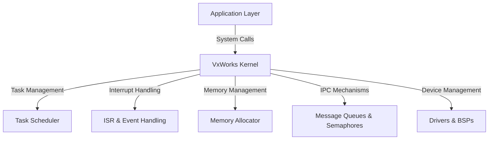

# VxWorks Technical Notes

## Quick Reference
- **One-sentence definition**: VxWorks is a real-time operating system (RTOS) designed for embedded systems, offering deterministic performance, modularity, and reliability.
- **Key use cases**: Aerospace, automotive, industrial automation, networking equipment, medical devices.
- **Prerequisites**: Understanding of operating systems, RTOS concepts, and embedded system programming.

## Table of Contents
1. [Introduction](#introduction)
2. [Core Concepts](#core-concepts)
  - [Fundamental Understanding](#fundamental-understanding)
  - [Key Components](#key-components)
  - [Common Misconceptions](#common-misconceptions)
3. [Visual Architecture](#visual-architecture)
4. [Implementation Details](#implementation-details)
  - [Intermediate Patterns](#intermediate-patterns)
5. [Real-World Applications](#real-world-applications)
  - [Industry Examples](#industry-examples)
  - [Hands-On Project](#hands-on-project)
6. [Tools & Resources](#tools--resources)
  - [Essential Tools](#essential-tools)
  - [Learning Resources](#learning-resources)
7. [References](#references)
8. [Appendix](#appendix)

## Introduction
### What
VxWorks is a high-performance, real-time operating system (RTOS) used in mission-critical embedded applications requiring reliability and determinism.

### Why
It enables efficient real-time task execution, robust scheduling, and scalable embedded development for critical systems.

### Where
VxWorks is widely deployed in industries such as aerospace, automotive, industrial automation, and telecommunications.

## Core Concepts
### Fundamental Understanding
- **Preemptive multitasking**: Task priority-based execution with deterministic scheduling.
- **Inter-process communication (IPC)**: Message queues, semaphores, and shared memory mechanisms.
- **Memory management**: Configurable memory regions and dynamic allocation.
- **Board Support Packages (BSPs)**: Hardware-specific adaptations for VxWorks.

### Key Components
- **Wind Kernel**: The real-time core handling scheduling, synchronization, and memory management.
- **Task Scheduling**: Priority-based preemptive scheduling with round-robin support.
- **Interrupt Handling**: Fast ISR (Interrupt Service Routine) execution for real-time responsiveness.
- **Inter-task Communication**: Semaphores, message queues, pipes, and shared memory.
- **File System**: Support for RAM disks, flash memory, and network-based file access.

### Common Misconceptions
- **VxWorks is only for legacy systems**: It remains actively updated with modern security and networking features.
- **RTOS is equivalent to a general-purpose OS**: RTOS guarantees deterministic response times, unlike general-purpose operating systems.
- **Thread priority alone ensures real-time performance**: System-wide resource management and synchronization mechanisms play a crucial role.

## Visual Architecture


## Implementation Details
### Intermediate Patterns
```c
#include <vxWorks.h>
#include <taskLib.h>
#include <semLib.h>

SEM_ID sem;
void task1() {
    while (1) {
        semTake(sem, WAIT_FOREVER);
        printf("Task 1 executing critical section\n");
        semGive(sem);
        taskDelay(50);
    }
}
void task2() {
    while (1) {
        semTake(sem, WAIT_FOREVER);
        printf("Task 2 executing critical section\n");
        semGive(sem);
        taskDelay(100);
    }
}
void start() {
    sem = semBCreate(SEM_Q_PRIORITY, SEM_FULL);
    taskSpawn("task1", 100, 0, 2000, (FUNCPTR)task1, 0, 0, 0, 0, 0, 0, 0, 0, 0, 0);
    taskSpawn("task2", 101, 0, 2000, (FUNCPTR)task2, 0, 0, 0, 0, 0, 0, 0, 0, 0, 0);
}
```
- **Design patterns**:
  - Using semaphores for synchronization between tasks.
  - Task prioritization to manage execution order.
- **Best practices**:
  - Minimize ISR execution time for better system responsiveness.
  - Avoid priority inversion using priority inheritance.
  - Use watchdog timers for fault detection.
- **Performance considerations**:
  - Optimize task switching overhead.
  - Minimize memory fragmentation with static allocation.

## Real-World Applications
### Industry Examples
- **Aerospace**: Flight control systems and mission-critical avionics.
- **Automotive**: ADAS, infotainment, and ECU control.
- **Industrial Automation**: Robotics, PLCs, and motion control.

### Hands-On Project
- **Project goal**: Implement a priority-based task synchronization system.
- **Implementation steps**:
  1. Create multiple tasks with different priority levels.
  2. Implement message queue-based inter-task communication.
  3. Optimize task execution and response times.
- **Validation methods**:
  - Use logging to analyze task execution timing.
  - Monitor CPU utilization with VxWorks tools.

## Tools & Resources
### Essential Tools
- **Development environment**: Wind River Workbench.
- **Key frameworks**: VxWorks Kernel API, BSP integration.
- **Testing tools**: Wind River Simics, on-target debugging tools.

### Learning Resources
- **Documentation**: Wind River official manuals.
- **Tutorials**: Intermediate VxWorks programming guides.
- **Community resources**: Wind River forums, RTOS development groups.

## References
- Official Wind River VxWorks documentation.
- Technical papers on RTOS scheduling.
- Industry standards for embedded systems.

## Appendix
- Glossary.
- Setup guides.
- Code templates.

