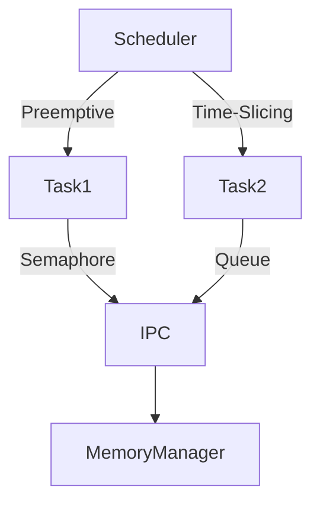

# RTOS Technical Notes (Advanced)

## Quick Reference  
- **Definition**: A **Real-Time Operating System (RTOS)** is an OS designed for **predictable, deterministic execution** of tasks under strict timing constraints. It ensures minimal latency, precise scheduling, and robust resource management for **hard and soft real-time applications**.  
- **Key Use Cases**: Automotive ADAS, avionics, industrial automation, robotics, telecommunications, and medical devices.  
- **Prerequisites**:  
  - Strong understanding of **embedded C/C++** and **microcontroller architectures**.  
  - Familiarity with **RTOS kernel design, scheduling policies, and IPC mechanisms**.  
  - Experience with **low-level debugging, real-time performance profiling, and resource optimization**.  

---

## Table of Contents  
1. **Introduction**  
   - Why RTOS in High-Performance Systems?  
   - Hard vs. Soft vs. Firm Real-Time Constraints  
   - RTOS vs. Bare-Metal and General-Purpose OS  
2. **Core Concepts**  
   - Advanced Task Scheduling & Priority Inversion  
   - Deterministic Memory Management & Fragmentation Avoidance  
   - Interrupt Handling & ISR Latency Optimization  
3. **RTOS Architecture**  
   - Deep Dive into Kernel Design  
   - Advanced Synchronization & Deadlock Resolution  
   - Low-Power & Energy-Efficient RTOS Execution  
4. **Implementation Details**  
   - Real-Time Multi-Core Processing & Load Balancing  
   - Dynamic Memory Allocation Strategies  
   - Optimizing Context Switching Performance  
5. **Real-World Applications**  
   - Industry-Specific Architectures & Implementations  
   - Case Study: Real-Time Sensor Fusion in ADAS  
   - Mission-Critical Systems & Fault Tolerance  
6. **Tools & Debugging**  
   - RTOS Profiling & Tracing  
   - Deterministic Debugging Strategies  

---

## Introduction  

### **Why RTOS in High-Performance Systems?**  
A real-time system requires **guaranteed execution times** and **low-latency task switching**. Unlike general-purpose OSes, an RTOS ensures **hard real-time constraints** by employing efficient **preemptive scheduling, resource prioritization, and real-time inter-task communication**.  

### **Hard vs. Soft vs. Firm Real-Time Constraints**  
| Type | Definition | Example |
|------|-----------|---------|
| **Hard Real-Time** | Failure to meet deadlines results in **catastrophic failure**. | **Airbag deployment system** |
| **Firm Real-Time** | Missing a deadline **reduces quality** but doesn't lead to failure. | **Stock market trading system** |
| **Soft Real-Time** | Occasional missed deadlines **degrade performance** but are acceptable. | **Streaming video player** |

---

## Core Concepts  

### **Advanced Task Scheduling & Priority Inversion**  
RTOS schedules tasks based on **strict priority levels** and **deterministic execution constraints**.  

#### **Common Scheduling Algorithms**  
- **Rate Monotonic Scheduling (RMS)** → Static priority assignment.  
- **Earliest Deadline First (EDF)** → Dynamic task priority based on deadline.  
- **Least Laxity First (LLF)** → Priority assigned based on slack time.  

#### **Priority Inversion Handling**  
🔹 **Problem**: A low-priority task holds a resource needed by a high-priority task, causing **unbounded blocking**.  
🔹 **Solutions**:  
1. **Priority Inheritance** → The lower-priority task inherits the higher priority.  
2. **Priority Ceiling Protocol (PCP)** → The resource is assigned a priority ceiling to prevent inversion.  

```c
// Mutex with Priority Inheritance (FreeRTOS)
xSemaphoreHandle xMutex = xSemaphoreCreateMutex();
void HighPriorityTask(void *pvParameters) {
    xSemaphoreTake(xMutex, portMAX_DELAY);
    // Critical section
    xSemaphoreGive(xMutex);
}
```

---

### **Deterministic Memory Management & Fragmentation Avoidance**  
Dynamic memory allocation in RTOS can cause **fragmentation**, leading to **non-deterministic memory access times**.  

🔹 **Strategies for Efficient Memory Management**:  
- **Static Allocation** → Pre-allocating memory ensures predictability.  
- **Memory Pools** → Using fixed-size block allocation reduces fragmentation.  
- **Heap Partitioning** → Allocating different memory regions for different task types.  

**Example: Memory Pool Allocation in FreeRTOS**  
```c
StaticTask_t xTaskBuffer;
StackType_t xStack[128];
TaskHandle_t xTaskHandle = xTaskCreateStatic(TaskFunction, "Task1", 128, NULL, 1, xStack, &xTaskBuffer);
```

✔ **Eliminates heap fragmentation and improves real-time behavior**.

---

### **Interrupt Handling & ISR Latency Optimization**  
Interrupt latency must be minimized to maintain **hard real-time constraints**.  

🔹 **Techniques to Optimize ISRs**  
✅ **Minimize ISR Execution Time** → Offload complex logic to tasks.  
✅ **Use Nested Vectored Interrupt Controller (NVIC)** → Enables fast ISR prioritization.  
✅ **Zero-Latency Interrupts** → Critical ISRs must not be disabled by scheduler locks.  

**Example: Handling ISR with Deferred Processing in FreeRTOS**  
```c
void ISR_Handler(void) {
    BaseType_t xHigherPriorityTaskWoken = pdFALSE;
    xSemaphoreGiveFromISR(xSemaphore, &xHigherPriorityTaskWoken);
    portYIELD_FROM_ISR(xHigherPriorityTaskWoken);
}
```
✔ **Ensures minimal ISR overhead and prioritizes task execution**.

---

## RTOS Architecture  

### **Deep Dive into Kernel Design**  
🔹 **RTOS Kernel Components**:  
- **Scheduler** → Handles task prioritization and switching.  
- **Memory Manager** → Allocates memory for tasks and stacks.  
- **Inter-Task Communication (IPC)** → Manages semaphores, queues, and mutexes.  



✔ **Illustrates RTOS task scheduling and IPC mechanisms**.

---

### **Low-Power & Energy-Efficient RTOS Execution**  
Power efficiency is critical in **battery-operated embedded systems**.  

✅ **Tickless Mode** → Disables periodic tick interrupts to save power.  
✅ **Dynamic Voltage and Frequency Scaling (DVFS)** → Reduces CPU clock speed when idle.  
✅ **Sleep & Deep Sleep Modes** → Reduces power consumption during inactivity.  

```c
void vApplicationIdleHook(void) {
    __WFI(); // Enter low-power mode
}
```

✔ **Optimizes energy consumption without sacrificing real-time performance**.

---

## Implementation Details  

### **Real-Time Multi-Core Processing & Load Balancing**  
Multi-core RTOS designs distribute tasks efficiently to **avoid CPU starvation**.  

🔹 **Strategies for Load Balancing**:  
- **Affinity Scheduling** → Assigns tasks to specific cores.  
- **Work Stealing** → Underutilized cores pull tasks from overloaded cores.  
- **Global Task Queue** → Centralized scheduling across multiple cores.  

✔ **Enhances RTOS performance in high-throughput applications**.

---

### **Optimizing Context Switching Performance**  
🔹 **Reducing Context Switch Overhead**:  
✅ **Minimize shared resources between tasks**.  
✅ **Use cooperative scheduling for low-priority tasks**.  
✅ **Optimize stack usage per task**.  

```c
void vApplicationStackOverflowHook(TaskHandle_t xTask, char *pcTaskName) {
    printf("Stack Overflow in Task: %s\n", pcTaskName);
}
```
✔ **Prevents unexpected task failures due to stack overflows**.

---

## Real-World Applications  

### **Case Study: Real-Time Sensor Fusion in ADAS**  
✔ **Goal**: Integrate **LIDAR, RADAR, and cameras** for real-time vehicle perception.  

🔹 **Challenges**:  
- **Strict timing constraints** for sensor data fusion.  
- **Low-latency task execution** for real-time decision-making.  
- **Efficient memory management** to avoid fragmentation.  

✔ **RTOS ensures deterministic processing for safe and reliable autonomous driving**.

---

## Tools & Debugging  

### **RTOS Profiling & Tracing**  
✅ **Tools**: FreeRTOS+Trace, SEGGER SystemView, Lauterbach Trace32.  
✅ **Metrics to Monitor**:  
- Task execution time.  
- Context switch frequency.  
- CPU load distribution.  

✔ **Enables real-time performance analysis and optimization**.

