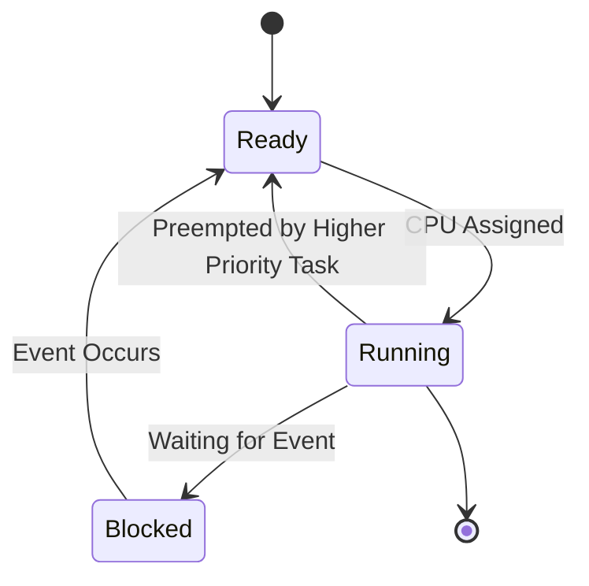

# RTOS Technical Notes (Beginner)  

## Quick Reference  
- **Definition**: A **Real-Time Operating System (RTOS)** is an operating system designed to **process data and execute tasks within strict timing constraints**, ensuring **predictable and deterministic behavior**.  
- **Key Use Cases**: Embedded systems, robotics, automotive ECUs, medical devices, industrial automation, and IoT applications.  
- **Prerequisites**:  
  - Basic understanding of **operating systems** (processes, scheduling).  
  - Familiarity with **C programming** and embedded systems.  
  - Basic knowledge of **microcontrollers and peripherals**.  

---

## Table of Contents  
1. **Introduction**  
   - What is an RTOS?  
   - Why use an RTOS?  
   - Common RTOS examples  
2. **Core Concepts**  
   - Task Management & Scheduling  
   - Inter-Task Communication (IPC)  
   - Synchronization Mechanisms  
3. **RTOS Architecture**  
   - Kernel Overview  
   - Task States & Transitions  
   - Memory Management  
4. **Implementation Details**  
   - Writing a Simple RTOS Task  
   - Basic IPC Mechanisms  
   - Debugging RTOS Applications  
5. **Real-World Applications**  
   - Common Use Cases  
   - Example: Sensor Data Processing  
6. **Tools & Resources**  

---

## Introduction  

### **What is an RTOS?**  
A **Real-Time Operating System (RTOS)** is a type of **lightweight OS** designed for **real-time applications**. It ensures that tasks meet **strict timing constraints**, unlike traditional OSes like Linux or Windows.  

### **Why use an RTOS?**  
- **Predictable execution**: Ensures tasks complete within set deadlines.  
- **Efficient task management**: Handles multiple processes with minimal delays.  
- **Low-latency response**: Optimized for real-time decision-making.  

### **Common RTOS Examples**  
- **FreeRTOS**: Open-source RTOS for microcontrollers.  
- **VxWorks**: Commercial RTOS used in aerospace & defense.  
- **PXROS**: Safety-certified RTOS for automotive applications.  
- **Zephyr**: RTOS for IoT and embedded devices.  

---

## Core Concepts  

### **Task Management & Scheduling**  
In an RTOS, tasks are **small execution units** that run based on priority. Tasks can be:  
- **Ready**: Waiting for CPU time.  
- **Running**: Actively executing.  
- **Blocked**: Waiting for an event (e.g., message, timer).  

RTOS scheduling algorithms:  
- **Round Robin**: Tasks share CPU time equally.  
- **Preemptive Priority**: High-priority tasks interrupt low-priority ones.  
- **Cooperative**: Tasks yield control voluntarily.  

**Example: Creating a Basic RTOS Task (FreeRTOS)**  
```c
void TaskFunction(void *pvParameters) {
    while(1) {
        printf("Task Running\n");
        vTaskDelay(1000 / portTICK_PERIOD_MS); // 1-second delay
    }
}
xTaskCreate(TaskFunction, "Task1", 100, NULL, 1, NULL);
```
✔ **Ensures task execution with controlled timing**.  

---

### **Inter-Task Communication (IPC)**  
RTOS tasks **communicate** using:  
- **Message Queues**: Tasks send and receive messages.  
- **Semaphores**: Prevent race conditions (e.g., shared resource access).  
- **Mutexes**: Ensure exclusive access to a resource.  

**Example: Task Synchronization with Semaphores**  
```c
SemaphoreHandle_t xSemaphore = xSemaphoreCreateBinary();
void Task1(void *pvParameters) {
    xSemaphoreGive(xSemaphore);  // Signal Task2 to proceed
}
void Task2(void *pvParameters) {
    xSemaphoreTake(xSemaphore, portMAX_DELAY);  // Wait for Task1
}
```
✔ **Ensures proper task coordination and avoids conflicts**.  

---

### **Synchronization Mechanisms**  
- **Timers**: Schedule periodic task execution.  
- **Event Flags**: Signal multiple tasks about system state changes.  

**Example: Using Timers in FreeRTOS**  
```c
TimerHandle_t myTimer = xTimerCreate("Timer", pdMS_TO_TICKS(500), pdTRUE, 0, TimerCallback);
void TimerCallback(TimerHandle_t xTimer) {
    printf("Timer expired!\n");
}
xTimerStart(myTimer, 0);
```
✔ **Efficiently triggers periodic tasks**.  

---

## RTOS Architecture  

### **Kernel Overview**  
An RTOS **kernel** is the core component that manages:  
- **Task scheduling**  
- **Memory allocation**  
- **Inter-task communication**  

### **Task States & Transitions**  
Tasks move between states based on **CPU availability and event triggers**.  



✔ **Helps manage real-time execution without conflicts**.  

### **Memory Management**  
RTOS memory management methods:  
- **Static Allocation**: Memory assigned at compile-time.  
- **Dynamic Allocation**: Memory assigned during execution.  
- **Heap & Stack**: Tasks use **separate stacks** to prevent overflow.  

---

## Implementation Details  

### **Writing a Simple RTOS Task**  
Steps to create an RTOS-based system:  
1. **Initialize the RTOS kernel**.  
2. **Define tasks with priorities**.  
3. **Use IPC mechanisms to synchronize**.  
4. **Run the scheduler**.  

✔ **Ensures modular and predictable real-time execution**.  

---

### **Basic IPC Mechanisms**  
- **Queues**: Send structured messages between tasks.  
- **Mutexes**: Ensure safe resource sharing.  
- **Event Groups**: Synchronize multiple tasks with event flags.  

✔ **Helps in multi-tasking without conflicts**.  

---

### **Debugging RTOS Applications**  
Common debugging tools:  
- **RTOS Aware Debuggers** (JTAG, Trace32).  
- **Performance Profiling** (CPU usage, task switching).  
- **Logging & Tracing** (Event recording).  

✔ **Helps identify scheduling & execution bottlenecks**.  

---

## Real-World Applications  

### **Common Use Cases**  
- **IoT Devices**: Sensor data processing.  
- **Automotive ECUs**: Real-time control of engines and braking.  
- **Industrial Robotics**: Motion control with strict deadlines.  

---

### **Example: Sensor Data Processing with RTOS**  
✔ **Goal**: Read a sensor every 500ms and process the data in a separate task.  

**Implementation Steps:**  
1. **Create a sensor-reading task** that reads temperature data.  
2. **Use a message queue** to send data to the processing task.  
3. **Process the data in real-time** and log results.  

**Example Code:**  
```c
QueueHandle_t xQueue;
void SensorTask(void *pvParameters) {
    int sensor_data = readSensor();
    xQueueSend(xQueue, &sensor_data, portMAX_DELAY);
}
void ProcessingTask(void *pvParameters) {
    int received_data;
    xQueueReceive(xQueue, &received_data, portMAX_DELAY);
    printf("Processed Data: %d\n", received_data);
}
```
✔ **Demonstrates real-time sensor processing with RTOS**.  

---

## Tools & Resources  

### **Essential Tools**  
- **Development Environments**: Keil, Eclipse, VS Code  
- **RTOS Debuggers**: Lauterbach, OpenOCD  
- **Embedded Boards**: STM32, ESP32, TI MSP430  

### **Learning Resources**  
- **FreeRTOS & Zephyr Documentation**  
- **Embedded RTOS Books**  
- **Online Courses (Coursera, Udemy)**  

---

## References  
- FreeRTOS Documentation  
- RTOS Design Patterns Book  
- ARM Cortex-M Real-Time Programming  
