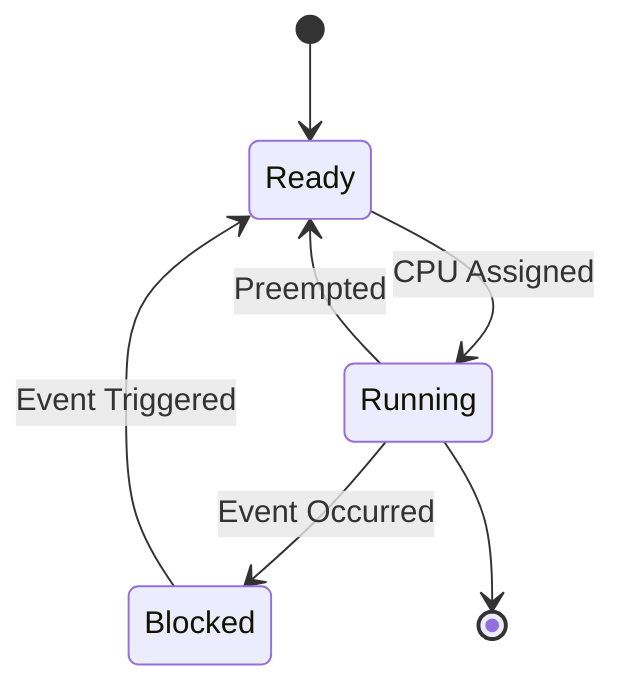

# RTOS Technical Notes (Intermediate)

## Quick Reference
- **Definition**: A **Real-Time Operating System (RTOS)** is an OS designed for **predictable, deterministic task execution** under **strict timing constraints**. It enables **real-time scheduling, resource management, and inter-task communication** in embedded systems.
- **Key Use Cases**: Automotive ECUs, industrial automation, aerospace, medical devices, robotics, and IoT.
- **Prerequisites**:  
  - Strong understanding of **C programming** and **embedded systems**.  
  - Familiarity with **microcontroller architectures** and **peripherals**.  
  - Basic knowledge of **scheduling algorithms and concurrency**.

---

## Table of Contents  
1. **Introduction**  
   - What is an RTOS?  
   - Key Benefits & Challenges  
   - RTOS vs General-Purpose OS  
2. **Core Concepts**  
   - Task Management & Scheduling Policies  
   - Inter-Task Communication (IPC)  
   - Synchronization & Deadlocks  
3. **RTOS Architecture**  
   - Kernel Overview & Design  
   - Memory Management Techniques  
   - Context Switching Mechanism  
4. **Implementation Details**  
   - Writing Multi-Tasking Applications  
   - IPC Implementation Patterns  
   - Debugging RTOS-based Applications  
5. **Real-World Applications**  
   - Industry Use Cases  
   - Example: Real-Time Sensor Fusion  
6. **Tools & Resources**  

---

## Introduction  

### **What is an RTOS?**  
A **Real-Time Operating System (RTOS)** is designed for systems where **timing constraints and deterministic behavior** are critical. Unlike general-purpose OSes (Linux, Windows), an RTOS ensures **bounded response times** for **mission-critical tasks**.

### **Key Benefits & Challenges**  
✅ **Advantages**:  
- **Predictable task execution** under deadlines.  
- **Efficient resource utilization** (CPU, memory).  
- **Concurrency control** for multi-threaded applications.  

⚠ **Challenges**:  
- **Complex debugging** due to concurrency issues.  
- **Hard real-time constraints** require precise tuning.  
- **Memory overhead** compared to bare-metal programming.  

### **RTOS vs General-Purpose OS**  
| Feature | RTOS | General-Purpose OS (Linux/Windows) |
|---------|------|-----------------------------------|
| **Scheduling** | Deterministic | Best-effort (fairness-based) |
| **Latency** | Low (µs to ms) | Unpredictable (ms to sec) |
| **Task Priorities** | Strict | Soft priorities |
| **Resource Usage** | Minimal | High overhead |

---

## Core Concepts  

### **Task Management & Scheduling Policies**  
RTOS uses **task-based scheduling** to manage execution priorities.  

🔹 **Task States & Scheduling**  
- **Ready**: Waiting for CPU allocation.  
- **Running**: Actively executing.  
- **Blocked**: Waiting for an event.  
- **Suspended**: Temporarily inactive.  

🔹 **Common Scheduling Algorithms**  
- **Fixed-Priority Preemptive** (Most common)  
- **Rate Monotonic (RM)** (Static priority scheduling)  
- **Earliest Deadline First (EDF)** (Dynamic priority scheduling)  



✔ **Ensures priority-based execution with minimal latency**.

---

### **Inter-Task Communication (IPC) in RTOS**  
In a multi-threaded RTOS system, tasks communicate using:  

| IPC Mechanism | Description | Use Case |
|--------------|------------|----------|
| **Queues** | FIFO message exchange between tasks | Data buffering |
| **Semaphores** | Synchronization primitive to prevent race conditions | Shared resource management |
| **Mutexes** | Prevents multiple tasks from accessing a resource simultaneously | Exclusive access to peripherals |
| **Event Flags** | Signals multiple tasks simultaneously | Event-based triggers |

**Example: Using Queues for Task Communication (FreeRTOS)**  
```c
QueueHandle_t xQueue = xQueueCreate(10, sizeof(int));
void ProducerTask(void *pvParameters) {
    int data = 42;
    xQueueSend(xQueue, &data, portMAX_DELAY);
}
void ConsumerTask(void *pvParameters) {
    int receivedData;
    xQueueReceive(xQueue, &receivedData, portMAX_DELAY);
    printf("Received: %d\n", receivedData);
}
```
✔ **Queues provide efficient task-to-task communication**.

---

### **Synchronization & Deadlocks**  
Multi-tasking introduces **race conditions** and **deadlocks**, which must be managed using proper synchronization.

🔹 **Common Issues & Solutions**  
- **Priority Inversion**: A low-priority task blocks a high-priority task → *Solution: Priority Inheritance*  
- **Deadlocks**: Circular waiting between tasks → *Solution: Timeout mechanisms*  

**Example: Using Mutex for Resource Protection**  
```c
MutexHandle_t xMutex = xSemaphoreCreateMutex();
void Task1(void *pvParameters) {
    xSemaphoreTake(xMutex, portMAX_DELAY);
    // Critical Section
    xSemaphoreGive(xMutex);
}
```
✔ **Ensures exclusive resource access and prevents deadlocks**.

---

## RTOS Architecture  

### **Kernel Overview & Design**  
The **RTOS kernel** is responsible for:  
- **Task scheduling** (preemptive or cooperative).  
- **Resource management** (memory, CPU, peripherals).  
- **Interrupt handling** for real-time responses.  

### **Memory Management Techniques**  
RTOS supports different memory models:  
- **Static Allocation** (Compile-time, deterministic).  
- **Dynamic Allocation** (Heap-based, but less predictable).  
- **Memory Pools** (Fixed-size pre-allocated memory blocks).  

**Example: Static Memory Allocation in FreeRTOS**  
```c
static StaticTask_t xTaskBuffer;
static StackType_t xStack[128];
TaskHandle_t xTaskHandle = xTaskCreateStatic(TaskFunction, "Task1", 128, NULL, 1, xStack, &xTaskBuffer);
```
✔ **Avoids heap fragmentation and improves real-time performance**.

---

### **Context Switching Mechanism**  
Context switching occurs when the RTOS switches execution from one task to another.

**Context Switch Steps:**  
1. Save current task registers.  
2. Load next task registers.  
3. Resume execution from saved state.  

✔ **Minimizes switching overhead to maintain real-time responsiveness**.

---

## Implementation Details  

### **Writing Multi-Tasking Applications**  
A well-designed RTOS application:  
- **Separates concerns** (each task has a single responsibility).  
- **Uses proper IPC mechanisms** (e.g., queues instead of global variables).  
- **Minimizes blocking calls** (to avoid task starvation).  

**Example: Multi-Tasking in RTOS**  
```c
void TaskA(void *pvParameters) {
    while (1) {
        printf("Task A Running\n");
        vTaskDelay(pdMS_TO_TICKS(500));
    }
}
void TaskB(void *pvParameters) {
    while (1) {
        printf("Task B Running\n");
        vTaskDelay(pdMS_TO_TICKS(1000));
    }
}
xTaskCreate(TaskA, "TaskA", 128, NULL, 1, NULL);
xTaskCreate(TaskB, "TaskB", 128, NULL, 2, NULL);
```
✔ **Demonstrates task prioritization in an RTOS environment**.

---

## Real-World Applications  

### **Industry Use Cases**  
- **Automotive**: Engine control units (ECUs)  
- **Aerospace**: Flight control systems  
- **Medical Devices**: Real-time patient monitoring  
- **Industrial**: Motor control in robotics  

### **Example: Real-Time Sensor Fusion**  
✔ **Goal**: Read sensor data every 100ms and fuse multiple sensor inputs.  

**Implementation Steps:**  
1. **Task 1**: Reads accelerometer data every 100ms.  
2. **Task 2**: Reads gyroscope data every 100ms.  
3. **Task 3**: Combines sensor data and processes it.  

✔ **Ensures deterministic real-time data processing**.

---

## Tools & Resources  

### **Essential Tools**  
- **Development Environments**: Keil, Eclipse, VS Code  
- **RTOS Debuggers**: JTAG, Lauterbach  
- **Embedded Boards**: STM32, ESP32  

### **Learning Resources**  
- **Books**: “Real-Time Concepts for Embedded Systems”  
- **Online Courses**: RTOS training (Udemy, Coursera)  
- **Official Documentation**: FreeRTOS, Zephyr, VxWorks  
