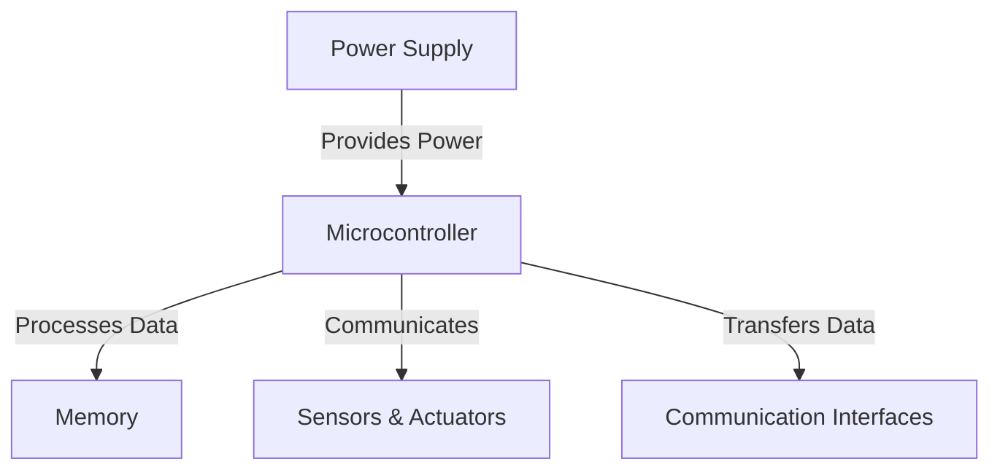

# Embedded Systems Technical Notes  
<!-- [A beginner-friendly introduction to embedded systems, covering fundamental principles, key components, and real-world applications.]   -->

## Quick Reference  
- **Definition:** An embedded system is a dedicated computing system designed for a specific function within a larger device.  
- **Key Use Cases:** IoT devices, automotive systems, industrial automation, medical equipment, consumer electronics.  
- **Prerequisites:** Basic knowledge of electronics, programming (C, Python, or Rust), and microcontrollers.  

## Table of Contents  
1. Introduction  
2. Core Concepts  
   - Fundamental Understanding  
   - Key Components  
   - Common Misconceptions  
3. Visual Architecture  
4. Implementation Details  
   - Basic Implementation  
5. Real-World Applications  
   - Industry Examples  
   - Hands-On Project  
6. Tools & Resources  
   - Essential Tools  
   - Learning Resources  
7. References  
8. Appendix  

## Introduction  

### What is an Embedded System?  
An **embedded system** is a combination of hardware and software designed to perform a specific task efficiently. Unlike general-purpose computers, embedded systems are optimized for dedicated functions with constraints on power, memory, and performance.  

### Why are Embedded Systems Important?  
- **Efficiency:** Optimized for performance with minimal resource usage.  
- **Reliability:** Designed for long-term, continuous operation.  
- **Real-Time Processing:** Many systems operate under strict timing constraints.  
- **Wide Applications:** Used in IoT, automotive, robotics, and healthcare.  

### Where are Embedded Systems Used?  
- **Automotive:** Engine control units (ECUs), ADAS, infotainment systems.  
- **Industrial Automation:** PLCs, robotics, smart sensors.  
- **Healthcare:** Medical devices, pacemakers, diagnostic tools.  
- **Consumer Electronics:** Smart TVs, wearables, gaming consoles.  

## Core Concepts  

### Fundamental Understanding  
1. **Microcontrollers vs. Microprocessors**  
   - **Microcontroller (MCU):** Self-contained unit with CPU, RAM, ROM, and peripherals (e.g., Arduino, STM32).  
   - **Microprocessor (MPU):** Requires external components (e.g., Raspberry Pi, ARM Cortex-A).  

2. **Real-Time Operating Systems (RTOS)**  
   - **Hard Real-Time:** Critical tasks must execute within strict time limits (e.g., pacemakers).  
   - **Soft Real-Time:** Delays are acceptable but not desirable (e.g., multimedia systems).  

3. **Power Management in Embedded Systems**  
   - Battery-powered designs require low-power modes (sleep, deep sleep).  
   - Energy-efficient communication protocols (e.g., Bluetooth Low Energy, Zigbee).  

### Key Components  
- **Microcontroller Unit (MCU)** – The "brain" of the system.  
- **Memory (RAM, ROM, Flash)** – Stores programs and data.  
- **Sensors & Actuators** – Enable interaction with the physical world.  
- **Communication Interfaces** – UART, I2C, SPI, CAN, Ethernet.  
- **Power Supply Unit (PSU)** – Converts and regulates power.  

### Common Misconceptions  
❌ Embedded systems are just small computers.  
✅ They are optimized for specific tasks with limited resources.  

❌ Only C is used in embedded programming.  
✅ Other languages like Rust, Python (MicroPython), and Ada are also used.  

## Visual Architecture  



- **Power Supply:** Converts voltage for system operation.  
- **Microcontroller:** Central processing unit of the embedded system.  
- **Memory:** Stores program code and runtime data.  
- **Sensors & Actuators:** Collect data and perform actions.  
- **Communication Interfaces:** Facilitate data exchange with other devices.  

## Implementation Details  

### Basic Implementation (Beginner)  

#### Blinking an LED using Arduino (C)  
```c
void setup() {
  pinMode(13, OUTPUT);
}

void loop() {
  digitalWrite(13, HIGH); // Turn LED on
  delay(1000);            // Wait 1 second
  digitalWrite(13, LOW);  // Turn LED off
  delay(1000);            // Wait 1 second
}
```

**Steps:**  
1. Set up an Arduino board.  
2. Connect an LED to pin 13.  
3. Upload the code using the Arduino IDE.  
4. Observe the LED blinking.  

**Common Pitfalls:**  
- Forgetting to set the pin mode in `setup()`.  
- Using blocking `delay()` in time-sensitive applications.  

## Real-World Applications  

### Industry Examples  
- **Smart Home Automation:** Smart thermostats, voice assistants.  
- **Automotive Systems:** Airbag controllers, anti-lock braking systems (ABS).  
- **Medical Devices:** Heart rate monitors, insulin pumps.  

### Hands-On Project: Temperature Monitoring System  
**Goal:** Build a simple temperature monitoring system using a microcontroller and a temperature sensor.  

**Hardware:**  
- Arduino Uno  
- DHT11 Temperature Sensor  
- LCD Display  

**Implementation Steps:**  
1. Connect the DHT11 sensor to the microcontroller.  
2. Read temperature data from the sensor.  
3. Display the temperature on an LCD.  
4. Set up an alarm if temperature exceeds a threshold.  

**Validation Methods:**  
- Test sensor readings at different temperatures.  
- Measure response time and accuracy.  

## Tools & Resources  

### Essential Tools  
- **Microcontrollers:** Arduino, ESP32, STM32.  
- **Development Environments:** Arduino IDE, PlatformIO, Keil, MPLAB.  
- **Debugging Tools:** Logic analyzers, oscilloscopes, JTAG debuggers.  

### Learning Resources  
- **Documentation:** [ARM Cortex-M Guide](https://developer.arm.com/documentation/101407/latest/)  
- **Tutorials:** [Embedded Systems with C](https://www.edx.org/course/embedded-systems)  
- **Communities:** [Embedded Systems Stack Exchange](https://electronics.stackexchange.com/)  

## References  
- [The Art of Designing Embedded Systems – Jack Ganssle]  
- [Embedded Systems Handbook – Richard Zurawski]  
- [ARM System-on-Chip Architecture – Steve Furber]  

## Appendix  

### Glossary  
- **Firmware:** Software designed to control embedded hardware.  
- **Interrupts:** Mechanisms that pause execution to handle events.  
- **Bootloader:** Small program that loads the main firmware.  

### Setup Guides  
- Installing Arduino IDE and writing your first program.  
- Setting up an ESP32 development environment.  

### Code Templates  
- **UART Communication:** Sending data between two devices.  
- **PWM Motor Control:** Speed control using Pulse Width Modulation.  
- **Low-Power Modes:** Reducing power consumption in IoT devices.  
