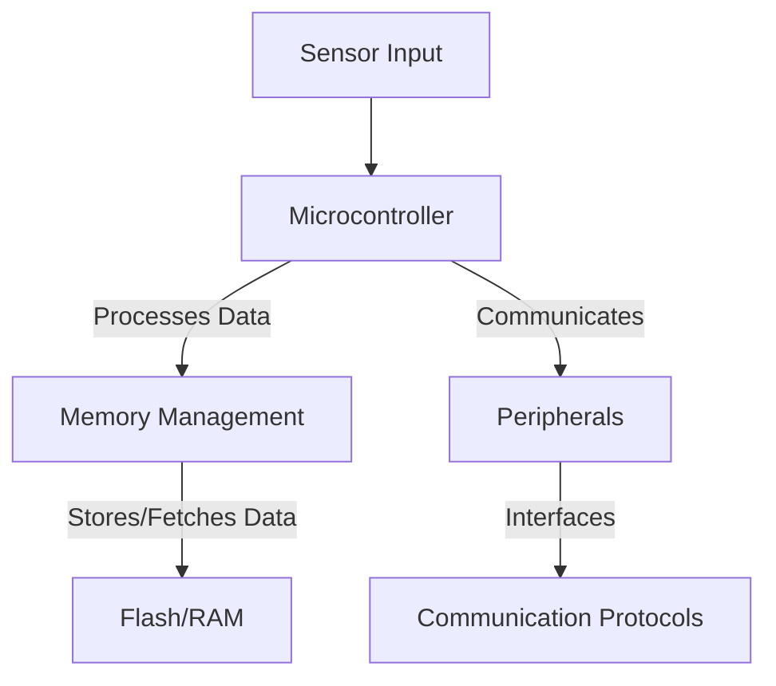

# Embedded Systems Technical Notes (Intermediate Level)  
<!-- [A deeper dive into embedded systems, covering architecture, real-time constraints, debugging, and low-power design.]   -->

## Quick Reference  
- **Target Audience:** Engineers familiar with microcontrollers, programming (C, C++), and basic hardware concepts.  
- **Key Topics:** RTOS, memory management, peripherals, debugging techniques, low-power optimization.  
- **Prerequisites:** Understanding of basic embedded systems, GPIO, UART, and simple microcontroller projects.  

## Table of Contents  
1. Advanced System Architecture  
2. Real-Time Constraints & RTOS  
3. Memory & Storage Management  
4. Power Optimization Techniques  
5. Peripheral Communication & Protocols  
6. Debugging & Performance Optimization  
7. Security in Embedded Systems  
8. Industry Applications & Advanced Projects  
9. References & Resources  

---

## 1️⃣ Advanced System Architecture  

### **Microcontroller vs. Microprocessor**  
| Feature        | Microcontroller (MCU) | Microprocessor (MPU) |
|--------------|----------------|----------------|
| **Integration** | CPU, RAM, ROM, Peripherals in one chip | CPU only, requires external memory and peripherals |
| **Power Consumption** | Low | Higher |
| **Application** | Real-time, embedded tasks (IoT, sensors, control systems) | General-purpose computing (Raspberry Pi, AI workloads) |

### **Embedded System Categories**  
- **Bare-metal Systems** – No OS, direct hardware control.  
- **RTOS-based Systems** – Run a real-time operating system for task scheduling.  
- **Embedded Linux Systems** – Use Linux distributions for complex tasks (e.g., Raspberry Pi, automotive ECUs).  

### **Common Architectures**  
- **Von Neumann vs. Harvard Architecture**  
- **ARM Cortex-M vs. RISC-V**  
- **Single-core vs. Multi-core MCUs**  



---

## 2️⃣ Real-Time Constraints & RTOS  

### **Real-Time Operating Systems (RTOS)**  
- **Hard Real-Time**: Guarantees response times (e.g., airbag systems).  
- **Soft Real-Time**: Delays are acceptable but minimized (e.g., video streaming).  

### **RTOS Concepts**  
| Feature | Description |
|---------|------------|
| **Tasks/Threads** | Independent execution units within an RTOS |
| **Scheduler** | Determines task execution order |
| **Interrupts (ISR)** | Handles urgent events (e.g., sensor triggers) |
| **Mutex/Semaphores** | Synchronization mechanisms to prevent resource conflicts |
| **Message Queues** | Used for task communication |

#### **Example: FreeRTOS Task Switching**  
```c
void vTask1(void *pvParameters) {
    while (1) {
        printf("Task 1 Running\n");
        vTaskDelay(1000 / portTICK_PERIOD_MS);
    }
}

void vTask2(void *pvParameters) {
    while (1) {
        printf("Task 2 Running\n");
        vTaskDelay(500 / portTICK_PERIOD_MS);
    }
}

int main() {
    xTaskCreate(vTask1, "Task1", 1000, NULL, 1, NULL);
    xTaskCreate(vTask2, "Task2", 1000, NULL, 1, NULL);
    vTaskStartScheduler();  // Start RTOS
}
```

---

## 3️⃣ Memory & Storage Management  

### **Memory Types in Embedded Systems**  
- **SRAM:** Fast but volatile (used for runtime data).  
- **Flash Memory:** Non-volatile, used for firmware storage.  
- **EEPROM:** Non-volatile, used for small data storage.  

### **Memory Optimization Techniques**  
- Use `volatile` keyword for shared variables in ISRs.  
- Avoid heap fragmentation (`malloc()` is dangerous in embedded).  
- Use memory pools for dynamic allocations in RTOS-based systems.  

**Example: Static Memory Allocation for RTOS Tasks**  
```c
static StackType_t xStackBuffer[128];
static StaticTask_t xTaskBuffer;

void Task(void *pvParameters) {
    while (1) { printf("Task Running\n"); }
}

void app_main() {
    xTaskCreateStatic(Task, "Task", 128, NULL, 1, xStackBuffer, &xTaskBuffer);
}
```

---

## 4️⃣ Power Optimization Techniques  

- **Sleep Modes**: Use low-power states (`STOP`, `STANDBY`).  
- **Clock Gating**: Disable unused peripherals to reduce power.  
- **Dynamic Voltage Scaling (DVS)**: Adjust supply voltage dynamically.  
- **Interrupt-driven Processing**: Avoid busy loops, use interrupts instead.  

**Example: ESP32 Deep Sleep Mode**  
```c
#include "esp_sleep.h"

void setup() {
    esp_sleep_enable_timer_wakeup(1000000); // 1 second
    esp_deep_sleep_start();
}
```

---

## 5️⃣ Peripheral Communication & Protocols  

### **Common Protocols**  
| Protocol | Speed | Use Case |
|----------|-------|----------|
| **UART** | Slow | Debugging, serial communication |
| **SPI** | Fast | High-speed sensors, SD cards |
| **I2C** | Moderate | Multiple peripherals, sensors |
| **CAN** | Fast | Automotive, industrial networks |
| **Ethernet/WiFi** | High | IoT, connected devices |

**Example: I2C Communication with a Sensor (STM32)**  
```c
HAL_I2C_Master_Transmit(&hi2c1, SENSOR_ADDR, data, sizeof(data), HAL_MAX_DELAY);
HAL_I2C_Master_Receive(&hi2c1, SENSOR_ADDR, buffer, sizeof(buffer), HAL_MAX_DELAY);
```

---

## 6️⃣ Debugging & Performance Optimization  

### **Common Debugging Tools**  
- **JTAG/SWD Debuggers** (Segger J-Link, ST-Link).  
- **Logic Analyzers** for signal debugging.  
- **Profiling Tools** (e.g., ARM Keil µVision).  

### **Optimization Techniques**  
- Minimize interrupt latency.  
- Optimize loops with **DMA (Direct Memory Access)** instead of CPU polling.  
- Use **Fixed-point arithmetic** instead of floating-point operations.  

---

## 7️⃣ Security in Embedded Systems  

### **Key Security Measures**  
- **Secure Bootloaders**: Prevent unauthorized firmware updates.  
- **Encryption**: AES, ECC for data security.  
- **Code Obfuscation**: Prevent reverse engineering.  
- **Watchdog Timers (WDT)**: Prevent system hang-ups.  

**Example: Enabling Watchdog Timer (ESP32)**  
```c
esp_task_wdt_init(5, true);  // Timeout 5s
esp_task_wdt_add(NULL);       // Add current task
```

---

## 8️⃣ Industry Applications & Advanced Projects  

### **Real-World Use Cases**  
- **Automotive:** ADAS, engine control, EV battery management.  
- **Industrial IoT (IIoT):** Predictive maintenance, robotics.  
- **Wearables:** Smartwatches, fitness trackers.  

### **Advanced Project: Real-Time Data Logging System**  
**Goal:** Log sensor data from an accelerometer to an SD card every millisecond while sending data over UART.  

**Features:**  
- RTOS-based multitasking  
- SPI communication with SD card  
- UART debugging  

---

## 9️⃣ References & Resources  

### **Books**  
- *"Embedded Systems Design"* – Steve Heath  
- *"The Art of Embedded Systems Programming"* – Jack Ganssle  

### **Online Courses**  
- [MIT Embedded Systems](https://ocw.mit.edu/)  
- [ARM Cortex-M Programming](https://www.arm.com/)  
