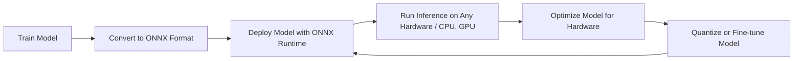

# ONNX (Open Neural Network Exchange) - Notes

## Table of Contents (ToC)
  - [Introduction](#introduction)
  - [Key Concepts](#key-concepts)
    - [Feynman Principle](#feynman-principle)
    - [Misconceptions or Difficult Points](#misconceptions-or-difficult-points)
  - [Why It Matters / Relevance](#why-it-matters--relevance)
  - [Architecture Pipeline](#architecture-pipeline)
  - [Framework / Key Theories or Models](#framework--key-theories-or-models)
  - [How ONNX Works](#how-onnx-works)
  - [Methods, Types \& Variations](#methods-types--variations)
    - [Contrasting Examples](#contrasting-examples)
  - [Self-Practice / Hands-On Examples](#self-practice--hands-on-examples)
  - [Pitfalls \& Challenges](#pitfalls--challenges)
  - [Feedback \& Evaluation](#feedback--evaluation)
  - [Tools, Libraries \& Frameworks](#tools-libraries--frameworks)
  - [Hello World! (Practical Example)](#hello-world-practical-example)
  - [Advanced Exploration](#advanced-exploration)
  - [Zero to Hero Lab Projects](#zero-to-hero-lab-projects)
  - [Continuous Learning Strategy](#continuous-learning-strategy)
  - [References](#references)


## Introduction
- **ONNX (Open Neural Network Exchange)** is an open-source format for representing machine learning models, enabling models trained in different frameworks like PyTorch and TensorFlow to be interoperable across different platforms and tools.

## Key Concepts
- **Interoperability**: ONNX provides a common format that allows models to be trained in one framework (e.g., PyTorch) and deployed in another (e.g., TensorFlow or Caffe2).
- **Model Conversion**: ONNX allows seamless conversion between different deep learning frameworks, eliminating the need for re-training models when switching platforms.
- **ONNX Runtime**: A high-performance inference engine that accelerates ONNX model deployment on different hardware platforms, such as CPUs, GPUs, and accelerators like NVIDIA’s TensorRT.
- **Operators and Graph Representation**: ONNX models consist of a computational graph of operators that can run on various hardware backends.
- **Pre-trained Models**: ONNX has a growing model zoo, a repository of pre-trained models that are readily available for deployment.

### Feynman Principle
- ONNX helps developers move their machine learning models from one environment to another without needing to rebuild or re-train the models from scratch.

### Misconceptions or Difficult Points
- **Misconception**: ONNX is a framework like PyTorch or TensorFlow. Reality: ONNX is a model format for representing models, not a training framework.
- **Difficult Point**: Model conversion isn’t always smooth, especially when frameworks use custom or unsupported layers.

## Why It Matters / Relevance
- **Framework Agnostic**: ONNX allows flexibility between different deep learning frameworks, letting developers choose the best tool for each task without worrying about compatibility.
- **Hardware Acceleration**: It allows models to run efficiently on different hardware architectures, including CPUs, GPUs, and specialized accelerators.
- **Edge Computing**: ONNX models can be deployed on edge devices, especially when paired with ONNX Runtime, making it suitable for real-time, low-latency applications.
- **Standardization**: By providing a common format, ONNX helps create a standardized ecosystem for model exchange and inference across industries.
- **Scalability**: ONNX models are portable and can be deployed from local devices to cloud platforms seamlessly, making it a powerful tool for scaling machine learning applications.

## Architecture Pipeline

- **Logical Steps**: Train → Convert → Deploy → Run → Optimize → Repeat.

## Framework / Key Theories or Models
1. **ONNX Model Format**: A standardized file format (.onnx) that defines models using a computational graph of nodes and operators.
2. **ONNX Operators**: Standardized building blocks of deep learning models, ensuring that different frameworks can interpret the same graph.
3. **ONNX Runtime**: A cross-platform, high-performance inference engine that can run ONNX models on various hardware configurations.
4. **Quantization**: The process of converting a model's weights from floating-point precision (FP32) to lower precision (INT8) to optimize performance, especially on edge devices.
5. **Conversion Tools**: Tools like PyTorch's `torch.onnx.export` and TensorFlow’s `tf2onnx` facilitate converting models from popular frameworks into ONNX format.

## How ONNX Works
- **Step-by-step**:
   1. **Train Model**: Use frameworks like PyTorch or TensorFlow to train a machine learning model.
   2. **Export Model to ONNX**: Convert the trained model into ONNX format using conversion tools (`torch.onnx.export` or `tf2onnx`).
   3. **Load Model in ONNX Runtime**: Load the ONNX model into the ONNX Runtime engine for high-performance inference.
   4. **Run Inference**: Run inference on the model across various hardware backends, such as CPU, GPU, or specialized hardware accelerators.
   5. **Optimization**: Apply optimizations, such as quantization, to improve the model’s performance and efficiency.

## Methods, Types & Variations
- **Exporting from PyTorch**: PyTorch provides a built-in function `torch.onnx.export()` to convert models into ONNX format.
- **Exporting from TensorFlow**: TensorFlow models can be converted using `tf2onnx`, a conversion tool that translates TensorFlow models into ONNX.
- **ONNX Runtime Variants**:
  - **ONNX Runtime**: General-purpose inference engine.
  - **ONNX Runtime with TensorRT**: Optimized for NVIDIA GPUs.
  - **ONNX Runtime for Mobile**: Lightweight version optimized for mobile and edge devices.
  
### Contrasting Examples
- **FP32 vs. INT8 Inference**: FP32 uses full floating-point precision for accuracy, but INT8 quantization speeds up inference on resource-constrained devices with slight accuracy trade-offs.
- **PyTorch Export** vs. **TensorFlow Export**: PyTorch has a native exporter, while TensorFlow requires `tf2onnx` for conversion.

## Self-Practice / Hands-On Examples
1. **Convert a PyTorch Model to ONNX**: Use the `torch.onnx.export()` function to convert a pre-trained ResNet model.
2. **Run Inference with ONNX Runtime**: Deploy the converted ONNX model on your local machine and run inference on an image classification task.
3. **Quantize the Model**: Apply quantization to reduce the model size and run inference with ONNX Runtime, comparing the performance of FP32 vs. INT8 models.

## Pitfalls & Challenges
- **Unsupported Layers**: Some layers or operations from the original frameworks may not be directly supported by ONNX, requiring custom layers or adaptation.
- **Conversion Issues**: Model conversion might not be perfect for complex or custom architectures.
- **Precision Loss**: Quantization might lead to minor accuracy loss, especially in tasks requiring fine precision.

## Feedback & Evaluation
1. **Feynman Technique**: Explain the process of converting a PyTorch model to ONNX format and running inference with ONNX Runtime to a beginner.
2. **Peer Review**: Present your ONNX-based workflow to a colleague and get feedback on model performance and compatibility.
3. **Benchmark Testing**: Measure and compare the performance of FP32 and INT8 models in terms of inference speed and accuracy using ONNX Runtime.

## Tools, Libraries & Frameworks
1. **ONNX Runtime**: A cross-platform, high-performance engine for running ONNX models.
   - **Pros**: Optimized for multiple hardware platforms, scalable.
   - **Cons**: Limited support for custom operations.
2. **PyTorch Exporter**: Native ONNX exporter for PyTorch models.
   - **Pros**: Easy to use, well-integrated with PyTorch.
   - **Cons**: May require adaptation for custom layers.
3. **tf2onnx**: A tool for converting TensorFlow models to ONNX format.
   - **Pros**: Provides a smooth transition from TensorFlow to ONNX.
   - **Cons**: Conversion issues with complex models.
4. **ONNX Model Zoo**: A collection of pre-trained ONNX models available for deployment.
   - **Pros**: Ready-to-use models for many tasks.
   - **Cons**: Limited models compared to other model zoos.
5. **ONNX Quantization Tool**: Helps optimize ONNX models for edge devices by converting models from FP32 to INT8 precision.

## Hello World! (Practical Example)
```python
import torch
import onnx
import onnxruntime as ort

# Load a pretrained PyTorch model
model = torch.hub.load('pytorch/vision:v0.10.0', 'resnet18', pretrained=True)

# Export the model to ONNX format
dummy_input = torch.randn(1, 3, 224, 224)
torch.onnx.export(model, dummy_input, "resnet18.onnx")

# Run inference with ONNX Runtime
ort_session = ort.InferenceSession("resnet18.onnx")
outputs = ort_session.run(None, {"input": dummy_input.numpy()})

print(outputs)
```
- This example demonstrates converting a PyTorch ResNet model to ONNX and running inference with ONNX Runtime.

## Advanced Exploration
1. **Paper**: "ONNX: Open Neural Network Exchange" – discusses ONNX's impact on model portability and standardization.
2. **Video**: ONNX Runtime tutorials on optimizing model inference across hardware backends.
3. **Article**: "Quantizing ONNX Models for Edge Devices" – practical guide on model quantization for improved performance on low-resource devices.

## Zero to Hero Lab Projects
- **Project**: Build a cross-platform object detection system using ONNX.
   - Convert a pre-trained YOLO model to ONNX format.


   - Deploy it on a CPU-based edge device and a GPU-based cloud server, comparing performance metrics.
  
## Continuous Learning Strategy
- Follow ONNX GitHub updates to stay informed about new model support and tools.
- Experiment with converting different types of neural networks (e.g., RNNs, CNNs) into ONNX and run performance benchmarks across different platforms.

## References
- Official ONNX documentation: https://onnx.ai
- PyTorch to ONNX Conversion Guide: https://pytorch.org/tutorials/advanced/super_resolution_with_onnxruntime