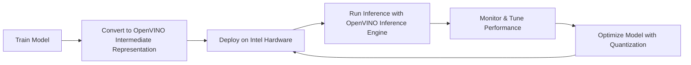

# OpenVINO Toolkit - Notes

## Table of Contents (ToC)
  - [Introduction](#introduction)
  - [Key Concepts](#key-concepts)
    - [Feynman Principle](#feynman-principle)
    - [Misconceptions or Difficult Points](#misconceptions-or-difficult-points)
  - [Why It Matters / Relevance](#why-it-matters--relevance)
  - [Architecture Pipeline](#architecture-pipeline)
  - [Framework / Key Theories or Models](#framework--key-theories-or-models)
  - [How OpenVINO Works](#how-openvino-works)
  - [Methods, Types \& Variations](#methods-types--variations)
    - [Contrasting Examples](#contrasting-examples)
  - [Self-Practice / Hands-On Examples](#self-practice--hands-on-examples)
  - [Pitfalls \& Challenges](#pitfalls--challenges)
  - [Feedback \& Evaluation](#feedback--evaluation)
  - [Tools, Libraries \& Frameworks](#tools-libraries--frameworks)
  - [Hello World! (Practical Example)](#hello-world-practical-example)
  - [Advanced Exploration](#advanced-exploration)
  - [Zero to Hero Lab Projects](#zero-to-hero-lab-projects)
  - [Continuous Learning Strategy](#continuous-learning-strategy)
  - [References](#references)


## Introduction
- **OpenVINO Toolkit** is a toolkit developed by Intel that helps developers optimize and deploy deep learning models on Intel hardware, such as CPUs, GPUs, and VPUs, to improve inference performance, particularly for computer vision applications.

## Key Concepts
- **Model Optimization**: OpenVINO optimizes models for inference by reducing precision (e.g., converting FP32 models to INT8) and accelerating them on Intel hardware.
- **Inference Engine**: A key component that runs optimized models on various Intel hardware.
- **Model Conversion**: Converts pre-trained models from frameworks like TensorFlow, PyTorch, and ONNX into OpenVINO Intermediate Representation (IR).
- **Intermediate Representation (IR)**: A platform-agnostic format used by OpenVINO to run optimized models on different devices.
- **Hardware Acceleration**: Uses Intel CPUs, integrated GPUs, VPUs, and FPGAs to speed up inference tasks.

### Feynman Principle
- OpenVINO helps convert and optimize AI models, making them run faster on Intel hardware without requiring developers to write specialized code for different devices.

### Misconceptions or Difficult Points
- **Misconception**: OpenVINO only works on Intel processors. Reality: While optimized for Intel hardware, it also supports other platforms.
- **Difficult Point**: Model conversion can be tricky if the original model contains unsupported operations or custom layers.

## Why It Matters / Relevance
- **Edge Computing**: OpenVINO enables high-performance inference on Intel-based edge devices, making it ideal for IoT and real-time computer vision applications.
- **Cross-Hardware Compatibility**: It allows the same model to run on different Intel hardware (CPUs, GPUs, VPUs) with minimal modification, simplifying deployment.
- **Low Latency**: Optimizes models to minimize latency, critical for tasks like video surveillance, autonomous systems, and robotics.
- **Scalability**: OpenVINO’s flexibility allows models to scale across different Intel devices in data centers, edge, or consumer products.
- **Real-time Analytics**: Boosts performance for real-time analytics in fields like healthcare (e.g., AI-assisted diagnostics), retail (e.g., smart checkout), and industrial automation.

## Architecture Pipeline

- **Logical Steps**: Train → Convert to IR → Deploy → Run inference → Tune performance → Optimize → Redeploy.

## Framework / Key Theories or Models
1. **Intermediate Representation (IR)**: OpenVINO converts models into a format (IR) optimized for inference across multiple Intel devices.
2. **Layer Fusion**: Combines multiple layers into one to reduce computation and improve inference speed.
3. **Post-training Optimization**: Techniques like quantization and pruning applied after model training to boost performance without re-training.
4. **Heterogeneous Execution**: OpenVINO can run different parts of the model on different hardware, such as CPU for general tasks and GPU for parallel processing.
5. **Edge AI**: Running AI algorithms locally on devices rather than relying on cloud resources.

## How OpenVINO Works
- **Step-by-step**:
   1. **Train Model**: Use frameworks like TensorFlow, PyTorch, or ONNX to train a model.
   2. **Convert Model**: Convert the model into OpenVINO’s Intermediate Representation (IR) using the Model Optimizer.
   3. **Deploy Model**: Load the model onto Intel hardware using the Inference Engine.
   4. **Inference**: Run real-time inference on Intel devices (e.g., CPU, GPU, FPGA) optimized for low latency.
   5. **Optimization**: Apply further optimizations like quantization to reduce model size and improve efficiency.

## Methods, Types & Variations
- **Post-training Quantization**: Reduce the precision of weights from FP32 to INT8, resulting in faster inference with minimal accuracy loss.
- **Heterogeneous Execution**: Execute different parts of the model on different hardware (e.g., use CPU and GPU together).
- **Model Pruning**: Reduces model size by removing unnecessary layers and parameters.

### Contrasting Examples
- **Quantization** vs. **Pruning**: Quantization reduces precision of weights, while pruning removes unnecessary parts of the model.
- **CPU Deployment** vs. **GPU Deployment**: Running on CPU is more general-purpose but slower, while GPU deployment leverages parallelism for faster inference.

## Self-Practice / Hands-On Examples
1. **Convert a Model to IR**: Convert a pre-trained TensorFlow or PyTorch model into OpenVINO’s IR format.
2. **Run Inference on Intel CPU**: Deploy the converted model on an Intel CPU and test inference performance on an image classification task.
3. **Quantize the Model**: Apply post-training quantization to the model and compare its performance and accuracy before and after.

## Pitfalls & Challenges
- **Unsupported Operations**: Not all operations in the original models are supported by OpenVINO; custom layers may require extra steps.
- **Hardware Compatibility**: Some Intel features, like VPU support, might not be available on all systems.
- **Accuracy Loss**: Post-training optimization techniques like quantization might slightly reduce accuracy, particularly in sensitive models like medical diagnostics.

## Feedback & Evaluation
1. **Feynman Technique**: Explain how to convert a TensorFlow model to OpenVINO’s IR format to a non-expert.
2. **Peer Review**: Share your OpenVINO deployment workflow with colleagues and gather feedback.
3. **Performance Testing**: Test your model’s inference speed and accuracy before and after applying optimizations like quantization.

## Tools, Libraries & Frameworks
1. **OpenVINO Model Optimizer**: Converts models from popular frameworks into OpenVINO’s IR format.
   - **Pros**: Easy to use with many frameworks.
   - **Cons**: Some unsupported layers require manual intervention.
2. **OpenVINO Inference Engine**: Runs optimized models on Intel hardware.
   - **Pros**: High-performance, cross-hardware support.
   - **Cons**: Optimized mainly for Intel devices.
3. **Benchmark App**: A tool to measure the performance of the OpenVINO model on different hardware.
   - **Pros**: Quickly evaluate inference speed and latency.
   - **Cons**: Limited to Intel hardware testing.
4. **Intel Distribution of OpenVINO**: A comprehensive package that includes everything needed for model optimization and deployment.
   - **Pros**: Full-featured, wide support for Intel products.
   - **Cons**: Designed specifically for Intel platforms.

## Hello World! (Practical Example)
```python
from openvino.runtime import Core

# Load the Inference Engine
ie = Core()

# Load the network model (.xml and .bin files)
model = ie.read_model(model="mobilenet_v2.xml")
compiled_model = ie.compile_model(model=model, device_name="CPU")

# Create an inference request
infer_request = compiled_model.create_infer_request()

# Load input image and preprocess
input_image = preprocess_image('image.jpg')

# Perform inference
result = infer_request.infer({0: input_image})

# Process output
print(result)
```
- This code demonstrates how to load and run inference using an OpenVINO model on Intel hardware.

## Advanced Exploration
1. **Paper**: "OpenVINO: Deep Learning Deployment Toolkit for Edge Inference" – details on model optimization and performance.
2. **Video**: OpenVINO tutorial on deploying models on Intel hardware and optimizing for edge devices.
3. **Article**: "Model Quantization in OpenVINO: Best Practices" – advanced techniques for post-training optimizations.

## Zero to Hero Lab Projects
- **Project**: Build a real-time object detection system on Intel hardware using OpenVINO.
   - Convert a pre-trained object detection model to OpenVINO IR format.
   - Deploy the model on an Intel CPU/GPU and implement real-time inference on video input.

## Continuous Learning Strategy
- **Next Steps**: 
   - Explore heterogeneous execution to distribute model tasks across CPU and GPU.
   - Experiment with model quantization and pruning to further optimize your models for performance and size.
- **Related Topics**: Edge AI, FPGA acceleration, and Intel’s oneAPI for cross-hardware programming.

## References
- **OpenVINO Documentation**: https://docs.openvino.ai/latest/index.html
- **OpenVINO Model Optimizer**: https://docs.openvino.ai/latest/openvino_docs_MO_DG_Deep_Learning_Model_Optimizer_DevGuide.html
- **Quantization Techniques**: https://arxiv.org/abs/1712.05877