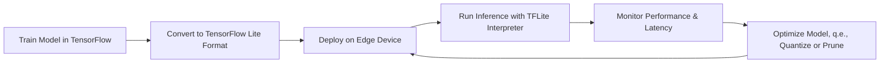

# TensorFlow Lite - Notes

## Table of Contents (ToC)

  - [Introduction](#introduction)
  - [Key Concepts](#key-concepts)
    - [Feynman Principle](#feynman-principle)
    - [Misconceptions or Difficult Points](#misconceptions-or-difficult-points)
  - [Why It Matters / Relevance](#why-it-matters--relevance)
  - [Architecture Pipeline](#architecture-pipeline)
  - [Framework / Key Theories or Models](#framework--key-theories-or-models)
  - [How TensorFlow Lite Works](#how-tensorflow-lite-works)
  - [Methods, Types \& Variations](#methods-types--variations)
    - [Contrasting Examples](#contrasting-examples)
  - [Self-Practice / Hands-On Examples](#self-practice--hands-on-examples)
  - [Pitfalls \& Challenges](#pitfalls--challenges)
  - [Feedback \& Evaluation](#feedback--evaluation)
  - [Tools, Libraries \& Frameworks](#tools-libraries--frameworks)
  - [Hello World! (Practical Example)](#hello-world-practical-example)
  - [Advanced Exploration](#advanced-exploration)
  - [Zero to Hero Lab Projects](#zero-to-hero-lab-projects)
  - [Continuous Learning Strategy](#continuous-learning-strategy)
  - [References](#references)


## Introduction
- TensorFlow Lite (TFLite) is a lightweight version of TensorFlow designed to run machine learning models on edge devices with limited resources like mobile phones, microcontrollers, and embedded systems.

## Key Concepts
- **Model Conversion**: TensorFlow models are converted to TensorFlow Lite format, optimizing them for size and performance on edge devices.
- **Interpreter**: A runtime environment that runs TensorFlow Lite models on edge devices.
- **Quantization**: Reduces the precision of model weights to make models faster and lighter.
- **Edge Device**: A device with local computing capabilities to run machine learning models without cloud dependency.
- **Latency**: The delay between input data processing and receiving model output, crucial in real-time applications.

### Feynman Principle
- TensorFlow Lite simplifies deploying ML models to devices with limited computing power, offering a fast, efficient solution for edge applications.

### Misconceptions or Difficult Points
- **Misconception**: TensorFlow Lite supports all TensorFlow models and operations. Reality: Some models need to be optimized or simplified before conversion.
- **Difficult Point**: Model accuracy may degrade after applying optimizations like quantization.

## Why It Matters / Relevance
- **Real-time Applications**: TensorFlow Lite enables applications such as object detection, speech recognition, and pose estimation to run locally on mobile or edge devices.
- **Low Latency**: By running models locally, TensorFlow Lite ensures low latency in tasks requiring real-time responses, like robotics or augmented reality.
- **Energy Efficiency**: Edge devices save energy by running models locally, avoiding the need to send data to the cloud.
- **Scalability**: Deploying models to a large number of devices without relying on cloud infrastructure reduces costs and increases scalability.
- **IoT Expansion**: TensorFlow Lite is key to enabling intelligent IoT systems that rely on AI at the edge.

## Architecture Pipeline

- **Logical Steps**: Train model → Convert to TensorFlow Lite → Deploy → Run inference → Monitor → Optimize → Redeploy.

## Framework / Key Theories or Models
1. **Quantization**: Converts high-precision model weights (e.g., 32-bit floats) into lower precision (e.g., 8-bit) to reduce size and increase speed.
2. **Pruning**: Removes unnecessary weights and connections from the model to make it smaller.
3. **Distillation**: Compresses large models by training smaller models using the predictions of the larger model as guidance.
4. **Edge Computing**: Processing data locally on the device instead of sending it to a remote server.
5. **On-device AI**: Running machine learning inference locally without requiring cloud resources.

## How TensorFlow Lite Works
- **Step-by-step**:
   1. **Train Model**: Use TensorFlow to train a deep learning model.
   2. **Convert Model**: Convert the TensorFlow model to TFLite format using the TensorFlow Lite Converter.
   3. **Deploy Model**: Load the converted model on the target edge device.
   4. **Inference**: The TFLite Interpreter runs the model, taking input data, processing it, and returning predictions.
   5. **Optimize**: Quantize or prune the model to improve performance, then redeploy it for better efficiency.

## Methods, Types & Variations
- **Post-training Quantization**: Applied after training to optimize models for edge devices.
- **Quantization-aware Training**: During training, models are designed to be quantized later without losing much accuracy.
- **Full Integer Quantization**: Converts all operations and weights to integer precision for maximum efficiency.

### Contrasting Examples
- **Post-training Quantization** vs. **Quantization-aware Training**: Post-training quantization is simpler but might degrade accuracy, while quantization-aware training provides better accuracy at the cost of increased training complexity.

## Self-Practice / Hands-On Examples
1. **Convert a Pre-trained Model**: Use TensorFlow Lite to convert a pre-trained MobileNet model to the TFLite format.
2. **Run Inference on Raspberry Pi**: Deploy a converted TensorFlow Lite model on a Raspberry Pi and run inference on real-time video data.
3. **Model Quantization**: Apply post-training quantization to reduce model size and test the impact on accuracy.

## Pitfalls & Challenges
- **Model Size vs. Accuracy Trade-off**: Quantization and pruning may degrade accuracy.
- **Hardware Limitations**: Edge devices have limited resources like memory and processing power, requiring heavy optimizations.
- **Unsupported Operations**: Not all TensorFlow operations are supported in TensorFlow Lite, which may require changes to the model architecture.
  
## Feedback & Evaluation
1. **Feynman Technique**: Explain the model conversion and deployment process in TensorFlow Lite to a non-expert.
2. **Peer Review**: Get feedback from developers on your edge device deployment process.
3. **Real-world Simulation**: Test TensorFlow Lite models in real-world scenarios, such as deploying a model in a mobile app.

## Tools, Libraries & Frameworks
1. **TensorFlow Lite**: Optimized for deploying TensorFlow models on edge devices.
   - **Pros**: Cross-platform, supports a wide range of devices.
   - **Cons**: Limited support for some advanced TensorFlow operations.
2. **Edge TPU Compiler**: Used to deploy models on Google Coral devices.
   - **Pros**: High efficiency on Coral hardware.
   - **Cons**: Limited to specific devices.
3. **TFLite Model Maker**: Simplifies creating TensorFlow Lite models from existing datasets.
   - **Pros**: Simplifies model creation for edge devices.
   - **Cons**: Limited flexibility compared to custom TensorFlow models.
4. **TFLite Micro**: For running TensorFlow Lite models on microcontrollers.
   - **Pros**: Ultra-lightweight, ideal for low-power devices.
   - **Cons**: Limited computational power.

## Hello World! (Practical Example)
```python
import tensorflow as tf
from tensorflow import lite

# Load and convert a pre-trained model to TensorFlow Lite
model = tf.keras.applications.MobileNetV2(weights='imagenet')

# Convert the model to TensorFlow Lite format
converter = lite.TFLiteConverter.from_keras_model(model)
tflite_model = converter.convert()

# Save the TFLite model to a file
with open('mobilenet_v2.tflite', 'wb') as f:
    f.write(tflite_model)
```
- This code demonstrates how to convert a MobileNetV2 model to TensorFlow Lite format for deployment on an edge device.

## Advanced Exploration
1. **Paper**: "EfficientNet: Rethinking Model Scaling for Convolutional Neural Networks" – for insights into efficient models for mobile and edge devices.
2. **Video**: TensorFlow Lite tutorial on deploying models to Android devices.
3. **Article**: "The Art of Model Compression" for advanced techniques in optimizing machine learning models.

## Zero to Hero Lab Projects
- **Project**: Build and deploy a real-time image classification system on a Raspberry Pi using TensorFlow Lite and a pre-trained model.
   - Start by deploying a basic image classifier, then optimize it using post-training quantization.

## Continuous Learning Strategy
- **Next Steps**: 
   - Explore quantization-aware training to improve model accuracy on edge devices.
   - Experiment with deploying models on different edge hardware like Coral and NVIDIA Jetson.
- **Related Topics**: Model compression techniques, hardware acceleration for edge devices, and federated learning for edge AI.

## References
- **TensorFlow Lite Documentation**: https://www.tensorflow.org/lite
- **EfficientNet Paper**: https://arxiv.org/abs/1905.11946
- **TensorFlow Lite Model Maker**: https://www.tensorflow.org/lite/models/model_maker