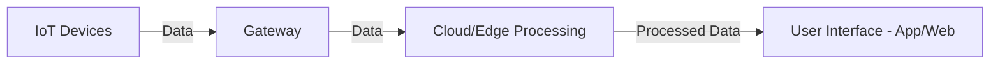

# Internet of Things (IoT) Technical Notes
<!-- [An interconnected network of devices, sensors, and systems exchanging data in real time over the internet.] -->

## Quick Reference
- **Definition:** IoT (Internet of Things) refers to a network of physical devices embedded with sensors, software, and connectivity to collect and exchange data.
- **Key Use Cases:** Smart homes, industrial automation, healthcare monitoring, smart cities, agriculture, and wearable technology.
- **Prerequisites:** Basic knowledge of networking, sensors, and embedded systems.

## Table of Contents
1. [Introduction](#introduction)
2. [Core Concepts](#core-concepts)
    - [Fundamental Understanding](#fundamental-understanding)
    - [Key Components](#key-components)
    - [Common Misconceptions](#common-misconceptions)
3. [Visual Architecture](#visual-architecture)
4. [Implementation Details](#implementation-details)
    - [Basic Implementation (Beginner)](#basic-implementation-beginner)
5. [Real-World Applications](#real-world-applications)
    - [Industry Examples](#industry-examples)
    - [Hands-On Project](#hands-on-project)
6. [Tools & Resources](#tools--resources)
    - [Essential Tools](#essential-tools)
    - [Learning Resources](#learning-resources)
7. [References](#references)
8. [Appendix](#appendix)

## Introduction
### What is IoT?
The Internet of Things (IoT) is a network of interconnected physical devices that communicate and exchange data using internet connectivity. These devices range from simple sensors to complex smart systems.

### Why is IoT Important?
IoT enables automation, remote monitoring, and smart decision-making by providing real-time data. It enhances efficiency, reduces costs, and improves convenience in various sectors.

### Where is IoT Used?
- **Smart Homes:** Automated lighting, security systems, voice assistants.
- **Industrial IoT (IIoT):** Predictive maintenance, asset tracking.
- **Healthcare:** Remote patient monitoring, smart wearables.
- **Agriculture:** Smart irrigation, livestock monitoring.
- **Smart Cities:** Traffic management, waste management systems.

## Core Concepts
### Fundamental Understanding
- **Connectivity:** IoT devices communicate via Wi-Fi, Bluetooth, Zigbee, or LoRaWAN.
- **Sensors & Actuators:** Sensors collect data (e.g., temperature, motion), while actuators perform actions (e.g., turn on a fan).
- **Cloud & Edge Computing:** IoT systems often send data to cloud platforms for processing or use edge computing for real-time decision-making.
- **Data Processing & Analytics:** Data collected from IoT devices is processed to generate insights.

### Key Components
1. **IoT Devices** – Sensors, actuators, and embedded systems.
2. **Connectivity** – Networks such as Wi-Fi, 5G, LoRaWAN, and Bluetooth.
3. **Edge & Cloud Computing** – Data processing at the edge or in the cloud.
4. **Software & Applications** – Platforms like AWS IoT, Google Cloud IoT, and Azure IoT.

### Common Misconceptions
- **IoT is just smart home devices:** IoT extends far beyond home automation to industries, healthcare, and agriculture.
- **IoT devices always need the internet:** Some IoT systems use local networks and edge computing for offline functionality.
- **IoT is just about collecting data:** IoT enables automation and decision-making, not just data collection.

## Visual Architecture

- **IoT Devices:** Collect data from the environment.
- **Gateway:** Acts as a bridge between devices and cloud.
- **Cloud/Edge Processing:** Analyzes and processes data.
- **User Interface:** Provides insights and controls to users.

## Implementation Details
### Basic Implementation (Beginner)
#### Setting up an IoT Sensor (Temperature Monitoring)
```python
import machine
import time

sensor = machine.ADC(0)  # Simulated temperature sensor

while True:
    temperature = sensor.read() * (3.3 / 1024) * 100  # Convert to Celsius
    print(f"Temperature: {temperature}C")
    time.sleep(2)
```
- **Step 1:** Connect a temperature sensor to a microcontroller.
- **Step 2:** Read sensor data and convert it into a usable format.
- **Step 3:** Print the temperature data for monitoring.
- **Common Pitfalls:** Incorrect sensor calibration, poor power management.

## Real-World Applications
### Industry Examples
- **Smart Homes:** Automated climate control, security surveillance.
- **Healthcare:** Remote patient monitoring devices.
- **Industrial IoT:** Predictive maintenance in factories.

### Hands-On Project: Smart Temperature Logger
**Project Goals:**
- Use a microcontroller (ESP32/Raspberry Pi) to log temperature data.
- Send data to a cloud platform (Firebase/AWS IoT).
- Visualize temperature trends over time.

**Implementation Steps:**
1. Read temperature sensor data.
2. Connect to Wi-Fi and send data to a cloud service.
3. Store and visualize data using a dashboard.
4. Implement alerts for extreme temperatures.

## Tools & Resources
### Essential Tools
- **Hardware:** Raspberry Pi, ESP32, Arduino.
- **Networking:** MQTT, HTTP, WebSockets.
- **Cloud Platforms:** AWS IoT, Google Cloud IoT, Firebase.
- **Development Environment:** Arduino IDE, MicroPython, VS Code.

### Learning Resources
- **Documentation:**
  - [MQTT Protocol](https://mqtt.org/)
  - [ESP32 Official Docs](https://docs.espressif.com/)
- **Tutorials:**
  - [Raspberry Pi IoT Projects](https://www.raspberrypi.org/)
  - [MicroPython Guide](https://micropython.org/)
- **Community Resources:**
  - [IoT StackExchange](https://iot.stackexchange.com/)
  - [Hackster.io IoT Projects](https://www.hackster.io/)

## References
- [IEEE IoT Standards](https://standards.ieee.org/)
- [IoT Security Guidelines](https://www.owasp.org/)
- [AWS IoT Core Documentation](https://aws.amazon.com/iot-core/)

## Appendix
### Glossary
- **MQTT:** Lightweight messaging protocol for IoT communication.
- **Edge Computing:** Processing data close to the device rather than in the cloud.
- **LoRaWAN:** Low-power, long-range wireless communication for IoT.

### Setup Guides
- Installing MicroPython on ESP32
- Connecting Raspberry Pi to an IoT cloud service

### Code Templates
- Basic IoT sensor data logger
- Simple IoT dashboard with Flask

