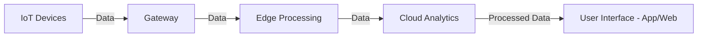

# Internet of Things (IoT) Technical Notes
<!-- [An interconnected network of devices, sensors, and systems exchanging data in real time over the internet.] -->

## Quick Reference
- **Definition:** IoT (Internet of Things) refers to a network of physical devices embedded with sensors, software, and connectivity to collect and exchange data.
- **Key Use Cases:** Smart homes, industrial automation, healthcare monitoring, smart cities, agriculture, and wearable technology.
- **Prerequisites:** Understanding of networking protocols, basic programming, and familiarity with embedded systems.
- **Related Notes:** [Embedded Systems](../../embedded-systems/), [Edge Computing](../../edge-computing/), [Edge AI](../../edge-computing/edge-ai/), [Cloud Computing](../../cloud-computing/). 

## Table of Contents
1. [Introduction](#introduction)
2. [Core Concepts](#core-concepts)
   - [Fundamental Understanding](#fundamental-understanding)
   - [Key Components](#key-components)
   - [Common Misconceptions](#common-misconceptions)
3. [Visual Architecture](#visual-architecture)
4. [Implementation Details](#implementation-details)
   - [Intermediate Patterns](#intermediate-patterns)
5. [Real-World Applications](#real-world-applications)
   - [Industry Examples](#industry-examples)
   - [Hands-On Project](#hands-on-project)
6. [Tools & Resources](#tools--resources)
   - [Essential Tools](#essential-tools)
   - [Learning Resources](#learning-resources)
7. [References](#references)
8. [Appendix](#appendix)

## Introduction
### What is IoT?
The Internet of Things (IoT) is a network of interconnected physical devices that communicate and exchange data using internet connectivity. These devices range from simple sensors to complex smart systems.

### Why is IoT Important?
IoT enables automation, remote monitoring, and smart decision-making by providing real-time data. It enhances efficiency, reduces costs, and improves convenience in various sectors.

### Where is IoT Used?
- **Smart Homes:** Automated lighting, security systems, voice assistants.
- **Industrial IoT (IIoT):** Predictive maintenance, asset tracking.
- **Healthcare:** Remote patient monitoring, smart wearables.
- **Agriculture:** Smart irrigation, livestock monitoring.
- **Smart Cities:** Traffic management, waste management systems.

## Core Concepts
### Fundamental Understanding
- **Connectivity:** IoT devices communicate via Wi-Fi, Bluetooth, Zigbee, or LoRaWAN.
- **Edge Computing:** Data processing at the edge for low latency and efficiency.
- **IoT Protocols:** MQTT, CoAP, HTTP used for communication.
- **Security Considerations:** Encryption, authentication, and threat mitigation.

### Key Components
1. **IoT Devices** – Sensors, actuators, and microcontrollers.
2. **Network Protocols** – MQTT, HTTP, CoAP, WebSockets.
3. **Edge & Cloud Computing** – Processing data locally or on cloud services.
4. **Software & Applications** – Platforms like AWS IoT, Google Cloud IoT, and Azure IoT.

### Common Misconceptions
- **IoT is only for consumer applications:** Industrial and enterprise IoT are major domains.
- **More devices mean better results:** Poorly managed IoT networks can lead to inefficiencies.
- **IoT security is optional:** Weak security can expose networks to cyber threats.

## Visual Architecture

- **IoT Devices:** Collect and transmit data.
- **Gateway:** Routes data and ensures security.
- **Edge Processing:** Filters and processes data before cloud upload.
- **Cloud Analytics:** Provides insights and enables decision-making.
- **User Interface:** Enables interaction and monitoring.

## Implementation Details
### Intermediate Patterns
#### IoT Sensor Data Logging with MQTT
```python
import paho.mqtt.client as mqtt
import json
import time

broker = "mqtt.example.com"
client = mqtt.Client()
client.connect(broker, 1883, 60)

sensor_data = {"temperature": 22.5, "humidity": 60}
while True:
    client.publish("iot/sensors", json.dumps(sensor_data))
    time.sleep(5)
```
- **Step 1:** Set up MQTT broker and establish a connection.
- **Step 2:** Collect and format sensor data in JSON.
- **Step 3:** Publish data to the IoT topic.
- **Common Pitfalls:** Incorrect broker configuration, QoS mismanagement.

## Real-World Applications
### Industry Examples
- **Smart Cities:** Intelligent traffic control and waste management.
- **Healthcare:** IoT-enabled smart medical devices.
- **Industrial IoT:** Machine failure prediction and automated quality control.

### Hands-On Project: IoT-Based Smart Thermostat
**Project Goals:**
- Implement an IoT thermostat with cloud monitoring.
- Use MQTT to send temperature data to a cloud dashboard.
- Apply automation rules to control an actuator (e.g., cooling system).

**Implementation Steps:**
1. Set up an ESP32 to read temperature data.
2. Publish data to an MQTT topic.
3. Create a cloud dashboard for monitoring.
4. Implement automation to trigger actions.

## Tools & Resources
### Essential Tools
- **Hardware:** ESP32, Raspberry Pi, Arduino.
- **Networking:** MQTT, HTTP, CoAP.
- **Cloud Platforms:** AWS IoT, Google Cloud IoT, Azure IoT Hub.
- **Development Tools:** VS Code, Arduino IDE, MicroPython.

### Learning Resources
- **Documentation:**
  - [MQTT Protocol](https://mqtt.org/)
  - [ESP32 Official Docs](https://docs.espressif.com/)
- **Tutorials:**
  - [IoT with Raspberry Pi](https://www.raspberrypi.org/)
  - [MicroPython on ESP32](https://micropython.org/)
- **Community Resources:**
  - [IoT StackExchange](https://iot.stackexchange.com/)
  - [Hackster.io IoT Projects](https://www.hackster.io/)

## References
- [IEEE IoT Standards](https://standards.ieee.org/)
- [IoT Security Guidelines](https://www.owasp.org/)
- [AWS IoT Core Documentation](https://aws.amazon.com/iot-core/)

## Appendix
### Glossary
- **MQTT:** Lightweight messaging protocol for IoT communication.
- **Edge Computing:** Processing data close to the device rather than in the cloud.
- **LoRaWAN:** Low-power, long-range wireless communication for IoT.

### Setup Guides
- Installing MicroPython on ESP32.
- Setting up an MQTT Broker.
- Connecting Raspberry Pi to an IoT cloud service.

### Code Templates
- IoT sensor data logger with MQTT.
- Smart thermostat automation script.
