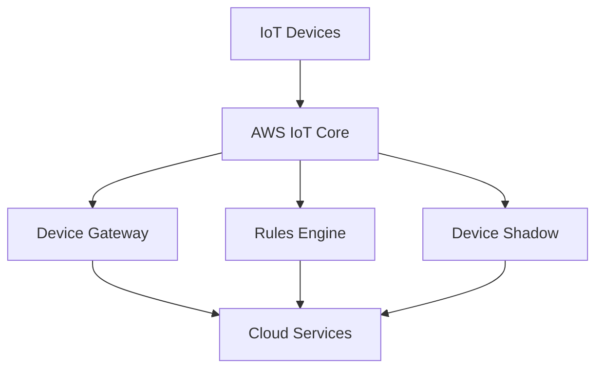

# AWS IoT Technical Notes
<!-- [Illustration showing a high-level overview of AWS IoT, including devices, the AWS IoT Core, and cloud services.] -->

## Quick Reference
- One-sentence definition: AWS IoT is a managed cloud platform that enables connected devices to securely interact with cloud applications and other devices.
- Key use cases: Smart home automation, industrial IoT, asset tracking, and predictive maintenance.
- Prerequisites:  
  - Beginner: Basic understanding of IoT concepts, cloud computing, and Python programming.

## Table of Contents
1. Introduction  
2. Core Concepts  
   - Fundamental Understanding  
   - Visual Architecture  
3. Implementation Details  
   - Basic Implementation  
4. Real-World Applications  
   - Industry Examples  
   - Hands-On Project  
5. Tools & Resources  
6. References  
7. Appendix  

---

## Introduction
### What: Core Definition and Purpose
AWS IoT (Internet of Things) is a managed cloud platform that enables connected devices to securely interact with cloud applications and other devices. It provides tools and services to collect, process, analyze, and act on data generated by IoT devices.

### Why: Problem It Solves/Value Proposition
AWS IoT simplifies the process of connecting, managing, and securing IoT devices at scale. It provides a robust infrastructure for data collection, processing, and analysis, enabling businesses to derive insights and automate actions based on IoT data.

### Where: Application Domains
AWS IoT is widely used in:
- Smart Home Automation: Controlling and monitoring home devices remotely.
- Industrial IoT: Monitoring and optimizing industrial equipment and processes.
- Asset Tracking: Tracking the location and condition of assets in real-time.
- Predictive Maintenance: Predicting equipment failures and scheduling maintenance.

---

## Core Concepts
### Fundamental Understanding
- **Basic Principles**:  
  - Devices: Physical objects connected to the internet that collect and transmit data.  
  - AWS IoT Core: The central hub that connects devices to AWS services.  
  - MQTT: A lightweight messaging protocol used for communication between devices and AWS IoT Core.  

- **Key Components**:  
  - Device Gateway: Manages secure communication between devices and AWS IoT Core.  
  - Rules Engine: Processes and routes device data to other AWS services.  
  - Device Shadow: A virtual representation of a device's state in the cloud.  

- **Common Misconceptions**:  
  - AWS IoT is only for large-scale deployments: AWS IoT can be used for small-scale projects as well.  
  - AWS IoT requires deep technical expertise: AWS IoT provides user-friendly tools and SDKs for beginners.  

### Visual Architecture


---

## Implementation Details
### Basic Implementation [Beginner]
```python
import boto3
import json

# Initialize the AWS IoT Data client
iot_client = boto3.client('iot-data', region_name='us-west-2')

# Define the topic and message
topic = 'my/topic'
message = {'key': 'value'}

# Publish the message to the topic
response = iot_client.publish(
    topic=topic,
    qos=1,
    payload=json.dumps(message)
)

print("Message published:", response)
```

- **Step-by-Step Setup**:  
  1. Install the AWS SDK for Python (Boto3).  
  2. Initialize the AWS IoT Data client with the appropriate region.  
  3. Define the topic and message to be published.  
  4. Publish the message to the topic using the `publish` method.  

- **Code Walkthrough**:  
  - The `boto3.client` initializes the AWS IoT Data client.  
  - The `topic` and `message` variables define the MQTT topic and message content.  
  - The `publish` method sends the message to the specified topic.  

- **Common Pitfalls**:  
  - Incorrect region: Ensure the correct AWS region is specified.  
  - Missing permissions: Ensure the IAM role has the necessary permissions to publish messages.  

---

## Real-World Applications
### Industry Examples
- **Smart Home Automation**: Controlling and monitoring home devices remotely.  
- **Industrial IoT**: Monitoring and optimizing industrial equipment and processes.  
- **Asset Tracking**: Tracking the location and condition of assets in real-time.  
- **Predictive Maintenance**: Predicting equipment failures and scheduling maintenance.  

### Hands-On Project
- **Project Goals**: Build a simple AWS IoT application to publish and subscribe to messages.  
- **Implementation Steps**:  
  1. Set up an AWS IoT Core instance.  
  2. Create an IoT thing and generate certificates.  
  3. Write a Python script to publish messages to an MQTT topic.  
  4. Write a Python script to subscribe to the MQTT topic and receive messages.  
- **Validation Methods**: Verify the messages are published and received correctly.  

---

## Tools & Resources
### Essential Tools
- **Development Environment**: Python, AWS SDK (Boto3).  
- **Key Frameworks**: AWS IoT Core, AWS Lambda, AWS S3.  
- **Testing Tools**: AWS IoT Test, MQTT Explorer.  

### Learning Resources
- **Documentation**: [AWS IoT Documentation](https://docs.aws.amazon.com/iot/).  
- **Tutorials**: "Getting Started with AWS IoT" by AWS.  
- **Community Resources**: AWS Forums, GitHub repositories.  

---

## References
- Official documentation: [AWS IoT Documentation](https://docs.aws.amazon.com/iot/).  
- Technical papers: "AWS IoT: Connecting Devices to the Cloud" by AWS.  
- Industry standards: AWS IoT applications in smart home automation and industrial IoT.  

---

## Appendix
### Glossary
- **Device**: A physical object connected to the internet that collects and transmits data.  
- **AWS IoT Core**: The central hub that connects devices to AWS services.  
- **MQTT**: A lightweight messaging protocol used for communication between devices and AWS IoT Core.  

### Setup Guides
- Install Boto3: `pip install boto3`.  
- Set up AWS IoT Core: Follow the official AWS IoT Core setup guide.  

### Code Templates
- Basic AWS IoT Python script template available on GitHub.  
