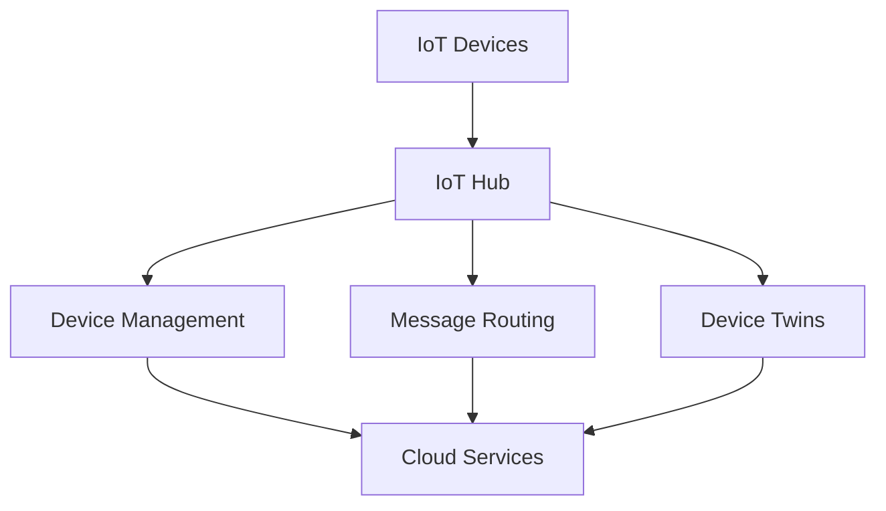

# Azure IoT Technical Notes
<!-- [Illustration showing a high-level overview of Azure IoT, including devices, the IoT Hub, and cloud services.] -->

## Quick Reference
- One-sentence definition: Azure IoT is a collection of Microsoft-managed cloud services that connect, monitor, and control IoT devices at scale.
- Key use cases: Smart home automation, industrial IoT, asset tracking, and predictive maintenance.
- Prerequisites:  
  - Beginner: Basic understanding of IoT concepts, cloud computing, and Python programming.

## Table of Contents
1. Introduction  
2. Core Concepts  
   - Fundamental Understanding  
   - Visual Architecture  
3. Implementation Details  
   - Basic Implementation  
4. Real-World Applications  
   - Industry Examples  
   - Hands-On Project  
5. Tools & Resources  
6. References  
7. Appendix  

---

## Introduction
### What: Core Definition and Purpose
Azure IoT is a collection of Microsoft-managed cloud services that enable you to connect, monitor, and control IoT devices at scale. It provides tools and services to collect, process, analyze, and act on data generated by IoT devices.

### Why: Problem It Solves/Value Proposition
Azure IoT simplifies the process of connecting, managing, and securing IoT devices at scale. It provides a robust infrastructure for data collection, processing, and analysis, enabling businesses to derive insights and automate actions based on IoT data.

### Where: Application Domains
Azure IoT is widely used in:
- Smart Home Automation: Controlling and monitoring home devices remotely.
- Industrial IoT: Monitoring and optimizing industrial equipment and processes.
- Asset Tracking: Tracking the location and condition of assets in real-time.
- Predictive Maintenance: Predicting equipment failures and scheduling maintenance.

---

## Core Concepts
### Fundamental Understanding
- **Basic Principles**:  
  - Devices: Physical objects connected to the internet that collect and transmit data.  
  - IoT Hub: The central hub that connects devices to Azure services.  
  - MQTT: A lightweight messaging protocol used for communication between devices and IoT Hub.  

- **Key Components**:  
  - Device Management: Manages device metadata and configuration.  
  - Message Routing: Routes device data to other Azure services.  
  - Device Twins: A virtual representation of a device's state in the cloud.  

- **Common Misconceptions**:  
  - Azure IoT is only for large-scale deployments: Azure IoT can be used for small-scale projects as well.  
  - Azure IoT requires deep technical expertise: Azure IoT provides user-friendly tools and SDKs for beginners.  

### Visual Architecture


---

## Implementation Details
### Basic Implementation [Beginner]
```python
from azure.iot.hub import IoTHubRegistryManager

# Define the connection string and device ID
connection_string = 'your-iot-hub-connection-string'
device_id = 'your-device-id'

# Initialize the IoT Hub Registry Manager
registry_manager = IoTHubRegistryManager(connection_string)

# Get the device details
device = registry_manager.get_device(device_id)
print("Device details:", device)
```

- **Step-by-Step Setup**:  
  1. Install the Azure IoT Hub SDK for Python.  
  2. Define the IoT Hub connection string and device ID.  
  3. Initialize the IoT Hub Registry Manager.  
  4. Get the device details using the `get_device` method.  

- **Code Walkthrough**:  
  - The `IoTHubRegistryManager` initializes the IoT Hub Registry Manager.  
  - The `connection_string` and `device_id` variables define the IoT Hub connection string and device ID.  
  - The `get_device` method retrieves the device details from IoT Hub.  

- **Common Pitfalls**:  
  - Incorrect connection string: Ensure the IoT Hub connection string is correct.  
  - Missing device ID: Verify the device ID is correct and exists in IoT Hub.  

---

## Real-World Applications
### Industry Examples
- **Smart Home Automation**: Controlling and monitoring home devices remotely.  
- **Industrial IoT**: Monitoring and optimizing industrial equipment and processes.  
- **Asset Tracking**: Tracking the location and condition of assets in real-time.  
- **Predictive Maintenance**: Predicting equipment failures and scheduling maintenance.  

### Hands-On Project
- **Project Goals**: Build a simple Azure IoT application to retrieve device details.  
- **Implementation Steps**:  
  1. Set up an Azure IoT Hub instance.  
  2. Register a device in the IoT Hub.  
  3. Write a Python script to retrieve device details.  
- **Validation Methods**: Verify the device details are retrieved correctly.  

---

## Tools & Resources
### Essential Tools
- **Development Environment**: Python, Azure SDK.  
- **Key Frameworks**: Azure IoT Hub, Azure Stream Analytics, Azure Functions.  
- **Testing Tools**: Azure Portal, MQTT Explorer.  

### Learning Resources
- **Documentation**: [Azure IoT Documentation](https://docs.microsoft.com/en-us/azure/iot-hub/).  
- **Tutorials**: "Getting Started with Azure IoT" by Microsoft.  
- **Community Resources**: Azure Forums, GitHub repositories.  

---

## References
- Official documentation: [Azure IoT Documentation](https://docs.microsoft.com/en-us/azure/iot-hub/).  
- Technical papers: "Azure IoT: Connecting Devices to the Cloud" by Microsoft.  
- Industry standards: Azure IoT applications in smart home automation and industrial IoT.  

---

## Appendix
### Glossary
- **Device**: A physical object connected to the internet that collects and transmits data.  
- **IoT Hub**: The central hub that connects devices to Azure services.  
- **MQTT**: A lightweight messaging protocol used for communication between devices and IoT Hub.  

### Setup Guides
- Install Azure SDK: Follow the official Azure SDK installation guide.  
- Set up Azure IoT Hub: Follow the official Azure IoT Hub setup guide.  

### Code Templates
- Basic Azure IoT Python script template available on GitHub.  
