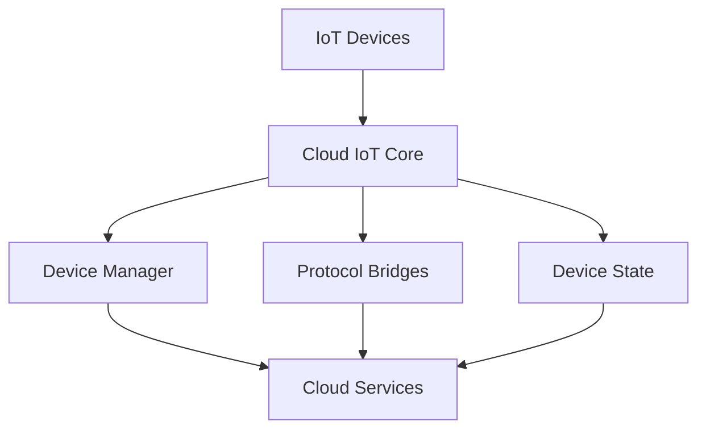

# Google Cloud IoT Technical Notes
<!-- [Illustration showing a high-level overview of Google Cloud IoT, including devices, the Cloud IoT Core, and cloud services.] -->

## Quick Reference
- One-sentence definition: Google Cloud IoT is a managed service that allows you to securely connect, manage, and ingest data from IoT devices at scale.
- Key use cases: Smart home automation, industrial IoT, asset tracking, and predictive maintenance.
- Prerequisites:  
  - Beginner: Basic understanding of IoT concepts, cloud computing, and Python programming.

## Table of Contents
1. Introduction  
2. Core Concepts  
   - Fundamental Understanding  
   - Visual Architecture  
3. Implementation Details  
   - Basic Implementation  
4. Real-World Applications  
   - Industry Examples  
   - Hands-On Project  
5. Tools & Resources  
6. References  
7. Appendix  

---

## Introduction
### What: Core Definition and Purpose
Google Cloud IoT is a managed service that enables you to securely connect, manage, and ingest data from IoT devices at scale. It provides tools and services to collect, process, analyze, and act on data generated by IoT devices.

### Why: Problem It Solves/Value Proposition
Google Cloud IoT simplifies the process of connecting, managing, and securing IoT devices at scale. It provides a robust infrastructure for data collection, processing, and analysis, enabling businesses to derive insights and automate actions based on IoT data.

### Where: Application Domains
Google Cloud IoT is widely used in:
- Smart Home Automation: Controlling and monitoring home devices remotely.
- Industrial IoT: Monitoring and optimizing industrial equipment and processes.
- Asset Tracking: Tracking the location and condition of assets in real-time.
- Predictive Maintenance: Predicting equipment failures and scheduling maintenance.

---

## Core Concepts
### Fundamental Understanding
- **Basic Principles**:  
  - Devices: Physical objects connected to the internet that collect and transmit data.  
  - Cloud IoT Core: The central hub that connects devices to Google Cloud services.  
  - MQTT: A lightweight messaging protocol used for communication between devices and Cloud IoT Core.  

- **Key Components**:  
  - Device Manager: Manages device metadata and configuration.  
  - Protocol Bridges: Facilitate communication between devices and Cloud IoT Core using MQTT or HTTP.  
  - Device State: A virtual representation of a device's state in the cloud.  

- **Common Misconceptions**:  
  - Google Cloud IoT is only for large-scale deployments: Google Cloud IoT can be used for small-scale projects as well.  
  - Google Cloud IoT requires deep technical expertise: Google Cloud IoT provides user-friendly tools and SDKs for beginners.  

### Visual Architecture


---

## Implementation Details
### Basic Implementation [Beginner]
```python
from google.cloud import iot_v1
from google.oauth2 import service_account

# Define the project, region, registry, and device details
project_id = 'your-project-id'
cloud_region = 'us-central1'
registry_id = 'your-registry-id'
device_id = 'your-device-id'

# Load the service account credentials
credentials = service_account.Credentials.from_service_account_file('path/to/service-account.json')

# Initialize the Device Manager client
client = iot_v1.DeviceManagerClient(credentials=credentials)

# Define the device path
device_path = client.device_path(project_id, cloud_region, registry_id, device_id)

# Get the device details
device = client.get_device(request={"name": device_path})
print("Device details:", device)
```

- **Step-by-Step Setup**:  
  1. Install the Google Cloud IoT client library for Python.  
  2. Define the project, region, registry, and device details.  
  3. Load the service account credentials.  
  4. Initialize the Device Manager client.  
  5. Get the device details using the `get_device` method.  

- **Code Walkthrough**:  
  - The `iot_v1.DeviceManagerClient` initializes the Device Manager client.  
  - The `device_path` method constructs the device path using project, region, registry, and device details.  
  - The `get_device` method retrieves the device details from Cloud IoT Core.  

- **Common Pitfalls**:  
  - Incorrect credentials: Ensure the service account credentials are correct and have the necessary permissions.  
  - Missing project details: Verify the project, region, registry, and device details are correct.  

---

## Real-World Applications
### Industry Examples
- **Smart Home Automation**: Controlling and monitoring home devices remotely.  
- **Industrial IoT**: Monitoring and optimizing industrial equipment and processes.  
- **Asset Tracking**: Tracking the location and condition of assets in real-time.  
- **Predictive Maintenance**: Predicting equipment failures and scheduling maintenance.  

### Hands-On Project
- **Project Goals**: Build a simple Google Cloud IoT application to retrieve device details.  
- **Implementation Steps**:  
  1. Set up a Google Cloud IoT Core instance.  
  2. Create a device registry and register a device.  
  3. Write a Python script to retrieve device details.  
- **Validation Methods**: Verify the device details are retrieved correctly.  

---

## Tools & Resources
### Essential Tools
- **Development Environment**: Python, Google Cloud SDK.  
- **Key Frameworks**: Google Cloud IoT Core, Google Cloud Pub/Sub, Google Cloud Functions.  
- **Testing Tools**: Google Cloud Console, MQTT Explorer.  

### Learning Resources
- **Documentation**: [Google Cloud IoT Documentation](https://cloud.google.com/iot/docs).  
- **Tutorials**: "Getting Started with Google Cloud IoT" by Google Cloud.  
- **Community Resources**: Google Cloud Forums, GitHub repositories.  

---

## References
- Official documentation: [Google Cloud IoT Documentation](https://cloud.google.com/iot/docs).  
- Technical papers: "Google Cloud IoT: Connecting Devices to the Cloud" by Google Cloud.  
- Industry standards: Google Cloud IoT applications in smart home automation and industrial IoT.  

---

## Appendix
### Glossary
- **Device**: A physical object connected to the internet that collects and transmits data.  
- **Cloud IoT Core**: The central hub that connects devices to Google Cloud services.  
- **MQTT**: A lightweight messaging protocol used for communication between devices and Cloud IoT Core.  

### Setup Guides
- Install Google Cloud SDK: Follow the official Google Cloud SDK installation guide.  
- Set up Google Cloud IoT Core: Follow the official Google Cloud IoT Core setup guide.  

### Code Templates
- Basic Google Cloud IoT Python script template available on GitHub.  
