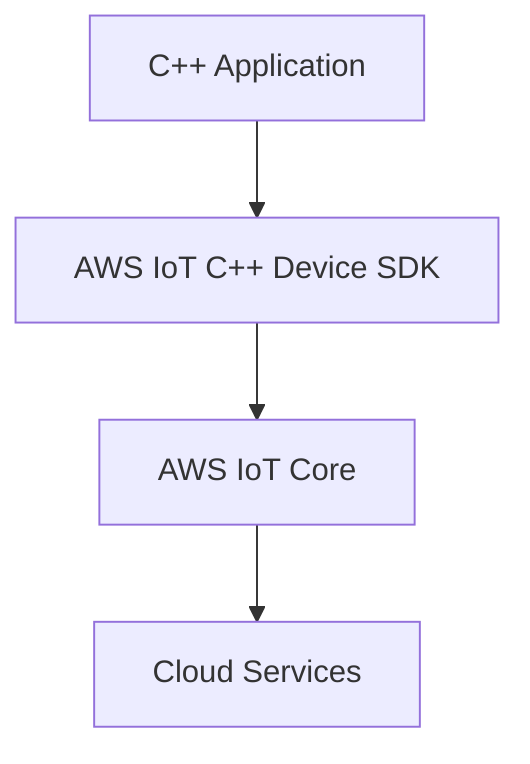

# AWS IoT C++ Device SDK Technical Notes
<!-- [Illustration showing a high-level overview of AWS IoT C++ Device SDK, including devices, the AWS IoT Core, and cloud services.] -->

## Quick Reference
- One-sentence definition: The AWS IoT C++ Device SDK is a library that enables C++ applications to securely connect to AWS IoT Core and interact with AWS services.
- Key use cases: Smart home automation, industrial IoT, asset tracking, and predictive maintenance.
- Prerequisites:  
  - Beginner: Basic understanding of IoT concepts, C++ programming, and AWS IoT Core.

## Table of Contents
1. Introduction  
2. Core Concepts  
   - Fundamental Understanding  
   - Visual Architecture  
3. Implementation Details  
   - Basic Implementation  
4. Real-World Applications  
   - Industry Examples  
   - Hands-On Project  
5. Tools & Resources  
6. References  
7. Appendix  

---

## Introduction
### What: Core Definition and Purpose
The AWS IoT C++ Device SDK is a library that enables C++ applications to securely connect to AWS IoT Core and interact with AWS services. It provides tools and APIs to facilitate communication between IoT devices and the cloud.

### Why: Problem It Solves/Value Proposition
The AWS IoT C++ Device SDK simplifies the process of connecting C++ applications to AWS IoT Core. It provides a robust framework for secure communication, enabling developers to focus on building IoT applications rather than low-level networking details.

### Where: Application Domains
The AWS IoT C++ Device SDK is widely used in:
- Smart Home Automation: Controlling and monitoring home devices remotely.
- Industrial IoT: Monitoring and optimizing industrial equipment and processes.
- Asset Tracking: Tracking the location and condition of assets in real-time.
- Predictive Maintenance: Predicting equipment failures and scheduling maintenance.

---

## Core Concepts
### Fundamental Understanding
- **Basic Principles**:  
  - Devices: Physical objects connected to the internet that collect and transmit data.  
  - AWS IoT Core: The central hub that connects devices to AWS services.  
  - MQTT: A lightweight messaging protocol used for communication between devices and AWS IoT Core.  

- **Key Components**:  
  - SDK Libraries: Prebuilt libraries that provide APIs for connecting to AWS IoT Core.  
  - Device Shadow: A virtual representation of a device's state in the cloud.  
  - Topics: Named channels for publishing and subscribing to messages.  

- **Common Misconceptions**:  
  - AWS IoT C++ Device SDK is only for advanced users: The SDK provides user-friendly APIs for beginners.  
  - AWS IoT C++ Device SDK is only for large-scale deployments: The SDK can be used for small-scale projects as well.  

### Visual Architecture


---

## Implementation Details
### Basic Implementation [Beginner]
```cpp
#include <aws/iot/mqtt_client.h>
#include <iostream>

int main() {
    // Initialize the AWS IoT MQTT client
    Aws::Iot::MqttClient client;

    // Define the MQTT endpoint and client ID
    std::string endpoint = "your-iot-endpoint";
    std::string clientId = "your-client-id";

    // Connect to AWS IoT Core
    if (client.Connect(endpoint.c_str(), clientId.c_str())) {
        std::cout << "Connected to AWS IoT Core" << std::endl;

        // Publish a message to a topic
        std::string topic = "my/topic";
        std::string message = "Hello, AWS IoT!";
        client.Publish(topic.c_str(), message.c_str());

        // Disconnect from AWS IoT Core
        client.Disconnect();
    } else {
        std::cerr << "Failed to connect to AWS IoT Core" << std::endl;
    }

    return 0;
}
```

- **Step-by-Step Setup**:  
  1. Install the AWS IoT C++ Device SDK.  
  2. Include the necessary headers and initialize the MQTT client.  
  3. Define the MQTT endpoint and client ID.  
  4. Connect to AWS IoT Core and publish a message to a topic.  

- **Code Walkthrough**:  
  - The `Aws::Iot::MqttClient` initializes the MQTT client.  
  - The `Connect` method establishes a connection to AWS IoT Core.  
  - The `Publish` method sends a message to the specified topic.  
  - The `Disconnect` method closes the connection to AWS IoT Core.  

- **Common Pitfalls**:  
  - Incorrect endpoint: Ensure the correct AWS IoT endpoint is specified.  
  - Missing certificates: Ensure the necessary certificates are configured for secure communication.  

---

## Real-World Applications
### Industry Examples
- **Smart Home Automation**: Controlling and monitoring home devices remotely.  
- **Industrial IoT**: Monitoring and optimizing industrial equipment and processes.  
- **Asset Tracking**: Tracking the location and condition of assets in real-time.  
- **Predictive Maintenance**: Predicting equipment failures and scheduling maintenance.  

### Hands-On Project
- **Project Goals**: Build a simple C++ application to connect to AWS IoT Core and publish a message.  
- **Implementation Steps**:  
  1. Set up an AWS IoT Core instance.  
  2. Install the AWS IoT C++ Device SDK.  
  3. Write a C++ application to connect to AWS IoT Core and publish a message.  
- **Validation Methods**: Verify the message is published to the specified topic.  

---

## Tools & Resources
### Essential Tools
- **Development Environment**: C++ compiler, AWS IoT C++ Device SDK.  
- **Key Frameworks**: AWS IoT Core, AWS Lambda, AWS S3.  
- **Testing Tools**: AWS IoT Test, MQTT Explorer.  

### Learning Resources
- **Documentation**: [AWS IoT C++ Device SDK Documentation](https://docs.aws.amazon.com/iot/latest/developerguide/iot-sdks.html).  
- **Tutorials**: "Getting Started with AWS IoT C++ Device SDK" by AWS.  
- **Community Resources**: AWS Forums, GitHub repositories.  

---

## References
- Official documentation: [AWS IoT C++ Device SDK Documentation](https://docs.aws.amazon.com/iot/latest/developerguide/iot-sdks.html).  
- Technical papers: "AWS IoT: Connecting Devices to the Cloud" by AWS.  
- Industry standards: AWS IoT applications in smart home automation and industrial IoT.  

---

## Appendix
### Glossary
- **Device**: A physical object connected to the internet that collects and transmits data.  
- **AWS IoT Core**: The central hub that connects devices to AWS services.  
- **MQTT**: A lightweight messaging protocol used for communication between devices and AWS IoT Core.  

### Setup Guides
- Install AWS IoT C++ Device SDK: Follow the official AWS IoT C++ Device SDK installation guide.  
- Set up AWS IoT Core: Follow the official AWS IoT Core setup guide.  

### Code Templates
- Basic AWS IoT C++ Device SDK application template available on GitHub.  
