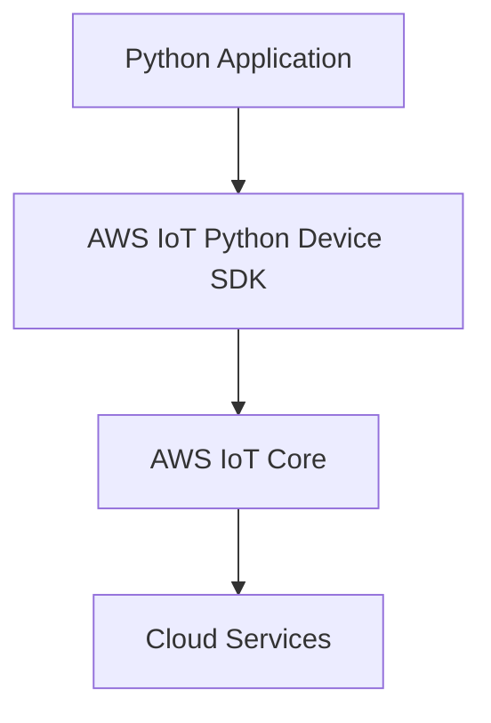

# AWS IoT Python Device SDK Technical Notes
<!-- [Illustration showing a high-level overview of AWS IoT Python Device SDK, including devices, the AWS IoT Core, and cloud services.] -->

## Quick Reference
- One-sentence definition: The AWS IoT Python Device SDK is a library that enables Python applications to securely connect to AWS IoT Core and interact with AWS services.
- Key use cases: Smart home automation, industrial IoT, asset tracking, and predictive maintenance.
- Prerequisites:  
  - Beginner: Basic understanding of IoT concepts, Python programming, and AWS IoT Core.

## Table of Contents
1. Introduction  
2. Core Concepts  
   - Fundamental Understanding  
   - Visual Architecture  
3. Implementation Details  
   - Basic Implementation  
4. Real-World Applications  
   - Industry Examples  
   - Hands-On Project  
5. Tools & Resources  
6. References  
7. Appendix  

---

## Introduction
### What: Core Definition and Purpose
The AWS IoT Python Device SDK is a library that enables Python applications to securely connect to AWS IoT Core and interact with AWS services. It provides tools and APIs to facilitate communication between IoT devices and the cloud.

### Why: Problem It Solves/Value Proposition
The AWS IoT Python Device SDK simplifies the process of connecting Python applications to AWS IoT Core. It provides a robust framework for secure communication, enabling developers to focus on building IoT applications rather than low-level networking details.

### Where: Application Domains
The AWS IoT Python Device SDK is widely used in:
- Smart Home Automation: Controlling and monitoring home devices remotely.
- Industrial IoT: Monitoring and optimizing industrial equipment and processes.
- Asset Tracking: Tracking the location and condition of assets in real-time.
- Predictive Maintenance: Predicting equipment failures and scheduling maintenance.

---

## Core Concepts
### Fundamental Understanding
- **Basic Principles**:  
  - Devices: Physical objects connected to the internet that collect and transmit data.  
  - AWS IoT Core: The central hub that connects devices to AWS services.  
  - MQTT: A lightweight messaging protocol used for communication between devices and AWS IoT Core.  

- **Key Components**:  
  - SDK Libraries: Prebuilt libraries that provide APIs for connecting to AWS IoT Core.  
  - Device Shadow: A virtual representation of a device's state in the cloud.  
  - Topics: Named channels for publishing and subscribing to messages.  

- **Common Misconceptions**:  
  - AWS IoT Python Device SDK is only for advanced users: The SDK provides user-friendly APIs for beginners.  
  - AWS IoT Python Device SDK is only for large-scale deployments: The SDK can be used for small-scale projects as well.  

### Visual Architecture


---

## Implementation Details
### Basic Implementation [Beginner]
```python
from awsiot import mqtt_connection_builder
import json

# Define the endpoint, client ID, and certificates
endpoint = "your-iot-endpoint"
client_id = "your-client-id"
cert_filepath = "path/to/certificate.pem.crt"
key_filepath = "path/to/private.pem.key"
root_ca_filepath = "path/to/root-ca.pem"

# Build the MQTT connection
mqtt_connection = mqtt_connection_builder.mtls_from_path(
    endpoint=endpoint,
    cert_filepath=cert_filepath,
    pri_key_filepath=key_filepath,
    client_id=client_id,
    ca_filepath=root_ca_filepath
)

# Connect to AWS IoT Core
connect_future = mqtt_connection.connect()
connect_future.result()  # Wait for the connection to complete

# Publish a message to a topic
topic = "my/topic"
message = {"key": "value"}
mqtt_connection.publish(
    topic=topic,
    payload=json.dumps(message),
    qos=1
)

# Disconnect from AWS IoT Core
disconnect_future = mqtt_connection.disconnect()
disconnect_future.result()
```

- **Step-by-Step Setup**:  
  1. Install the AWS IoT Python Device SDK.  
  2. Define the endpoint, client ID, and certificate paths.  
  3. Build the MQTT connection using `mqtt_connection_builder`.  
  4. Connect to AWS IoT Core and publish a message to a topic.  

- **Code Walkthrough**:  
  - The `mqtt_connection_builder.mtls_from_path` method initializes the MQTT connection with mutual TLS authentication.  
  - The `connect` method establishes a connection to AWS IoT Core.  
  - The `publish` method sends a message to the specified topic.  
  - The `disconnect` method closes the connection to AWS IoT Core.  

- **Common Pitfalls**:  
  - Incorrect endpoint: Ensure the correct AWS IoT endpoint is specified.  
  - Missing certificates: Ensure the necessary certificates are configured for secure communication.  

---

## Real-World Applications
### Industry Examples
- **Smart Home Automation**: Controlling and monitoring home devices remotely.  
- **Industrial IoT**: Monitoring and optimizing industrial equipment and processes.  
- **Asset Tracking**: Tracking the location and condition of assets in real-time.  
- **Predictive Maintenance**: Predicting equipment failures and scheduling maintenance.  

### Hands-On Project
- **Project Goals**: Build a simple Python application to connect to AWS IoT Core and publish a message.  
- **Implementation Steps**:  
  1. Set up an AWS IoT Core instance.  
  2. Install the AWS IoT Python Device SDK.  
  3. Write a Python application to connect to AWS IoT Core and publish a message.  
- **Validation Methods**: Verify the message is published to the specified topic.  

---

## Tools & Resources
### Essential Tools
- **Development Environment**: Python, AWS IoT Python Device SDK.  
- **Key Frameworks**: AWS IoT Core, AWS Lambda, AWS S3.  
- **Testing Tools**: AWS IoT Test, MQTT Explorer.  

### Learning Resources
- **Documentation**: [AWS IoT Python Device SDK Documentation](https://docs.aws.amazon.com/iot/latest/developerguide/iot-sdks.html).  
- **Tutorials**: "Getting Started with AWS IoT Python Device SDK" by AWS.  
- **Community Resources**: AWS Forums, GitHub repositories.  

---

## References
- Official documentation: [AWS IoT Python Device SDK Documentation](https://docs.aws.amazon.com/iot/latest/developerguide/iot-sdks.html).  
- Technical papers: "AWS IoT: Connecting Devices to the Cloud" by AWS.  
- Industry standards: AWS IoT applications in smart home automation and industrial IoT.  

---

## Appendix
### Glossary
- **Device**: A physical object connected to the internet that collects and transmits data.  
- **AWS IoT Core**: The central hub that connects devices to AWS services.  
- **MQTT**: A lightweight messaging protocol used for communication between devices and AWS IoT Core.  

### Setup Guides
- Install AWS IoT Python Device SDK: Follow the official AWS IoT Python Device SDK installation guide.  
- Set up AWS IoT Core: Follow the official AWS IoT Core setup guide.  

### Code Templates
- Basic AWS IoT Python Device SDK application template available on GitHub.  
