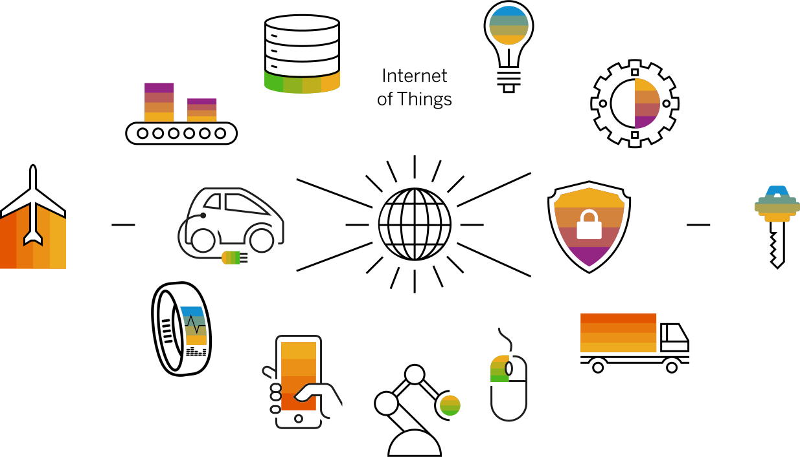

# Internet of Things (IoT)



## Overview 

Internet of Things (IoT) core concepts, real-world applications examples, and resources.

## Quick Start

```
│   iot-guide.md       ## You are here!
│   readme.md
├───concepts/
│       iot-core-basics.md
│       iot-core-intermediate.md
│       iot-core-advanced.md
│
├───lab/examples/
│       implementation.md
├───industry-applications/
│       industry-links.md
└───resources/
```

## Related Notes

- [Embedded Systems](../embedded-systems/)
- [Networking](../networking/)
- [Edge Computing](../edge-computing/)
- [Edge AI](../edge-computing/edge-ai/)
- [Cloud Computing](../cloud-computing/). 

## Contributing

Please refer to the [CONTRIBUTING.md](../../../CONTRIBUTING.md) file.


> ### "We are all connected – To each other, biologically. To the earth, chemically. To the universe, atomically." - Neil deGrasse Tyson