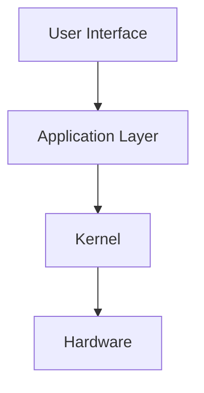

# Operating System (OS) - Notes

## Table of Contents
  - [Introduction](#introduction)
    - [What is an operating system?](#what-is-an-operating-system)
    - [Key Concepts and Terminology](#key-concepts-and-terminology)
    - [Applications](#applications)
  - [Fundamentals](#fundamentals)
    - [Operating System Architecture Pipeline](#operating-system-architecture-pipeline)
    - [How an Operating System Works?](#how-an-operating-system-works)
    - [Key operations](#key-operations)
  - [Tools \& Frameworks](#tools--frameworks)
  - [Hello World!](#hello-world)
  - [Lab: Zero to Hero Projects](#lab-zero-to-hero-projects)
  - [References](#references)


## Introduction

### What is an operating system?
> The core software that manages the hardware resources and software applications of a computer system.

### Key Concepts and Terminology

An operating system consists of several **components** that work together to provide the functionality of the OS:

- The **kernel** is the **core** of the OS that controls the **low-level** operations of the hardware and the **system calls** from the applications
- The **shell** is the **user interface** of the OS that allows users to **execute commands** and **run programs**
- The **file system** is the **data structure** of the OS that organizes the **files** and **directories** on the storage devices
- The **process** is the **unit of execution** of the OS that represents a **running program** and its associated **resources**
- The **thread** is the **subunit of execution** of the OS that represents a **sequence of instructions** within a process
- The **scheduler** is the **component** of the OS that decides **which process or thread** should run on the **CPU** at any given time
- The **memory manager** is the **component** of the OS that manages the **allocation** and **deallocation** of the **main memory** for the processes and the **virtual memory** for the system
- The **device driver** is the **software** of the OS that communicates with the **hardware devices** and provides a **uniform interface** for the applications

### Applications
> - Personal computers: **Windows**, **macOS**, **Linux**
> - Mobile phones: **Android**, **iOS**
> - Servers: **Linux**, **Unix**, **Windows Server**
> - Embedded systems: **Real-time operating systems (RTOS)**


## Fundamentals

### (tiny) Operating System Architecture Pipeline

The main components and functions of an operating system are:



### How an Operating System Works?

- An operating system consists of a kernel and a user interface.
- The kernel is the core of the operating system that interacts with the hardware and provides low-level services to the user programs.
- The user interface is the part of the operating system that allows the user to interact with the system, either through a graphical user interface (GUI) or a command-line interface (CLI).

### Key operations

> - **Resource Management:** Allocates and manages hardware resources like CPU, memory, and storage devices to ensure efficient operation of applications.
> - **Process Management:** Schedules and manages the execution of multiple processes simultaneously, ensuring fair and efficient use of resources.
> - **Inter-process Communication (IPC):** Enables processes to exchange data and communicate with each other, facilitating collaboration and data sharing.
> - **Input/Output (I/O) Management:** Handles interactions with peripheral devices like keyboards, monitors, and printers, enabling user input and output.
> - **Security:** Provides security mechanisms to protect the system from unauthorized access, malware attacks, and data breaches.
> - **Networking:** Facilitates communication between computers and networks, enabling file sharing, internet access, and remote connectivity.


## Tools & Frameworks
- There are various **tools** and **frameworks** that can help developers to create, modify, or analyze operating systems
- Some examples of **tools** are:
    - **Compilers** and **assemblers** that translate the **source code** of the OS into **executable code**
    - **Debuggers** and **profilers** that help to **find** and **fix** the **errors** and **performance issues** of the OS
    - **Emulators** and **virtual machines** that simulate the **hardware** and **software** environment of the OS
- Some examples of **frameworks** are:
    - **Linux** is an **open-source** and **modular** OS that can be **customized** and **extended** for various purposes and platforms
    - **Android** is a **mobile** OS that is based on **Linux** and provides a **rich** and **user-friendly** interface for **smartphones** and **tablets**
    - **Windows** is a **proprietary** and **monolithic** OS that is widely used for **personal** and **professional** computing and offers a **compatible** and **secure** environment for **applications** and **devices**

## Hello World!
- Here is an example of a **Hello World!** program in **C** language that can run on a **Linux** OS:

```c
#include <stdio.h>

int main(void) 
{
  printf("Hello, World!\n");
  return 0;
}
```

## Lab: Zero to Hero Projects

- Some examples of projects are:
    - **Build** your own **mini OS** from scratch using **assembly** and **C** languages and run it on a **virtual machine**
    - **Modify** the **Linux kernel** to add a new **system call** or a new **feature** and test it on a **real machine**
    - **Develop** an **Android app** that uses the **native APIs** and the **hardware sensors** of the device and publish it on the **Google Play Store**

## References
- [Operating System Concepts](https://www.amazon.com/Operating-System-Concepts-Abraham-Silberschatz/dp/1118063333) by Abraham Silberschatz, Peter B. Galvin, and Greg Gagne
- [Modern Operating Systems](https://www.amazon.com/Modern-Operating-Systems-Andrew-Tanenbaum/dp/013359162X) by Andrew S. Tanenbaum and Herbert Bos
- [Operating Systems: Three Easy Pieces](http://pages.cs.wisc.edu/~remzi/OSTEP/) by Remzi H. Arpaci-Dusseau and Andrea C. Arpaci-Dusseau
- [Linux Kernel Development](https://www.amazon.com/Linux-Kernel-Development-Robert-Love/dp/0672329468) by Robert Love
- [Android Programming: The Big Nerd Ranch Guide](https://www.amazon.com/Android-Programming-Ranch-Guide-Guides/dp/0135245125) by Bill Phillips, Chris Stewart, Kristin Marsicano, and Brian Gardner


