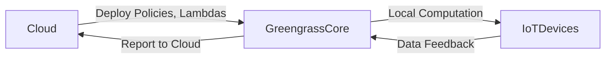

# AWS Greengrass - Notes

## Table of Contents (ToC)

  - [Introduction](#introduction)
  - [Key Concepts](#key-concepts)
  - [Why It Matters / Relevance](#why-it-matters--relevance)
  - [Architecture Pipeline](#architecture-pipeline)
  - [Framework / Key Theories or Models](#framework--key-theories-or-models)
  - [How AWS Greengrass Works](#how-aws-greengrass-works)
  - [Methods, Types & Variations](#methods-types--variations)
  - [Self-Practice / Hands-On Examples](#self-practice--hands-on-examples)
  - [Pitfalls & Challenges](#pitfalls--challenges)
  - [Feedback & Evaluation](#feedback--evaluation)
  - [Tools, Libraries & Frameworks](#tools-libraries--frameworks)
  - [Hello World! (Practical Example)](#hello-world-practical-example)
  - [Advanced Exploration](#advanced-exploration)
  - [Zero to Hero Lab Projects](#zero-to-hero-lab-projects)
  - [Continuous Learning Strategy](#continuous-learning-strategy)
  - [References](#references)

---

## Introduction
AWS Greengrass allows local device data processing and communication in edge environments using cloud-based management, making IoT devices smarter.

## Key Concepts
- **AWS Greengrass Core**: Software that runs on local devices, enabling them to act locally while communicating with AWS services.
- **Lambdas**: Functions deployed on Greengrass Core for local execution without connecting to the cloud.
- **IoT Edge**: Refers to devices that compute data near their source instead of relying on centralized cloud processing.
  
**Feynman Principle**: AWS Greengrass lets devices process information near their location and interact with the cloud only when necessary, helping them react faster to real-world events.

**Misconception**: AWS Greengrass is only for large-scale IoT. In fact, it's flexible enough to work for small, resource-limited edge devices too.

## Why It Matters / Relevance
- **Smart Cities**: Enable sensors in a city to react instantly to traffic conditions without cloud delay.
- **Manufacturing**: Processes large volumes of data locally on factory floors, reducing latency and improving productivity.
- **Healthcare**: Devices process patient data near hospitals to ensure privacy and real-time analysis.
- **Agriculture**: In-field sensors adjust irrigation systems instantly, responding to weather changes.
- **Autonomous Vehicles**: Process sensor data locally to ensure real-time reactions for autonomous navigation.

Mastering AWS Greengrass helps streamline IoT system design, ensuring reliable, low-latency performance in critical environments.

## Architecture Pipeline

Logical steps:
1. Deploying policies and Lambdas to Greengrass Core from AWS.
2. Core runs local computation and controls IoT devices.
3. Devices send feedback to the core for real-time processing.
4. Core reports data back to the cloud for long-term storage.

## Framework / Key Theories or Models
1. **Edge Computing**: Brings computation close to the data source, reducing latency and network strain.
2. **Lambda Functions**: AWS's serverless compute model that allows execution based on events.
3. **MQTT**: A messaging protocol used by IoT devices to communicate over networks.

## How AWS Greengrass Works
1. **Setup AWS Greengrass Core** on a local device.
2. **Define policies** for device communication and security.
3. **Deploy Lambda functions** to the Greengrass Core to run locally.
4. **Connect IoT devices** to the core.
5. Devices **communicate and process data** in real-time with the core.
6. The core **syncs with the AWS Cloud** for long-term data management and analytics.

## Methods, Types & Variations
- **AWS Greengrass V1**: The initial version with Lambda-centric processing.
- **AWS Greengrass V2**: Enhanced version with support for Docker containers and broader device capabilities.
  
**Contrast**: Greengrass V1 focuses on Lambdas, while V2 supports containers for more complex, varied workloads.

## Self-Practice / Hands-On Examples
1. **Create an AWS Greengrass Core** on a Raspberry Pi.
2. **Deploy a Lambda function** to the core that controls a local sensor.
3. Simulate **local data processing** without a cloud connection.

## Pitfalls & Challenges
- **Security**: Misconfigured security policies can expose IoT devices.
  - **Solution**: Always implement strict IAM roles and encrypt data in transit.
- **Latency**: Incorrectly managed device configurations may result in latency during communication.
  - **Solution**: Optimize network usage and reduce unnecessary communication with the cloud.

## Feedback & Evaluation
- **Self-explanation test**: Explain the role of Greengrass Core in edge computing to a peer.
- **Peer Review**: Share a Greengrass setup with a colleague and receive feedback on the architecture.
- **Real-world simulation**: Build an IoT system with Greengrass and test it in an offline environment.

## Tools, Libraries & Frameworks
- **AWS Greengrass CLI**: For managing core devices locally.
- **AWS IoT Device SDK**: Allows IoT devices to interact with Greengrass.
- **AWS CloudWatch**: Monitors device performance and Lambdas on the cloud.
  
| Tool              | Pros                             | Cons                                  |
|-------------------|----------------------------------|---------------------------------------|
| AWS Greengrass    | Scalable, secure, powerful edge solution | Setup complexity for beginners         |
| CloudWatch        | Comprehensive monitoring         | Additional costs for heavy usage      |
| IoT Device SDK    | Easy device interaction          | Limited to AWS ecosystem              |

## Hello World! (Practical Example)
```python
import greengrasssdk
client = greengrasssdk.client('iot-data')

def lambda_handler(event, context):
    response = client.publish(
        topic='sensor/temperature',
        payload='{"temperature": 22}'
    )
    return response
```
This Lambda function runs locally on the Greengrass Core and publishes temperature data to an MQTT topic.

## Advanced Exploration
1. **Paper**: "Edge Computing: A Survey on Research Challenges" – comprehensive look at challenges in edge computing.
2. **Video**: AWS re:Invent video on "Scaling IoT with AWS Greengrass."
3. **Blog**: Exploring AWS Greengrass V2 with Docker containers.

## Zero to Hero Lab Projects
- **Beginner**: Set up a Greengrass Core and control a simple IoT device.
- **Intermediate**: Build a local data processing pipeline for a small sensor network.
- **Advanced**: Create a hybrid system that runs Docker containers on Greengrass V2 to process video data locally.

## Continuous Learning Strategy
- Learn about **real-time communication protocols** for IoT.
- Explore **edge AI** by integrating AWS Greengrass with machine learning models.
- Dive into **AWS Lambda** and its role in both cloud and edge environments.

## References
- AWS Greengrass Documentation: https://docs.aws.amazon.com/greengrass
- MQTT Protocol Overview: https://mqtt.org
- Research article on Edge Computing: https://arxiv.org/