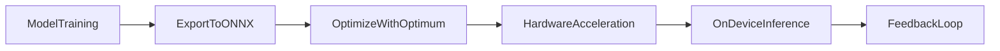

# Hugging Face Optimum - Notes

## Table of Contents (ToC)
1. [Introduction](#introduction)
2. [Key Concepts](#key-concepts)
3. [Why It Matters / Relevance](#why-it-matters--relevance)
4. [Architecture Pipeline](#architecture-pipeline)
5. [Framework / Key Theories or Models](#framework--key-theories-or-models)
6. [How Hugging Face Optimum Works](#how-hugging-face-optimum-works)
7. [Methods, Types & Variations](#methods-types--variations)
8. [Self-Practice / Hands-On Examples](#self-practice--hands-on-examples)
9. [Pitfalls & Challenges](#pitfalls--challenges)
10. [Feedback & Evaluation](#feedback--evaluation)
11. [Tools, Libraries & Frameworks](#tools-libraries--frameworks)
12. [Hello World! (Practical Example)](#hello-world-practical-example)
13. [Advanced Exploration](#advanced-exploration)
14. [Zero to Hero Lab Projects](#zero-to-hero-lab-projects)
15. [Continuous Learning Strategy](#continuous-learning-strategy)
16. [References](#references)

---

## Introduction
Hugging Face Optimum is an extension of the Hugging Face Transformers library that optimizes models for deployment on specialized hardware (like GPUs, TPUs, and accelerators) by leveraging advanced performance optimization techniques.

## Key Concepts
- **Optimum**: A toolkit that provides performance improvements for Hugging Face Transformers models on hardware like NVIDIA GPUs, Intel processors, and Apple M1 chips.
- **Hardware Acceleration**: Enhancing model performance by using the full potential of hardware like GPUs or specialized accelerators.
- **ONNX Runtime**: Optimum enables the export of models to the ONNX (Open Neural Network Exchange) format, improving inference speeds across various platforms.

**Feynman Principle**: Hugging Face Optimum is like a set of turbochargers for AI models, helping them run faster and more efficiently by taking advantage of specialized hardware.

**Misconception**: Many believe that optimizing models for hardware acceleration requires deep knowledge of hardware and systems, but Hugging Face Optimum simplifies this process by automating most of the optimizations.

## Why It Matters / Relevance
- **Faster Inference**: By optimizing models for specific hardware, Optimum reduces the time it takes for models to make predictions.
- **Energy Efficiency**: Optimized models can run more efficiently, leading to reduced energy consumption and lower operational costs.
- **Edge and Cloud Deployment**: Optimum makes it easier to deploy high-performance models on both edge devices (like phones or IoT devices) and cloud infrastructure.
- **Model Flexibility**: Supports multiple hardware accelerators, making it versatile for different deployment environments.
- **Scalability**: For large-scale applications, Hugging Face Optimum ensures that models can scale efficiently, maintaining high performance as workloads grow.

Mastering Hugging Face Optimum is essential for AI engineers looking to deploy high-performance models in real-time applications, especially where speed and efficiency are critical.

## Architecture Pipeline

Steps:
1. **Model Training**: Train a Hugging Face Transformers model.
2. **Export to ONNX**: Convert the trained model into the ONNX format for portability and optimization.
3. **Optimize with Optimum**: Use Hugging Face Optimum to perform hardware-specific optimizations.
4. **Hardware Acceleration**: Deploy the optimized model on specialized hardware for faster inference.
5. **On-Device Inference**: Run the model on the target hardware, such as GPUs or TPUs, for real-time prediction.
6. **Feedback Loop**: Continuously monitor and fine-tune the model for even better performance.

## Framework / Key Theories or Models
1. **ONNX Runtime**: Provides a standard format to optimize machine learning models across different hardware platforms.
2. **NVIDIA TensorRT Integration**: Optimum leverages TensorRT for NVIDIA GPUs to significantly speed up inference.
3. **Intel OpenVINO**: Optimizes model performance on Intel processors, particularly for edge computing.
4. **Apple Core ML**: Allows models to run efficiently on Apple devices using Apple’s neural engine.
5. **Transformers Models**: The pre-trained models from Hugging Face are the primary focus of optimization, with architectures like BERT, GPT, and Vision Transformers benefiting the most from Optimum.

## How Hugging Face Optimum Works
1. **Model Training**: The process begins with training a model in the Hugging Face Transformers library.
2. **ONNX Conversion**: Convert the model into ONNX format using Hugging Face’s Optimum framework.
3. **Optimization**: Optimum applies hardware-specific optimization, including quantization, pruning, and leveraging accelerator libraries like TensorRT and OpenVINO.
4. **Deployment**: Once optimized, the model is deployed onto hardware (GPU, TPU, or accelerators) for efficient real-time inference.
5. **Inference**: The optimized model performs inference directly on the device or infrastructure, with reduced latency and increased throughput.

## Methods, Types & Variations
- **ONNX Models**: Models are exported to ONNX format for hardware-agnostic optimizations.
- **Quantized Models**: Optimum allows models to be quantized to reduce size and improve speed.
- **Accelerated Models**: Models optimized for specific hardware, such as NVIDIA GPUs, Intel CPUs, or Apple devices.
  
**Contrast**: Standard models may work across various devices but lack hardware-specific optimization. Optimized models using Optimum are designed for high performance on specific hardware, improving efficiency and speed.

## Self-Practice / Hands-On Examples
1. **Export a Hugging Face model to ONNX** and observe performance differences before and after optimization with Optimum.
2. **Optimize a BERT model for NVIDIA TensorRT** and measure the latency improvements.
3. **Deploy a Vision Transformer model** on an Intel processor using OpenVINO.

## Pitfalls & Challenges
- **Model Compatibility**: Not all Hugging Face models may be immediately compatible with every hardware optimization.
  - **Solution**: Test your model with various hardware platforms and use Optimum’s compatibility checks.
- **Hardware-specific Tuning**: Some optimizations may require fine-tuning for specific devices.
  - **Solution**: Use Optimum’s tools for quantization and hardware profiling.
- **Complex Deployments**: Optimizing models for distributed environments or mixed hardware can be complex.
  - **Solution**: Follow Hugging Face Optimum guidelines and case studies for distributed deployments.

## Feedback & Evaluation
- **Self-explanation test**: Explain how Hugging Face Optimum improves model performance on different hardware platforms.
- **Peer review**: Share an optimized model with peers and compare performance across different hardware setups.
- **Real-world simulation**: Deploy an optimized model in a production environment and evaluate its speed, accuracy, and efficiency metrics.

## Tools, Libraries & Frameworks
- **Hugging Face Optimum**: The main tool for hardware optimization of Transformers models.
- **ONNX Runtime**: A runtime that allows optimized inference across multiple platforms.
- **NVIDIA TensorRT**: Framework for optimizing models on NVIDIA GPUs.
- **Intel OpenVINO**: Optimizes models for Intel CPUs and integrated accelerators.

| Tool                               | Pros                                             | Cons                                  |
|------------------------------------|--------------------------------------------------|---------------------------------------|
| Hugging Face Optimum               | Simplifies hardware optimization for Transformers models | Limited to specific hardware profiles |
| ONNX Runtime                       | Allows cross-platform model portability          | May require additional conversions    |
| TensorRT                           | Significant speedup on NVIDIA GPUs               | Limited to NVIDIA hardware            |
| OpenVINO                           | Optimizes for Intel hardware, including edge devices | Not applicable for non-Intel hardware |

## Hello World! (Practical Example)
```python
from optimum.onnxruntime import ORTModelForSequenceClassification
from transformers import AutoTokenizer

# Load the tokenizer and model
tokenizer = AutoTokenizer.from_pretrained("bert-base-uncased")
model = ORTModelForSequenceClassification.from_pretrained("bert-base-uncased", export=True)

# Tokenize input
inputs = tokenizer("This is a test", return_tensors="pt")

# Run inference
outputs = model(**inputs)
print(outputs.logits)
```
This example demonstrates how to load a BERT model optimized for ONNX runtime using Hugging Face Optimum.

## Advanced Exploration
1. **Paper**: "Optimizing Transformer Models for Hardware Acceleration" – An in-depth look at optimization techniques for Transformer models.
2. **Video**: "Deploying Hugging Face Models at Scale with Optimum" – A guide to scaling optimized models in production environments.
3. **Blog**: "Accelerating Hugging Face Models with ONNX Runtime" – Practical tips for using ONNX Runtime with Hugging Face Optimum.

## Zero to Hero Lab Projects
- **Beginner**: Export a BERT model to ONNX format and optimize it for NVIDIA GPUs using TensorRT.
- **Intermediate**: Develop an NLP-based application that uses a Hugging Face model optimized for both edge devices and cloud infrastructure.
- **Advanced**: Build a distributed model deployment system that dynamically selects hardware-specific optimizations using Hugging Face Optimum, depending on the available hardware (cloud or edge).

## Continuous Learning Strategy
- Explore **ONNX tutorials** to understand how to convert and optimize models for different hardware architectures.
- Study **advanced quantization techniques** to further reduce model size without sacrificing accuracy.
- Investigate **multi-hardware deployment strategies** using Hugging Face Optimum in hybrid cloud-edge environments.

## References
- Hugging Face Optimum Documentation: https://huggingface.co/docs/optimum/main/en/
- ONNX Runtime Documentation: https://onnxruntime.ai/
- TensorRT: https://developer.nvidia.com/tensorrt