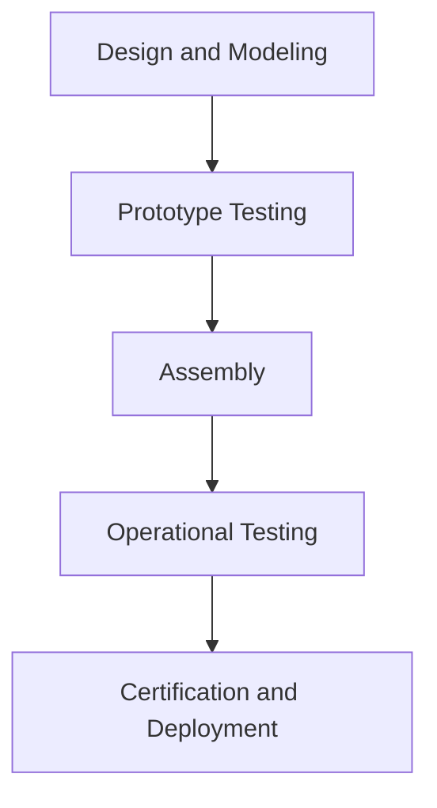

# Aircraft - Notes

## Table of Contents
- Introduction
- Key Concepts
- Applications
- Architecture Pipeline
- Frameworks / Key Theories or Models
- How Aircraft Work
- Types of Aircraft & Variations
- Self-Practice / Hands-On Examples
- Pitfalls & Challenges
- Feedback & Evaluation
- Tools, Libraries & Frameworks
- Hello World! (Practical Example)
- Advanced Exploration
- Zero to Hero Lab Projects
- Continuous Learning Strategy
- References

## Introduction
Aircraft are complex vehicles that enable travel through the atmosphere by utilizing principles of aerodynamics and propulsion.

### Key Concepts
- **Lift, Drag, Thrust, and Weight**: Fundamental forces in flight.
- **Aerodynamics**: Study of airflow around the aircraft to optimize performance.
- **Propulsion Systems**: Mechanisms (engines, propellers) that generate thrust.
- **Avionics**: The electronic systems controlling navigation, communication, and instrumentation.
- **Misconceptions**: A common misunderstanding is that wing shape alone generates lift, while airflow dynamics play a crucial role.

### Applications
1. **Commercial Aviation**: Transporting passengers and cargo worldwide.
2. **Military Use**: Surveillance, combat, and transport.
3. **Agriculture**: Crop-dusting, surveying, and mapping.
4. **Scientific Research**: Environmental monitoring, weather data collection.
5. **Medical Services**: Air ambulance and emergency transport.

## Architecture Pipeline


### Description
1. **Design and Modeling**: Create a detailed design, focusing on aerodynamics, materials, and functionality.
2. **Prototype Testing**: Build and test scaled prototypes to study performance and make improvements.
3. **Assembly**: Construct the aircraft using specialized manufacturing techniques.
4. **Operational Testing**: Conduct test flights to ensure safety and efficiency.
5. **Certification and Deployment**: Obtain regulatory certifications and deploy aircraft for operational use.

## Frameworks / Key Theories or Models
1. **Bernoulli’s Principle**: Explains how air pressure differences create lift.
2. **Newton’s Third Law**: For every action, there’s an equal and opposite reaction; essential in thrust generation.
3. **Flight Envelope Theory**: Determines an aircraft's safe operating conditions.
4. **Propulsion Models**: Jet propulsion, turbojet, turbofan, turboprop, and piston engines.
5. **Control Theory**: Stability and control mechanisms keep the aircraft balanced in various conditions.

## How Aircraft Work
1. **Lift Generation**: Air moving over wings creates low pressure on top and high pressure below, resulting in lift.
2. **Thrust Production**: Engines generate thrust to move the aircraft forward.
3. **Control Surfaces**: Flaps, rudder, and ailerons adjust lift, pitch, and yaw for stable flight.
4. **Avionics and Navigation**: Use GPS, radar, and other systems for accurate positioning and control.

## Types of Aircraft & Variations
- **Fixed-Wing vs. Rotary-Wing**: Fixed-wing aircraft (planes) provide steady lift; rotary-wing (helicopters) have more flexibility in maneuvering.
- **Manned vs. Unmanned (UAV)**: Manned aircraft carry a crew, while UAVs are remotely or autonomously controlled.
- **Propeller vs. Jet Engines**: Propeller-driven for lower speeds and altitudes; jet engines for high-speed, high-altitude flight.
- **Single vs. Multi-Engine**: Single-engine aircraft are simpler and often lighter, while multi-engine ones provide greater power and redundancy.

## Self-Practice / Hands-On Examples
1. **Flight Simulator**: Practice controlling different types of aircraft virtually.
2. **Wind Tunnel Testing**: Study how small-scale models react in a controlled airflow.
3. **RC Aircraft**: Build and operate small, radio-controlled aircraft for hands-on aerodynamics experience.
4. **Flight Path Planning**: Use software to design optimal flight paths considering fuel, distance, and weather.
5. **Basic Maintenance Skills**: Learn common inspection points and maintenance practices.

## Pitfalls & Challenges
- **Weather Sensitivity**: Adverse weather conditions can impact safety and efficiency.
- **Fuel Efficiency and Range**: Aircraft design often involves trade-offs between fuel economy and speed/range.
- **Complex Regulation**: Must meet stringent safety standards and airworthiness certification.
- **Engine Failures**: Aircraft rely on robust systems to handle potential failures during flight.
- **Human Error**: Pilot decisions significantly impact safety; requires rigorous training and protocol adherence.

## Feedback & Evaluation
- **Flight Simulation Review**: Analyze simulation outcomes to improve reaction skills.
- **Maintenance Logs**: Review past maintenance records to spot trends or recurring issues.
- **Flight Data Analysis**: Analyze flight data for insights on fuel consumption, speed, and efficiency.
  
## Tools, Libraries & Frameworks
1. **X-Plane**: Advanced flight simulation software for virtual testing.
2. **MATLAB/Simulink**: For modeling and simulating aircraft dynamics and controls.
3. **SolidWorks**: CAD software used for 3D aircraft design and testing.
4. **ROS (Robot Operating System)**: Useful for UAVs, especially for autonomous flight planning.
5. **NASA’s OpenVSP**: Software for parametric aircraft modeling and testing.

## Hello World! (Practical Example)
```python
from scipy.integrate import odeint
import numpy as np

# Simple model to simulate lift force (F = 0.5 * rho * v^2 * A * Cl)
rho = 1.225  # Air density (kg/m^3)
A = 30  # Wing area (m^2)
Cl = 1.0  # Lift coefficient

def lift_force(v):
    return 0.5 * rho * v**2 * A * Cl

# Simulate lift force at different speeds
speeds = np.linspace(0, 300, 100)  # Speed in m/s
lift_forces = [lift_force(v) for v in speeds]

print(lift_forces)  # Example output for lift forces at different speeds
```

## Advanced Exploration
1. **Read**: "Introduction to Flight" by John D. Anderson, a foundational book on aerodynamics.
2. **Watch**: Aircraft design and aerodynamics courses on platforms like Coursera or edX.
3. **Explore**: Advanced topics in flight mechanics, propulsion systems, and control engineering.

## Zero to Hero Lab Projects
- **Flight Dynamics Model**: Create a simulation to understand how lift, thrust, and drag interact.
- **Wind Tunnel Mini-Project**: Build a basic wind tunnel and test small models to observe airflow.
- **Autonomous UAV Design**: Develop a UAV that can autonomously navigate a pre-defined path.

## Continuous Learning Strategy
1. **Next Steps**: Explore advanced aerodynamics or start learning about control systems.
2. **Related Topics**: Explore avionics, propulsion systems, and autonomous flight technology.
3. **Further Reading**: Look into academic journals on aircraft design and aerospace engineering.

## References
- "Fundamentals of Aerodynamics" by John D. Anderson.
- FAA’s Pilot’s Handbook of Aeronautical Knowledge.
- Boeing and Airbus technical documentation on aircraft design and safety.

