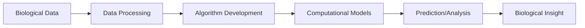

# Computational Biology - Notes

## Table of Contents (ToC)
  - [Introduction](#introduction)
  - [Key Concepts](#key-concepts)
  - [Why It Matters / Relevance](#why-it-matters--relevance)
  - [Learning Map (Architecture Pipeline)](#learning-map-architecture-pipeline)
  - [Framework / Key Theories or Models](#framework--key-theories-or-models)
  - [How Computational Biology Works](#how-computational-biology-works)
  - [Methods, Types \& Variations](#methods-types--variations)
  - [Self-Practice / Hands-On Examples](#self-practice--hands-on-examples)
  - [Pitfalls \& Challenges](#pitfalls--challenges)
  - [Feedback \& Evaluation](#feedback--evaluation)
  - [Tools, Libraries \& Frameworks](#tools-libraries--frameworks)
  - [Hello World! (Practical Example)](#hello-world-practical-example)
  - [Advanced Exploration](#advanced-exploration)
  - [Zero to Hero Lab Projects](#zero-to-hero-lab-projects)
  - [Continuous Learning Strategy](#continuous-learning-strategy)
  - [Summary:](#summary)
  - [References](#references)


## Introduction
- **Computational biology** is the application of data analysis, algorithms, and mathematical models to understand biological systems and relationships.

## Key Concepts
- **Genome**: The complete set of DNA, including all of its genes, that carries the instructions for life.
- **Bioinformatics**: The science of collecting and analyzing complex biological data, such as genetic codes.
- **Modeling**: Simulating biological processes using computational algorithms to predict behavior or outcomes.
- **Feynman Principle**: Imagine the genome as a massive instruction manual, and computational biology is about decoding, analyzing, and making sense of it using data and algorithms.
- **Misconception**: Many think computational biology only deals with human DNA, but it applies to all life forms, including viruses and plants.

## Why It Matters / Relevance
- **Example 1**: Analyzing genetic mutations to predict the likelihood of diseases like cancer.
- **Example 2**: Understanding protein folding, crucial in drug design.
- **Importance**: Mastering computational biology is vital in fields like healthcare, personalized medicine, environmental biology, and biotechnology.

## Learning Map (Architecture Pipeline)

- Biological data is collected → Processed and analyzed → Algorithms model the biological processes → Results help in predicting biological outcomes.

## Framework / Key Theories or Models
- **Central Dogma of Molecular Biology**: DNA → RNA → Protein; computational models simulate how genetic information leads to functional proteins.
- **Phylogenetic Trees**: Computational methods that track evolutionary relationships between species.
- **Sequence Alignment**: Aligning DNA or protein sequences to identify regions of similarity, often used in evolutionary biology and genomics.

## How Computational Biology Works
- Biological data, such as DNA sequences or protein structures, is collected and analyzed using specialized algorithms.
- Models simulate biological processes, like the folding of proteins or the spread of diseases.
- Results offer insights, such as identifying disease-associated mutations or predicting how organisms evolve.

## Methods, Types & Variations
- **Sequence Analysis**: Examines DNA, RNA, or protein sequences to identify functions or evolutionary relationships.
- **Structural Biology**: Predicts the 3D structure of proteins or nucleic acids.
- **Contrasting Example**: Sequence alignment focuses on linear data (DNA), while structural biology analyzes 3D configurations (proteins).

## Self-Practice / Hands-On Examples
1. **DNA Sequence Alignment**: Use an online tool like BLAST (Basic Local Alignment Search Tool) to align DNA sequences and identify similarities.
2. **Protein Structure Modeling**: Use a tool like PyMOL to visualize the 3D structure of a protein.
3. **Phylogenetic Tree Building**: Build a simple evolutionary tree using MEGA software based on DNA sequences.

## Pitfalls & Challenges
- **Challenge 1**: Handling the massive amount of biological data efficiently.
- **Challenge 2**: Understanding the complexity of biological processes in computational terms.
- **Suggestion**: Start with smaller datasets and simple models, then progress to more complex systems as you gain confidence.

## Feedback & Evaluation
- **Self-explanation test**: Can you explain how sequence alignment works and why it’s important?
- **Peer review**: Discuss with peers to compare computational approaches in biology.
- **Real-world simulation**: Run a simulation on a simple biological model, like protein folding, and analyze the results.

## Tools, Libraries & Frameworks
- **Biopython**: A library that provides tools for biological computation.
- **BLAST**: A tool for comparing biological sequences.
- **Comparison**: Biopython allows for more custom, in-depth bioinformatics analysis, while BLAST is fast and effective for quick sequence comparisons.

## Hello World! (Practical Example)
```python
# Example of basic DNA sequence alignment using Biopython
from Bio.Seq import Seq
from Bio import pairwise2
from Bio.pairwise2 import format_alignment

seq1 = Seq("ACGTACGT")
seq2 = Seq("ACGTGACG")

# Perform global alignment
alignments = pairwise2.align.globalxx(seq1, seq2)

# Show the alignments
for alignment in alignments:
    print(format_alignment(*alignment))
```
- **Explanation**: This script aligns two DNA sequences to find regions of similarity.

## Advanced Exploration
- **Paper**: "Deep Learning in Genomics" (journal article).
- **Video**: "Computational Biology Explained" by Nature Video.
- **Article**: Explore machine learning applications in computational biology.

## Zero to Hero Lab Projects
- **Project**: Create a bioinformatics pipeline that takes a DNA sequence and predicts the resulting protein structure.
- **Challenge**: Build and fine-tune this pipeline to handle large genomic datasets, analyzing gene variations or mutations.

## Continuous Learning Strategy
- Next steps: Study **computational genomics** and **systems biology** to explore more advanced areas.
- Related topics: **Structural bioinformatics**, **machine learning in biology**, and **computational drug design**.

## Summary:

> This comprehensive format provides a structured approach to learning **Computational Biology**, with a balance of theory, hands-on practice, and advanced exploration.


## References
- **"Bioinformatics: Sequence and Genome Analysis"** by David Mount (textbook).
- **National Center for Biotechnology Information (NCBI)** website.
- **Coursera**: Bioinformatics and Computational Biology courses.

---
