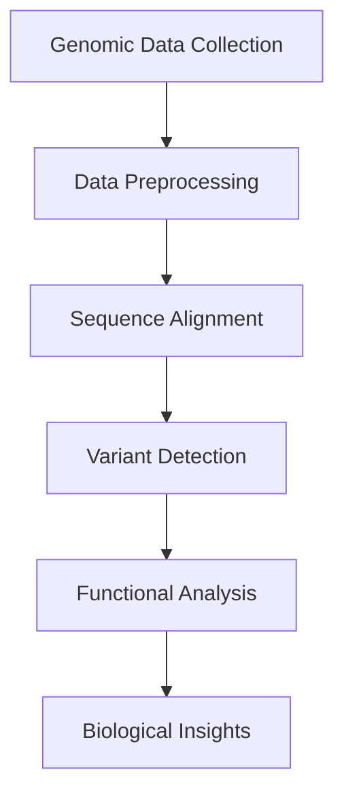

# Computational Genomics - Notes

## Table of Contents (ToC)
  - [Introduction](#introduction)
  - [Key Concepts](#key-concepts)
  - [Why It Matters / Relevance](#why-it-matters--relevance)
  - [Learning Map (Architecture Pipeline)](#learning-map-architecture-pipeline)
  - [Framework / Key Theories or Models](#framework--key-theories-or-models)
  - [How Computational Genomics Works](#how-computational-genomics-works)
  - [Methods, Types \& Variations](#methods-types--variations)
  - [Self-Practice / Hands-On Examples](#self-practice--hands-on-examples)
  - [Pitfalls \& Challenges](#pitfalls--challenges)
  - [Feedback \& Evaluation](#feedback--evaluation)
  - [Tools, Libraries \& Frameworks](#tools-libraries--frameworks)
  - [Hello World! (Practical Example)](#hello-world-practical-example)
  - [Advanced Exploration](#advanced-exploration)
  - [Zero to Hero Lab Projects](#zero-to-hero-lab-projects)
  - [Continuous Learning Strategy](#continuous-learning-strategy)
  - [References](#references)


## Introduction
- **Computational genomics** is the field that uses data analysis, algorithms, and statistical models to study genomes, the complete set of DNA in an organism, and to understand gene functions, relationships, and evolutionary patterns.

## Key Concepts
- **Genome**: The entire genetic material of an organism, encoded in DNA (or RNA in some viruses).
- **Alignment**: The process of arranging DNA, RNA, or protein sequences to identify regions of similarity.
- **Variant Calling**: Identifying differences, such as mutations, between an individual’s genome and a reference genome.
- **Feynman Principle**: Imagine the genome as a huge book. Computational genomics is about decoding this book to find patterns, errors, and how sections of the book relate to different biological functions.
- **Misconception**: Computational genomics is only about sequencing DNA. In fact, it involves complex analysis like identifying gene interactions, regulatory mechanisms, and evolutionary patterns.

## Why It Matters / Relevance
- **Example 1**: Detecting genetic mutations linked to diseases like cancer by analyzing genomic data from patients.
- **Example 2**: Understanding genetic diversity and evolution in species, aiding conservation efforts or agricultural improvements.
- **Importance**: Mastering computational genomics is crucial in areas such as personalized medicine, population genetics, and drug development.

## Learning Map (Architecture Pipeline)

- Genomic data is collected → Preprocessed → Aligned against a reference genome → Variants are detected → Function and significance are analyzed to provide insights into diseases, evolution, etc.

## Framework / Key Theories or Models
- **Hardy-Weinberg Equilibrium**: A principle that explains how allele frequencies remain constant in a population under ideal conditions, which helps in understanding genetic variation.
- **Neutral Theory of Molecular Evolution**: This theory suggests that most genetic mutations are neutral and do not affect the organism’s fitness, important for interpreting mutation rates.
- **Central Dogma of Molecular Biology**: The flow of genetic information from DNA to RNA to protein underpins many of the analyses in computational genomics.

## How Computational Genomics Works
- Genomic sequences are collected from organisms through DNA sequencing technologies.
- Data preprocessing involves cleaning and organizing the raw data.
- Algorithms align the sequences to reference genomes, identifying variations or mutations.
- Analytical models predict the functional impact of these variations, providing biological insights, such as identifying gene-disease associations.

## Methods, Types & Variations
- **Sequence Alignment**: Matching DNA sequences to a reference genome to find similarities or differences.
- **Genome-Wide Association Studies (GWAS)**: Identifying genetic variants linked to specific traits or diseases by comparing genomes across populations.
- **Contrasting Example**: While sequence alignment focuses on detecting similarities and differences between individual genomes, GWAS focuses on large-scale population data to find associations with traits or diseases.

## Self-Practice / Hands-On Examples
1. **BLAST (Basic Local Alignment Search Tool)**: Practice aligning your own DNA sequences to reference genomes using BLAST.
2. **Variant Calling Pipeline**: Use tools like GATK to detect genetic variants in sample DNA sequences.
3. **Genome Browser Exploration**: Use a genome browser (e.g., UCSC Genome Browser) to explore genome annotations and identify gene regions of interest.

## Pitfalls & Challenges
- **Challenge 1**: Handling large datasets can be computationally intensive and time-consuming.
- **Challenge 2**: Accurately interpreting genomic data, especially when linking variants to disease, can be complex.
- **Suggestion**: Use cloud-based platforms for processing large genomic datasets and start with small, well-annotated datasets for practice.

## Feedback & Evaluation
- **Self-explanation test**: Can you explain how sequence alignment helps in identifying gene mutations?
- **Peer review**: Discuss genomic data analysis approaches with peers to gain different perspectives.
- **Real-world simulation**: Run a small GWAS or variant calling analysis and interpret the significance of your findings.

## Tools, Libraries & Frameworks
- **GATK (Genome Analysis Toolkit)**: A tool for variant discovery and genotyping in DNA sequencing data.
- **Biopython**: A library for working with genomic data in Python.
- **Comparison**: GATK is highly specialized for genomic variant analysis, while Biopython is more versatile for general bioinformatics tasks.

## Hello World! (Practical Example)
```python
# Using Biopython to fetch and analyze a gene sequence from GenBank
from Bio import Entrez, SeqIO

# Provide your email for Entrez access
Entrez.email = "your_email@example.com"

# Fetch a sequence from GenBank
handle = Entrez.efetch(db="nucleotide", id="NM_001301717", rettype="gb", retmode="text")
record = SeqIO.read(handle, "genbank")

# Display sequence information
print(f"Gene: {record.name}")
print(f"Description: {record.description}")
print(f"Sequence: {record.seq[:100]}...")  # Print first 100 bases
```
- **Explanation**: This code retrieves a gene sequence from GenBank, a database of nucleotide sequences, and displays the basic information.

## Advanced Exploration
- **Paper**: "Population Genomics in the Era of Big Data" (journal article).
- **Video**: "Genome Sequencing Explained" by 23andMe (YouTube video).
- **Article**: Explore computational genomics applications in personalized medicine and pharmacogenomics.

## Zero to Hero Lab Projects
- **Project**: Build a pipeline that takes raw DNA sequencing data, aligns it to a reference genome, and calls variants. Analyze the impact of those variants on gene function.
- **Challenge**: Incorporate statistical models like GWAS to identify variants associated with a particular disease or trait.
## Continuous Learning Strategy
- Next steps: Study **epigenomics** and **transcriptomics** to expand understanding of how gene expression is regulated and how modifications to the genome, beyond DNA sequences, affect cellular functions.
- Related topics: **Systems biology**, which integrates genomics, proteomics, and other omics fields to study biological systems as a whole.

## Summary:

> This structured summary of **Computational Genomics** includes theoretical foundations, practical exercises, and resources to further deepen learning. It offers a balance between conceptual understanding and hands-on practice, ensuring learners build both knowledge and skills in this critical field.

## References
- **"Bioinformatics: Sequence and Genome Analysis"** by David W. Mount (textbook).
- **UCSC Genome Browser**: A tool for visualizing and interpreting genomic data.
- **Ensembl**: A genome database for vertebrates and model organisms that integrates computational analysis.
