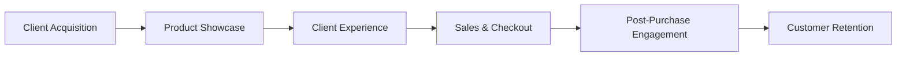

**Luxury Retail - Notes**

## Table of Contents
  - Introduction
  - Key Concepts
  - Applications
  - Architecture Pipeline
  - Framework / Key Theories or Models
  - How Luxury Retail Works
  - Methods, Types & Variations
  - Self-Practice / Hands-On Examples
  - Pitfalls & Challenges
  - Feedback & Evaluation
  - Tools, Libraries & Frameworks
  - Hello World! (Practical Example)
  - Advanced Exploration
  - Zero to Hero Lab Projects
  - Continuous Learning Strategy
  - References

## Introduction
- **Luxury retail** represents high-end goods and experiences, often combining exclusivity, personalized service, and premium quality.

### Key Concepts
- **Luxury Branding:** Establishing an elite, aspirational brand image and consistently upholding its reputation.
- **Customer Experience:** Creating an immersive and exclusive environment, both in-store and online, for high-value clients.
- **Product Differentiation:** Using unique designs, materials, or heritage to justify premium pricing.
- **Exclusivity:** Limited availability or custom services that heighten perceived value.
  
- **Misconceptions:** Luxury retail isn’t only about high price; it also demands a high level of quality and customer engagement. Digital transformation can enhance rather than dilute luxury experiences.

### Applications
1. **In-store Personalization:** AI-driven suggestions or VIP experiences based on customer history.
2. **Augmented Reality (AR):** Virtual try-ons for luxury fashion and jewelry.
3. **Inventory Management:** Predictive analytics to manage high-value, limited stock effectively.
4. **E-commerce Optimization:** Customized web experiences for VIP clients.
5. **Data-Driven Loyalty Programs:** Exclusive offers based on client buying patterns.

**Why It Matters:** Luxury retail shapes customer expectations in personalization, exclusivity, and quality, impacting industries from automotive to hospitality.

## Architecture Pipeline
The luxury retail pipeline typically includes steps from *Client Acquisition* to *Customer Retention*, each requiring specialized technologies to enhance experience and personalization.



### Description
1. **Client Acquisition:** Targeted marketing, leveraging social media influencers, exclusive invites, etc.
2. **Product Showcase:** High-end visual presentation, in-store or online, including AR and VR.
3. **Client Experience:** Personalization via AI recommendations or in-store VIP treatments.
4. **Sales & Checkout:** Tailored payment experiences and secure transactions.
5. **Post-Purchase Engagement:** Follow-up with personalized thank-yous, invitations to events.
6. **Customer Retention:** Loyalty programs or memberships offering ongoing benefits.

## Framework / Key Theories or Models
- **Maslow’s Hierarchy in Luxury:** Clients seek status and self-actualization.
- **Experience Economy:** Shift from goods/services to experiences that emotionally engage.
- **AIDA Model (Attention, Interest, Desire, Action):** Guides how luxury brands appeal to consumers.

## How Luxury Retail Works
1. **Attraction & Differentiation:** Unique branding and exclusivity attract discerning clients.
2. **Client Engagement:** Personalized interactions, both online and offline, using customer data.
3. **Sales Process:** High-touch sales, often with personal stylists or consultations.
4. **Customer Relationship Management (CRM):** Tools like Salesforce or luxury-specific CRMs manage VIP client profiles.
5. **Customer Retention & Loyalty:** Exclusive events, limited releases, and VIP memberships.

## Methods, Types & Variations
- **Physical Boutique:** Traditional retail experience with high-end service.
- **Omnichannel Presence:** Seamless transition between in-store and online, often with custom online services.
- **Luxury E-commerce:** Premium website experience, sometimes gated access for VIPs.
- **Pop-up Experiences:** Limited-time events or stores create buzz and exclusivity.

## Self-Practice / Hands-On Examples
1. **Customer Persona Creation:** Craft profiles for typical luxury retail clients.
2. **Mock E-commerce Experience Design:** Design a high-end e-commerce flow, emphasizing VIP elements.
3. **Analyze Brand Consistency:** Choose a luxury brand and assess how consistently it presents itself across platforms.

## Pitfalls & Challenges
- **Maintaining Exclusivity Online:** Balancing reach with maintaining an exclusive feel.
- **Data Privacy Concerns:** Ensuring customer data security is paramount for high-value clients.
- **Rapid Trends:** Luxury brands must stay relevant while preserving timeless appeal.

## Feedback & Evaluation
- **Self-Explanation Test:** Describe the luxury retail client journey as if explaining it to a beginner.
- **Peer Review:** Share ideas for enhancing luxury retail experiences and gather feedback.
- **Simulation:** Test mock customer profiles to see how they respond to personalized luxury offerings.

## Tools, Libraries & Frameworks
- **Salesforce:** For client management and personalized marketing.
- **ARKit/ARCore:** AR tools for virtual try-ons or product displays.
- **SAP Commerce Cloud:** E-commerce platform for personalized, high-end online stores.

## Hello World! (Practical Example)
Here’s a simple Python script simulating a VIP recommendation system using customer purchase history.

```python
from sklearn.neighbors import NearestNeighbors
import numpy as np

# Sample purchase history data
purchase_data = np.array([
    [1, 5, 0, 2],  # Client 1 purchases
    [3, 0, 1, 4],  # Client 2 purchases
    [1, 4, 3, 2]   # Client 3 purchases
])

# Fit nearest neighbors to find similar VIP client preferences
nn = NearestNeighbors(n_neighbors=2)
nn.fit(purchase_data)
client_id = 0  # VIP client to find recommendations for

# Find similar clients
_, indices = nn.kneighbors([purchase_data[client_id]])
print("Recommended products based on similar VIP clients:", indices[0])
```

## Advanced Exploration
- **“Decoding the New Luxury Mindset” by BCG** – Analyzes trends in digital luxury.
- **"The Luxury Strategy" by Kapferer and Bastien** – A comprehensive book on luxury marketing.
- **McKinsey Report on Digital Transformation in Luxury** – Insights into digital adaptation for luxury.

## Zero to Hero Lab Projects
1. **Luxury E-commerce Prototype:** Build a luxury e-commerce site with exclusive sections for registered clients.
2. **AR Product Showcase:** Use AR to allow virtual try-ons or previews for luxury products.
3. **VIP Loyalty Program Mockup:** Design a loyalty program with tiers and rewards based on client purchases.

## Continuous Learning Strategy
- **Advanced Marketing Strategies:** Study digital marketing, especially for high-net-worth clients.
- **Luxury Brand Case Studies:** Analyze how brands like Hermès or Cartier maintain exclusivity.
- **Digital Transformation in Luxury:** Keep updated with new technologies and platforms impacting luxury retail.

## References
- BCG. "Digital Disruption in Luxury: 2022 Insights."
- McKinsey & Company. "The Role of Experience in the Luxury Market." 
- Kapferer, J.N., & Bastien, V. *The Luxury Strategy: Break the Rules of Marketing to Build Luxury Brands.*